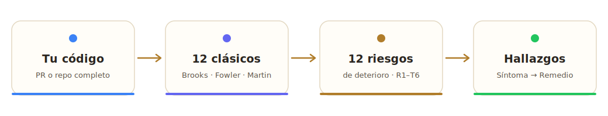
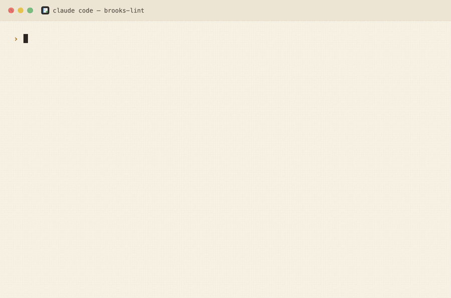
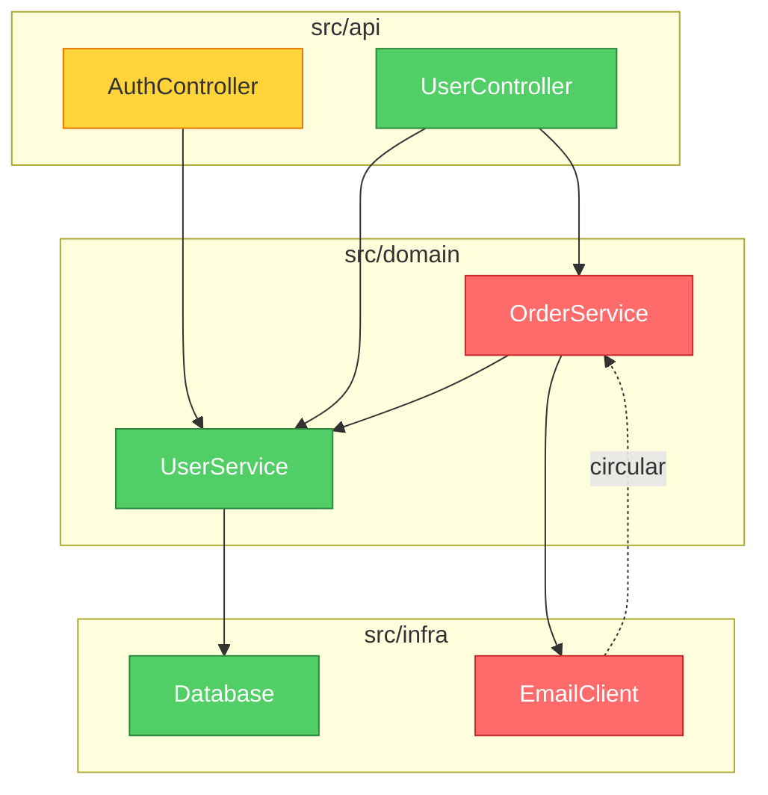

<p align="center">
  
</p>

<h1 align="center">brooks-lint</h1>

<p align="center">
  <strong>Revisiones de código con IA fundamentadas en doce libros clásicos de ingeniería.<br>
  Consistentes. Trazables. Accionables.</strong>
</p>

<p align="center">
  <a href="README.md">English</a> ·
  <a href="README.zh-CN.md">简体中文</a> ·
  <a href="README.zh-TW.md">繁體中文</a> ·
  <a href="README.ja.md">日本語</a> ·
  <a href="README.ko.md">한국어</a> ·
  <strong>Español</strong>
</p>

<p align="center">
  <a href="#inicio-rápido">Inicio rápido</a> •
  <a href="#los-seis-riesgos-de-deterioro">Los seis riesgos de deterioro</a> •
  <a href="#cómo-se-ve">Cómo se ve</a> •
  <a href="#benchmark">Benchmark</a> •
  <a href="#instalación">Instalación</a>
</p>

<p align="center">
  
  
  
  
  
</p>

<p align="center">
  <a href="https://trendshift.io/repositories/47738" target="_blank"></a>
</p>

<p align="center">
  
</p>

<p align="center">
  <a href="https://hyhmrright.github.io/brooks-lint/"></a>
</p>

<p align="center">
  <strong><a href="https://hyhmrright.github.io/brooks-lint/">→ Visita el sitio web</a></strong>
</p>

---

> *"Gestar un hijo lleva nueve meses, sin importar a cuántas mujeres se asigne."*
> — Frederick Brooks, *The Mythical Man-Month* (El mítico hombre-mes) (1975)

**50 años después, Brooks seguía teniendo razón — y también McConnell, Fowler, Martin, Hunt & Thomas, Evans, Ousterhout, Winters, Meszaros, Osherove, Feathers y el equipo de Testing de Google.**

La mayoría de las herramientas de calidad de código cuentan líneas y complejidad ciclomática. **brooks-lint** va más a fondo: diagnostica tu código frente a seis dimensiones de riesgo de deterioro sintetizadas a partir de doce libros clásicos de ingeniería, produciendo cada vez hallazgos estructurados con citas de libros, etiquetas de severidad y remedios concretos.

Para el mapeo completo de fuente a skill, incluyendo excepciones y protecciones contra falsos positivos, consulta
[`skills/_shared/source-coverage.md`](skills/_shared/source-coverage.md).

## Inicio rápido

```bash
# Claude Code
/plugin marketplace add hyhmrright/brooks-lint
/plugin install brooks-lint@brooks-lint-marketplace

# Cualquier otra plataforma de Agent Skills — Cursor · Codex · Gemini · Copilot · Windsurf · OpenCode · Kiro · …
curl -fsSL https://raw.githubusercontent.com/hyhmrright/brooks-lint/main/scripts/install.sh | bash -s -- <platform>
```

Luego solo pide ("revisa este PR", "audita la arquitectura") — o ejecuta un comando:

| Comando | Qué hace |
|---------|--------------|
| `/brooks-review` | Revisa un PR o diff |
| `/brooks-audit` | Audita la arquitectura (+ grafo de dependencias en Mermaid) |
| `/brooks-debt` | Hoja de ruta de deuda técnica priorizada |
| `/brooks-test` | Revisión de calidad de la suite de pruebas |
| `/brooks-health` | Panel de salud en todas las dimensiones |
| `/brooks-sweep` | Barre todas las dimensiones y corrige hallazgos automáticamente |

Cada hallazgo se devuelve como **Síntoma → Origen → Consecuencia → Remedio** con una cita de libro y una puntuación de salud de 0 a 100. Las opciones completas de instalación (8 plataformas más), el uso por comando y la configuración de CI/CD están [más abajo](#instalación).

## Los doce libros

| Libro | Autor | Contribuye a |
|------|--------|----------------|
| *The Mythical Man-Month* | Frederick Brooks | R2, R4, R5 |
| *Code Complete* | Steve McConnell | R1, R4 |
| *Refactoring* | Martin Fowler | R1, R2, R3, R4, R6 |
| *Clean Architecture* | Robert C. Martin | R2, R5 |
| *The Pragmatic Programmer* | Hunt & Thomas | R2, R3, R4, R5, T2, T3 |
| *Domain-Driven Design* | Eric Evans | R1, R3, R6 |
| *A Philosophy of Software Design* | John Ousterhout | R1, R4 |
| *Software Engineering at Google* | Winters, Manshreck & Wright | R2, R5 |
| *The Art of Unit Testing* | Roy Osherove | T1, T2, T4, T5 |
| *How Google Tests Software* | James A. Whittaker, Jason Arbon & Jeff Carollo | T5, T6 |
| *Working Effectively with Legacy Code* | Michael Feathers | T4, T5, T6 |
| *xUnit Test Patterns* | Gerard Meszaros | T1, T2, T3, T4 |

## Los seis riesgos de deterioro

brooks-lint evalúa tu código frente a **seis riesgos de deterioro del código de producción** y **seis riesgos de deterioro de la suite de pruebas**, sintetizados a partir de doce libros clásicos de ingeniería:

| Riesgo de deterioro | Pregunta diagnóstica | Fuentes |
|------------|---------------------|---------|
| 🧠 Sobrecarga cognitiva | ¿Cuánto esfuerzo mental cuesta entender esto? | Code Complete, Refactoring, DDD, Philosophy of SD |
| 🔗 Propagación de cambios | ¿Cuántas cosas no relacionadas se rompen con un solo cambio? | Refactoring, Clean Architecture, Pragmatic, SE@Google |
| 📋 Duplicación de conocimiento | ¿La misma decisión se expresa en varios lugares? | Pragmatic, Refactoring, DDD |
| 🌀 Complejidad accidental | ¿El código es más complejo que el problema? | Refactoring, Code Complete, Brooks, Philosophy of SD |
| 🏗️ Desorden de dependencias | ¿Las dependencias fluyen en una dirección consistente? | Clean Architecture, Brooks, Pragmatic, SE@Google |
| 🗺️ Distorsión del modelo de dominio | ¿El código representa fielmente el dominio? | DDD, Refactoring |

> Philosophy of SD = *A Philosophy of Software Design* (Ousterhout) · SE@Google = *Software Engineering at Google* (Winters et al.)

## Cómo se ve

Dado este código:

```python
class UserService:
    def update_profile(self, user_id, name, email, avatar_url):
        user = self.db.query(f"SELECT * FROM users WHERE id = {user_id}")
        user['email'] = email
        ...
        if user['email'] != email:   # always False — silent bug
            self.smtp.send(...)
        points = user['login_count'] * 10 + 500
        self.db.execute(f"UPDATE loyalty SET points={points} WHERE user_id={user_id}")
```

brooks-lint produce:

---

**Puntuación de salud: 28/100**

*Este método concentra cuatro responsabilidades de negocio no relacionadas en una sola función, contiene un error lógico que suprime silenciosamente las notificaciones de cambio de correo electrónico y queda totalmente expuesto a inyección de SQL.*

### 🔴 Propagación de cambios — Un solo método cambia por cuatro razones de negocio no relacionadas
**Síntoma:** `update_profile` realiza la actualización de los campos del perfil, las notificaciones de cambio de correo, el recálculo de puntos de fidelidad y la invalidación de caché, todo en el cuerpo de un mismo método.
**Origen:** Fowler — *Refactoring* — Divergent Change (Cambio divergente); Hunt & Thomas — *The Pragmatic Programmer* — Orthogonality (Ortogonalidad)
**Consecuencia:** Cualquier cambio en la fórmula de fidelidad arriesga romper las notificaciones de correo y viceversa. Cada edición conlleva riesgo de regresión en cuatro dominios no relacionados de forma simultánea.
**Remedio:** Extrae `NotificationService`, `LoyaltyService` y `UserCacheInvalidator`. `UserService.update_profile` debería orquestar llamando a cada uno — no debería contener lógica de implementación propia.

### 🔴 Distorsión del modelo de dominio — Error lógico silencioso: la notificación de correo nunca se dispara
**Síntoma:** `user['email'] = email` sobrescribe el valor anterior antes de `if user['email'] != email` — la condición siempre es `False`. La notificación es código muerto.
**Origen:** McConnell — *Code Complete* — Cap. 17: Estructuras de control inusuales
**Consecuencia:** Los usuarios nunca son notificados cuando cambia su dirección de correo. Fallo silencioso de integridad de datos — el sistema parece funcionar mientras viola una regla de negocio.
**Remedio:** Captura `old_email = user['email']` antes de cualquier mutación. Compara contra `old_email`, no contra `user['email']`.

*(+ 6 hallazgos más, incluyendo inyección de SQL, desorden de dependencias y números mágicos)*

### Auditoría de arquitectura con grafo de dependencias

En el Modo 2 (Auditoría de arquitectura), brooks-lint genera un **grafo de dependencias en Mermaid** en la parte superior del informe. Los módulos se colorean según su severidad: rojo = hallazgos Critical, amarillo = Warning, verde = limpio.



El grafo se renderiza de forma nativa en GitHub, Notion y otros entornos Markdown — sin herramientas adicionales.

## Más ejemplos

La [Galería completa](docs/gallery.md) contiene salida real de brooks-lint en Python, TypeScript, Go y Java — incluyendo revisiones de PR, auditorías de arquitectura con grafos de dependencias en Mermaid, evaluaciones de deuda técnica y revisiones de calidad de pruebas.

¿Nuevo en los riesgos de deterioro? La [**Guía de campo de los riesgos de deterioro**](https://hyhmrright.github.io/brooks-lint/guide.html) explica los seis — pregunta diagnóstica, síntomas característicos, libros de origen y remedio para cada uno.

---

## Benchmark

Probado en 3 escenarios del mundo real (revisión de PR, auditoría de arquitectura, evaluación de deuda técnica):

| Criterio | brooks-lint | Claude solo |
|-----------|:-----------:|:------------:|
| Hallazgos estructurados (Síntoma → Origen → Consecuencia → Remedio) | ✅ 100% | ❌ 0% |
| Citas de libros por hallazgo | ✅ 100% | ❌ 0% |
| Etiquetas de severidad (🔴/🟡/🟢) | ✅ 100% | ❌ 0% |
| Puntuación de salud (0–100) | ✅ 100% | ❌ 0% |
| Detecta Propagación de cambios | ✅ 100% | ✅ 100% |
| **Tasa de aprobación global** | **94%** | **16%** |

La brecha no está en lo que Claude *puede* encontrar — está en lo que encuentra de forma *consistente*, con evidencia trazable y remedios accionables cada vez.

### Benchmarks reproducibles

La tabla anterior es ilustrativa. Estas cifras son **deterministas y puedes reproducirlas localmente**:

**Fidelidad del parser** — la exportación a SARIF y los gates de CI dependen de parsear correctamente el informe Markdown del modelo. Frente a un **corpus congelado de 30 informes reales generados por el modelo** que abarcan los seis modos (`evals/benchmark-corpus.json`), cada uno emparejado con un inventario de hallazgos **calificado de forma independiente** (un pase de modelo separado, revisado manualmente por muestreo), el parser distribuido obtiene — ejecuta `npm run benchmark`:

| Métrica (n = 30, corpus congelado) | Resultado |
|---|:---:|
| Coincidencia exacta del conteo de severidad (parser vs. verdad calificada) | 30 / 30 |
| Precisión / recall del código de riesgo | 100% / 100% (56 códigos a nivel de hallazgo, 0 FP / 0 FN) |
| SARIF 2.1.0 válido emitido | 30 / 30 |

Como el parser es determinista y el corpus está congelado, `npm run benchmark` da a todo el mundo el mismo resultado, y `npm test` lo protege como regresión. El corpus incluye deliberadamente 9 informes de falsos positivos / compensaciones (por ejemplo, un diseño de puertos y adaptadores que *parece* un ciclo de dependencias) que deben permanecer limpios.

**Determinismo del scoring** — para un conjunto fijo de hallazgos (2 Critical / 3 Warning / 1 Suggestion), los presets de severidad producen exactamente las puntuaciones que predice su tabla de `common.md`: strict **34**, balanced **54**, legacy-friendly **74** — y solo `legacy-friendly` encabeza con las tres correcciones principales.

**Calidad del modelo** — si el modelo encuentra los riesgos *correctos* en código real se mide con la **suite de evaluaciones de 57 escenarios** (`evals/evals.json`): `npm run evals` (estructural) y `npm run evals:live` (en vivo, requiere `ANTHROPIC_API_KEY`).

> Alcance y honestidad: las cifras del parser son deterministas y exactamente reproducibles. Las cifras de severidad y de la suite de evaluaciones son mediciones en vivo de una sola ejecución contra el modelo y varían ligeramente entre ejecuciones. El benchmark del parser mide la fidelidad del parseo de informes (¿lee la herramienta cada hallazgo que el informe declara?), no si un hallazgo dado es "correcto". La coincidencia del conteo de severidad es la señal totalmente independiente; la concordancia de códigos de riesgo también refleja la leyenda canónica compartida de nombre→código.

## Cómo se compara

| | brooks-lint | ESLint / Pylint | GitHub Copilot Review | Claude sin más |
|---|:---:|:---:|:---:|:---:|
| Detecta problemas de sintaxis y estilo | — | ✅ | ✅ | ~ |
| Cadena de diagnóstico estructurada | ✅ | ❌ | ❌ | ❌ |
| Rastrea los hallazgos hasta libros clásicos | ✅ | ❌ | ❌ | ❌ |
| Etiquetas de severidad consistentes | ✅ | ✅ | ~ | ❌ |
| Perspectivas a nivel de arquitectura | ✅ | ❌ | ~ | ~ |
| Análisis del modelo de dominio | ✅ | ❌ | ❌ | ~ |
| Cero configuración, sin plugins que instalar | ✅ | ❌ | ✅ | ✅ |
| Funciona con cualquier lenguaje | ✅ | ❌ | ✅ | ✅ |

> `~` = ocasionalmente / de forma inconsistente

**brooks-lint no reemplaza a tu linter.** Captura lo que los linters no pueden: deriva arquitectónica, silos de conocimiento y distorsión del modelo de dominio — los problemas que frenan a los equipos durante meses antes de que alguien lo note.

## Instalación

### Claude Code (recomendado)

#### Mediante el Plugin Marketplace
```bash
/plugin marketplace add hyhmrright/brooks-lint
/plugin install brooks-lint@brooks-lint-marketplace
```

Los comandos en forma corta (`/brooks-review`) se instalan automáticamente al iniciar la primera sesión. Para instalarlos manualmente:
```bash
bash hooks/session-start
```

#### Instalación manual
```bash
mkdir -p ~/.claude/skills/brooks-lint
cp -r skills/* ~/.claude/skills/brooks-lint/
```

### Gemini CLI

#### Mediante extensión
```bash
/extensions install https://github.com/hyhmrright/brooks-lint
```

#### Instalación manual
```bash
mkdir -p ~/.gemini/skills
cp -r skills/* ~/.gemini/skills/      # flat — Gemini discovers skills only one level deep
```
> O simplemente: `./scripts/install.sh gemini`

### Codex CLI

#### Mediante el instalador de skills (en una sesión de Codex)
```
Install the brooks-lint skill from hyhmrright/brooks-lint
```

#### Línea de comandos
```bash
python3 ~/.codex/skills/.system/skill-installer/scripts/install-skill-from-github.py \
  --repo hyhmrright/brooks-lint --path skills --name brooks-lint
```

#### Instalación manual
```bash
git clone https://github.com/hyhmrright/brooks-lint.git /tmp/brooks-lint
mkdir -p ~/.codex/skills
cp -r /tmp/brooks-lint/skills/* ~/.codex/skills/   # flat — matches the skill-installer layout
```
> O simplemente: `./scripts/install.sh codex`

### Más plataformas — OpenCode · Cursor · Windsurf · Antigravity · pi · Copilot · Kiro · Factory Droid

brooks-lint se distribuye como [Agent Skills](https://agentskills.io) estándar. **Cualquier agente que cargue Agent
Skills ejecuta los seis modos sin conversión alguna** — un solo comando los instala:

```bash
# elige tu plataforma; --project instala en el repositorio actual en lugar de en tu configuración global
curl -fsSL https://raw.githubusercontent.com/hyhmrright/brooks-lint/main/scripts/install.sh | bash -s -- <platform>
#   <platform> = opencode · cursor · windsurf · antigravity · pi · kiro · copilot · droid · gemini · codex · agents
```

El instalador copia los skills **de forma plana** en la carpeta correcta para tu plataforma, de modo que el framework
compartido (`../_shared/`) siempre se resuelve — no puedes equivocarte con el diseño. Luego solo pide
("revisa este PR", "audita la arquitectura") y el skill correspondiente se activa automáticamente desde su
`description`. ¿Nuevo en los skills, o usas otro agente? Consulta **[docs/getting-started.md](docs/getting-started.md)**.

<details><summary><b>OpenCode</b></summary>

`./scripts/install.sh opencode` → `~/.config/opencode/skills` (también lee `~/.claude/skills` y
`AGENTS.md`). Guía completa: [docs/opencode-setup.md](docs/opencode-setup.md).
</details>

<details><summary><b>Cursor</b> (2.4+)</summary>

`./scripts/install.sh cursor` → `~/.cursor/skills` (también `.agents/skills`; lee `AGENTS.md`).
Guía completa: [docs/cursor-setup.md](docs/cursor-setup.md).
</details>

<details><summary><b>Windsurf</b> (Cascade)</summary>

`./scripts/install.sh windsurf` → `~/.codeium/windsurf/skills` (lee `AGENTS.md`).
Guía completa: [docs/windsurf-setup.md](docs/windsurf-setup.md).
</details>

<details><summary><b>Antigravity</b> (Google)</summary>

`./scripts/install.sh antigravity --project` → `.agent/skills` (lee `AGENTS.md` / `GEMINI.md`).
Guía completa: [docs/antigravity-setup.md](docs/antigravity-setup.md).
</details>

<details><summary><b>pi</b> (earendil-works)</summary>

`./scripts/install.sh pi` → `~/.pi/agent/skills`, o apunta el ajuste `skills` de pi a un clon.
Guía completa: [docs/pi-setup.md](docs/pi-setup.md).
</details>

<details><summary><b>GitHub Copilot</b></summary>

`./scripts/install.sh copilot --project` → `.github/skills` (también detecta automáticamente `.claude/skills`; lee
`AGENTS.md`). Guía completa: [docs/copilot-setup.md](docs/copilot-setup.md).
</details>

<details><summary><b>Kiro</b> (AWS)</summary>

`./scripts/install.sh kiro` → `~/.kiro/skills` (registra automáticamente `/brooks-review`; lee `AGENTS.md`).
Guía completa: [docs/kiro-setup.md](docs/kiro-setup.md).
</details>

<details><summary><b>Factory Droid</b></summary>

`./scripts/install.sh droid` → `~/.factory/skills` (registra `/brooks-review`; lee `AGENTS.md`).
Guía completa: [docs/factory-droid-setup.md](docs/factory-droid-setup.md).
</details>

> **🧪 Estado de verificación.** Claude Code, Gemini CLI y Codex CLI están verificados por el mantenedor. Las ocho
> plataformas anteriores están documentadas a partir de la especificación oficial de skills de cada herramienta y verificadas a nivel
> de diseño de archivos (el instalador está probado), pero el mantenedor aún no las ha ejecutado de extremo a extremo en cada plataforma. ¿Probaste
> alguna — funciona **o** está rota? [Abre un issue](https://github.com/hyhmrright/brooks-lint/issues/new) con
> la plataforma, la versión y lo que viste. ¿Otro agente de Agent Skills? Casi con certeza funciona de la misma
> manera — cuéntanoslo y lo añadiremos.

## Comandos de barra

### Claude Code
| Comando | Forma corta | Acción |
|---------|------------|--------|
| `/brooks-lint:brooks-review` | `/brooks-review` | Revisión de código a nivel de PR |
| `/brooks-lint:brooks-audit` | `/brooks-audit` | Auditoría completa de arquitectura |
| `/brooks-lint:brooks-debt` | `/brooks-debt` | Evaluación de deuda técnica |
| `/brooks-lint:brooks-test` | `/brooks-test` | Revisión de salud de la suite de pruebas |
| `/brooks-lint:brooks-health` | `/brooks-health` | Panel de salud — las cuatro dimensiones |
| `/brooks-lint:brooks-sweep` | `/brooks-sweep` | Barrido completo — analiza todas las dimensiones y corrige hallazgos automáticamente |

> Los comandos en forma corta se instalan automáticamente al iniciar la primera sesión, mediante el hook session-start.

### Gemini CLI
| Comando | Acción |
|---------|--------|
| `/brooks-review` | Revisión de código a nivel de PR |
| `/brooks-audit` | Auditoría completa de arquitectura |
| `/brooks-debt` | Evaluación de deuda técnica |
| `/brooks-test` | Revisión de salud de la suite de pruebas |
| `/brooks-health` | Panel de salud — las cuatro dimensiones |
| `/brooks-sweep` | Barrido completo — analiza todas las dimensiones y corrige hallazgos automáticamente |

### Codex CLI

| Comando | Acción |
|---------|--------|
| `$brooks-review` | Revisión de código a nivel de PR |
| `$brooks-audit` | Auditoría completa de arquitectura |
| `$brooks-debt` | Evaluación de deuda técnica |
| `$brooks-test` | Revisión de salud de la suite de pruebas |
| `$brooks-health` | Panel de salud — las cuatro dimensiones |
| `$brooks-sweep` | Barrido completo — analiza todas las dimensiones y corrige hallazgos automáticamente |

Los skills también se activan automáticamente cuando hablas de calidad de código, arquitectura, mantenibilidad o salud de las pruebas.

### OpenCode · Cursor · Antigravity · pi

Estas plataformas invocan los Agent Skills automáticamente a partir del `description` de cada skill — solo pide
("revisa este PR", "audita la arquitectura", "¿dónde está nuestra peor deuda técnica?") y se ejecuta el modo
correspondiente. Para una invocación explícita, usa la sintaxis de comando de skill de la plataforma (por ejemplo, pi registra cada skill
como `/skill:brooks-review`; Cursor y OpenCode exponen `/brooks-review` una vez que el skill es descubierto).

## Uso

### Revisión de PR

```
/brooks-review                      # Claude Code (forma corta) / Gemini CLI
/brooks-lint:brooks-review          # Claude Code (forma completa)
$brooks-review                      # Codex CLI
```

Pega un diff o apunta la IA a los archivos modificados. Diagnostica cada uno de los seis riesgos de deterioro con hallazgos específicos en el formato Síntoma → Origen → Consecuencia → Remedio.

### Auditoría de arquitectura

```
/brooks-audit                       # Claude Code (forma corta) / Gemini CLI
/brooks-lint:brooks-audit           # Claude Code (forma completa)
$brooks-audit                       # Codex CLI
```

Describe la estructura de tu proyecto o comparte archivos clave. Mapea las dependencias entre módulos, identifica dependencias circulares y comprueba la alineación con la Ley de Conway.

### Evaluación de deuda técnica

```
/brooks-debt                        # Claude Code (forma corta) / Gemini CLI
/brooks-lint:brooks-debt            # Claude Code (forma completa)
$brooks-debt                        # Codex CLI
```

Clasifica tu deuda según los seis riesgos de deterioro, puntúa cada hallazgo por prioridad de Dolor × Alcance y produce una hoja de ruta de pago priorizada con clasificación Critical / Scheduled / Monitored.

### Revisión de calidad de pruebas

```
/brooks-test                        # Claude Code (forma corta) / Gemini CLI
/brooks-lint:brooks-test            # Claude Code (forma completa)
$brooks-test                        # Codex CLI
```

Audita tu suite de pruebas frente a seis riesgos de deterioro del espacio de pruebas — Oscuridad de la prueba, Fragilidad de la prueba, Duplicación de la prueba, Abuso de mocks, Ilusión de cobertura y Desajuste de arquitectura — provenientes de xUnit Test Patterns, The Art of Unit Testing, How Google Tests Software y Working Effectively with Legacy Code. Las revisiones de PR también incluyen automáticamente un Paso 7 ligero de Comprobación rápida de pruebas (omitido para diffs solo de documentación o que no son de código de producción).

### Panel de salud

```
/brooks-health                      # Claude Code (forma corta) / Gemini CLI
/brooks-lint:brooks-health          # Claude Code (forma completa)
$brooks-health                      # Codex CLI
```

Ejecuta escaneos abreviados en las cuatro dimensiones de calidad y produce una puntuación de salud compuesta y ponderada (0–100). Úsalo antes de un release, al incorporar a un nuevo equipo, o siempre que quieras un informe panorámico de "¿cómo vamos?". Para un diagnóstico más profundo en cualquier dimensión, usa en su lugar el skill enfocado.

### Barrido completo

```
/brooks-sweep                       # Claude Code (forma corta) / Gemini CLI
/brooks-lint:brooks-sweep           # Claude Code (forma completa)
$brooks-sweep                       # Codex CLI
```

Ejecuta un escaneo unificado de todos los riesgos de deterioro de producción (R1–R6) y de pruebas (T1–T6), además de la arquitectura, en una sola pasada, y luego aplica las correcciones: los cambios seguros se aplican automáticamente de inmediato, los cambios multiarchivo o que tocan interfaces requieren confirmación, y las decisiones arquitectónicas complejas se marcan como elementos manuales. Produce un Registro de correcciones, el delta de la puntuación de salud y una lista de elementos residuales.

## Configuración

Coloca un `.brooks-lint.yaml` en la raíz de tu proyecto para personalizar el comportamiento de la revisión:

```yaml
version: 1

strictness: balanced   # strict | balanced (default) | legacy-friendly — softer scoring for legacy code

disable:
  - T5   # skip coverage metrics check — we don't enforce coverage

severity:
  R1: suggestion   # downgrade Cognitive Overload findings for this domain

ignore:
  - "**/*.generated.*"
  - "**/vendor/**"

# custom_risks:   # define project-specific Cx codes — see skills/_shared/custom-risks-guide.md
# suppress:       # downgrade specific findings by risk + path (e.g. accepted legacy debt)
```

Copia [`.brooks-lint.example.yaml`](.brooks-lint.example.yaml) como punto de partida.
Todos los ajustes son opcionales — omite el archivo por completo para el comportamiento por defecto.

| Ajuste | Descripción |
|---------|-------------|
| `strictness` | Preset de scoring: `strict`, `balanced` (por defecto) o `legacy-friendly` (deducciones más ligeras, encabeza con las correcciones principales) |
| `disable` | Códigos de riesgo a omitir (`R1`–`R6`, `T1`–`T6`) |
| `severity` | Sobrescribe el nivel de severidad (`critical` / `warning` / `suggestion`) |
| `ignore` | Patrones glob de archivos a excluir |
| `focus` | Evalúa solo estos códigos de riesgo (no se puede combinar con `disable`) |
| `custom_risks` | Define códigos de riesgo específicos del proyecto (`C1`, `C2`, …) — consulta [`custom-risks-guide.md`](skills/_shared/custom-risks-guide.md) |
| `suppress` | Rebaja hallazgos específicos por riesgo + ruta (fecha `expires:` opcional) |

---

## ¿Por qué estos libros, por qué ahora?

En la era de la programación asistida por IA, escribimos más código y más rápido que nunca. Pero las ideas de seis décadas de ingeniería de software no han cambiado:

> *"La complejidad del software es una propiedad esencial, no accidental."*
> — Frederick Brooks

La IA puede ayudarte a escribir código más rápido, pero no puede decirte si estás construyendo una catedral o un pozo de brea. **brooks-lint cierra esa brecha** — lleva la sabiduría tan duramente ganada de doce libros clásicos de ingeniería a tu flujo de trabajo de desarrollo moderno.

Los riesgos de deterioro que identificaron estos autores son más relevantes que nunca:
- **Añadir asistentes de IA** no soluciona la sobrecarga cognitiva ni la distorsión del modelo de dominio
- **Generar más código** aumenta la propagación de cambios y la duplicación de conocimiento
- **Ir más rápido** vuelve aún más peligrosas la complejidad accidental y el desorden de dependencias

## Estructura del proyecto

```
brooks-lint/
├── .claude-plugin/              # Claude Code plugin metadata
├── .codex-plugin/               # Codex CLI plugin metadata
├── skills/
│   ├── _shared/                 # Shared framework files
│   │   ├── common.md            # Iron Law, Project Config, Report Template, Health Score
│   │   ├── source-coverage.md   # 12-book coverage matrix, tradeoffs, false-positive guards
│   │   ├── decay-risks.md       # Six decay risks with symptoms and book citations
│   │   ├── test-decay-risks.md  # Six test-space decay risks with book citations
│   │   ├── remedy-guide.md      # --fix mode: actionable Remedy enhancement rules
│   │   └── custom-risks-guide.md  # Template for project-specific risk codes
│   ├── brooks-review/           # Mode 1: PR Review
│   │   ├── SKILL.md
│   │   └── pr-review-guide.md
│   ├── brooks-audit/            # Mode 2: Architecture Audit
│   │   ├── SKILL.md
│   │   └── architecture-guide.md
│   ├── brooks-debt/             # Mode 3: Tech Debt Assessment
│   │   ├── SKILL.md
│   │   └── debt-guide.md
│   ├── brooks-test/             # Mode 4: Test Quality Review
│   │   ├── SKILL.md
│   │   └── test-guide.md
│   ├── brooks-health/           # Mode 5: Health Dashboard
│   │   ├── SKILL.md
│   │   └── health-guide.md
│   └── brooks-sweep/            # Mode 6: Full Sweep & Auto-Fix
│       ├── SKILL.md
│       └── sweep-guide.md
├── hooks/                       # SessionStart hook
├── commands/                    # Short-form command wrappers (auto-installed by hook)
├── evals/                       # Benchmark test cases
│   └── evals.json
└── assets/
    └── logo.svg
```

## Integración con CI/CD

Automatiza brooks-lint en cada PR usando la GitHub Action:

```yaml
# .github/workflows/brooks-lint.yml
name: Brooks-Lint PR Review
on:
  pull_request:
    types: [opened, synchronize, reopened]

jobs:
  brooks-lint:
    runs-on: ubuntu-latest
    permissions:
      pull-requests: write
    steps:
      - uses: actions/checkout@v4
        with:
          fetch-depth: 0
      - uses: hyhmrright/brooks-lint/.github/actions/brooks-lint@main
        with:
          mode: review
          anthropic-api-key: ${{ secrets.ANTHROPIC_API_KEY }}
          fail-below: 70
```

Consulta [`docs/github-action-example.yml`](docs/github-action-example.yml) para la plantilla completa.

La action publica la revisión como un comentario del PR y, opcionalmente, hace fallar el check si la puntuación de salud cae por debajo de un umbral. Si `.brooks-lint-history.json` está confirmado en tu repositorio, el comentario también incluye un delta de tendencia (p. ej., "85 → 82 (−3) en las últimas 3 ejecuciones").

**Gates de calidad y Code Scanning.** Más allá de `fail-below`, la action expone:

```yaml
        with:
          mode: review
          anthropic-api-key: ${{ secrets.ANTHROPIC_API_KEY }}
          fail-on: critical            # fail on any Critical finding (none | warning | critical)
          fail-on-regression: true     # fail if the Health Score dropped vs the last run
          sarif-file: brooks-lint.sarif  # also upload findings to GitHub Code Scanning
```

`fail-on-regression` lee `.brooks-lint-history.json`, así que confirma ese archivo para imponer "sin nuevas regresiones". Definir `sarif-file` hace que los hallazgos aparezcan en línea en la pestaña **Files changed** del PR y requiere el permiso `security-events: write` en el job.

**Coste:** ~$0,05–0,15 por ejecución de PR, según el tamaño del diff y el modelo. Se recomienda ejecutar solo en eventos `pull_request`.

## Hoja de ruta

> **Estado actual (v1.4):** base de 12 libros, 6 riesgos de deterioro de producción (R1–R6) + 6 riesgos de deterioro de pruebas (T1–T6), 6 skills — Revisión de PR, Auditoría de arquitectura, Deuda técnica, Calidad de pruebas, Panel de salud, Barrido completo — además de gates de calidad de CI, salida SARIF para GitHub Code Scanning, presets de severidad y un benchmark reproducible de fidelidad del parser. Las entradas anteriores más abajo describen hitos históricos, no el conjunto de funciones actual.

- [x] **v0.2**: Infraestructura de plugin (`.claude-plugin/`, hooks, comandos de barra)
- [x] **v0.3**: Ocho dimensiones de Brooks, puntuación de completitud de la documentación
- [x] **v0.4**: Framework de seis libros, dimensiones de riesgo de deterioro, cadena de diagnóstico, suite de benchmark
- [x] **v0.5**: Revisión de calidad de pruebas (Modo 4) — cuatro libros de testing, seis riesgos de deterioro de pruebas
- [x] **v0.6**: Grafo de dependencias en Mermaid en la Auditoría de arquitectura
- [x] **v0.7**: Configuración de proyecto `.brooks-lint.yaml`, contexto proactivo del Modo 2, expansión a 10 libros
- [x] **v0.8**: Arquitectura de skills independientes con comandos con espacio de nombres
- [x] **v0.9**: Validación de pasos, alcance de diff automático, panel `/brooks-health`, seguimiento de tendencias, modo triage, remedios `--fix`, informe de incorporación, GitHub Action
- [x] **v1.0**: Automatización de evaluaciones (`run-evals-live.mjs`), extensión de riesgos personalizados (códigos `Cx`)
- [x] **v1.1**: Skill de Barrido completo (`brooks-sweep`) — corrección automática unificada multidimensión
- [x] **v1.2**: Pipeline de barrido autónomo, propagación de versión con `npm run bump`
- [x] **v1.3**: Metadatos de marketplace de Codex, instalador de un solo comando para múltiples plataformas de agentes, README bilingüe + sitio de aterrizaje
- [x] **v1.4**: Salida SARIF para GitHub Code Scanning, gates de CI de severidad + regresión, presets de severidad (strict/balanced/legacy-friendly), suite de evaluaciones de 57 escenarios, benchmark reproducible de fidelidad del parser (`npm run benchmark`)

¿Quieres ayudar? Las mejores contribuciones ahora mismo son nuevos casos de prueba de evaluación y mejores patrones de síntomas de riesgo de deterioro. Consulta [CONTRIBUTING.md](CONTRIBUTING.md).

## Contribuir

Consulta [CONTRIBUTING.md](CONTRIBUTING.md) para saber cómo añadir hallazgos, mejorar guías o ampliar la suite de benchmark.

Ejecuta `/brooks-review` en tu propio PR — revisamos las contribuciones con la herramienta que estamos construyendo.

## Licencia

Licencia MIT — consulta [LICENSE](LICENSE) para más detalles.

## Agradecimientos

Este proyecto se apoya en los hombros de doce gigantes:

**Framework de código de producción**
- Frederick P. Brooks Jr. — *The Mythical Man-Month* (1975, Edición Aniversario 1995)
- Steve McConnell — *Code Complete* (1993, 2.ª ed. 2004)
- Martin Fowler — *Refactoring* (1999, 2.ª ed. 2018)
- Robert C. Martin — *Clean Architecture* (2017)
- Andrew Hunt & David Thomas — *The Pragmatic Programmer* (1999, Edición 20.º Aniversario 2019)
- Eric Evans — *Domain-Driven Design* (2003)
- John Ousterhout — *A Philosophy of Software Design* (2018)
- Titus Winters, Tom Manshreck y Hyrum Wright — *Software Engineering at Google* (2020)

**Framework de calidad de pruebas**
- Gerard Meszaros — *xUnit Test Patterns* (2007)
- Roy Osherove — *The Art of Unit Testing* (2009, 3.ª ed. 2023)
- Google Engineering — *How Google Tests Software* (2012)
- Michael Feathers — *Working Effectively with Legacy Code* (2004)

Los riesgos de deterioro codificados en esta herramienta son nuestra síntesis de sus ideas, aplicada a la evaluación moderna de la calidad del código.

---

## Historial de estrellas

[](https://star-history.com/#hyhmrright/brooks-lint&Date)

---

<p align="center">
  <strong>⭐ Si esta herramienta te ayudó a ver tu base de código de otra manera, ¡dale una estrella!</strong>
</p>
