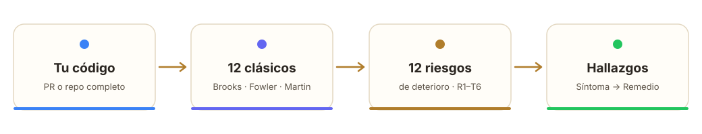
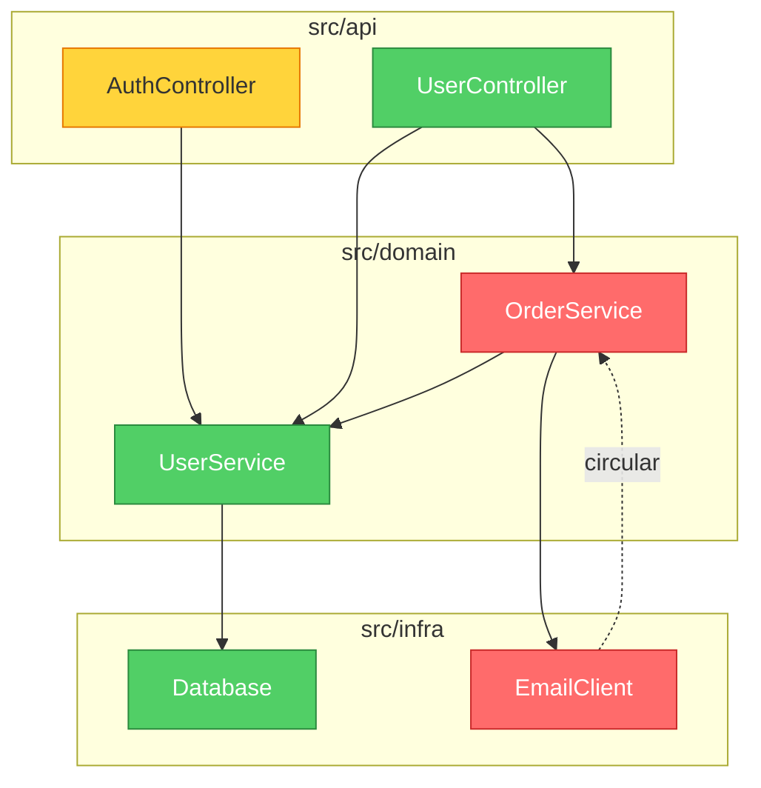

<p align="center">
  
</p>

<h1 align="center">brooks-lint</h1>

<p align="center">
  <strong>Revisiones de código con IA fundamentadas en doce libros clásicos de ingeniería.<br>
  Consistentes. Trazables. Accionables.</strong>
</p>

<p align="center">
  <a href="README.md">English</a> ·
  <a href="README.zh-CN.md">简体中文</a> ·
  <a href="README.zh-TW.md">繁體中文</a> ·
  <a href="README.ja.md">日本語</a> ·
  <a href="README.ko.md">한국어</a> ·
  <strong>Español</strong>
</p>

<p align="center">
  <a href="#inicio-rápido">Inicio rápido</a> •
  <a href="#los-seis-riesgos-de-deterioro">Los seis riesgos de deterioro</a> •
  <a href="#cómo-se-ve">Cómo se ve</a> •
  <a href="#benchmark">Benchmark</a> •
  <a href="#instalación">Instalación</a>
</p>

<p align="center">
  
  
  
  
  
</p>

<p align="center">
  <a href="https://trendshift.io/repositories/47738" target="_blank"></a>
</p>

<p align="center">
  
</p>

<p align="center">
  <a href="https://hyhmrright.github.io/brooks-lint/"></a>
</p>

<p align="center">
  <strong><a href="https://hyhmrright.github.io/brooks-lint/">→ Visita el sitio web</a></strong>
</p>

---

> *"Gestar un hijo lleva nueve meses, sin importar a cuántas mujeres se asigne."*
> — Frederick Brooks, *The Mythical Man-Month* (El mítico hombre-mes) (1975)

**50 años después, Brooks seguía teniendo razón — y también McConnell, Fowler, Martin, Hunt & Thomas, Evans, Ousterhout, Winters, Meszaros, Osherove, Feathers y el equipo de Testing de Google.**

La mayoría de las herramientas de calidad de código cuentan líneas y complejidad ciclomática. **brooks-lint** va más a fondo: diagnostica tu código frente a seis dimensiones de riesgo de deterioro sintetizadas a partir de doce libros clásicos de ingeniería, produciendo cada vez hallazgos estructurados con citas de libros, etiquetas de severidad y remedios concretos.

Para el mapeo completo de fuente a skill, incluyendo excepciones y protecciones contra falsos positivos, consulta
[`skills/_shared/source-coverage.md`](skills/_shared/source-coverage.md).

## Inicio rápido

```bash
# Claude Code
/plugin marketplace add hyhmrright/brooks-lint
/plugin install brooks-lint@brooks-lint-marketplace

# Cualquier otra plataforma de Agent Skills — Cursor · Codex · Gemini · Copilot · Windsurf · OpenCode · Kiro · …
curl -fsSL https://raw.githubusercontent.com/hyhmrright/brooks-lint/main/scripts/install.sh | bash -s -- <platform>
```

Luego solo pide ("revisa este PR", "audita la arquitectura"), o ejecuta uno de los seis comandos —
`/brooks-review`, `/brooks-audit`, `/brooks-debt`, `/brooks-test`, `/brooks-health`, `/brooks-sweep`
([qué hace cada uno](#comandos-de-barra)).

Cada hallazgo se devuelve como **Síntoma → Origen → Consecuencia → Remedio** con una cita de libro y
una puntuación de salud de 0 a 100. Las opciones completas de instalación (9 plataformas más) y la
configuración de CI/CD están [más abajo](#instalación).

## Los doce libros

| Libro | Autor | Contribuye a |
|------|--------|----------------|
| *The Mythical Man-Month* (1975) | Frederick P. Brooks Jr. | R2, R4, R5 |
| *Code Complete* (1993, 2.ª ed. 2004) | Steve McConnell | R1, R4 |
| *Refactoring* (1999, 2.ª ed. 2018) | Martin Fowler | R1, R2, R3, R4, R6 |
| *Clean Architecture* (2017) | Robert C. Martin | R2, R5 |
| *The Pragmatic Programmer* (1999, 20.º aniv. 2019) | Andrew Hunt & David Thomas | R2, R3, R4, R5, T2, T3 |
| *Domain-Driven Design* (2003) | Eric Evans | R1, R3, R6 |
| *A Philosophy of Software Design* (2018) | John Ousterhout | R1, R4 |
| *Software Engineering at Google* (2020) | Winters, Manshreck & Wright | R2, R5 |
| *The Art of Unit Testing* (2009, 3.ª ed. 2023) | Roy Osherove | T1, T2, T4, T5 |
| *How Google Tests Software* (2012) | Whittaker, Arbon & Carollo | T5, T6 |
| *Working Effectively with Legacy Code* (2004) | Michael Feathers | T4, T5, T6 |
| *xUnit Test Patterns* (2007) | Gerard Meszaros | T1, T2, T3, T4 |

## Los seis riesgos de deterioro

brooks-lint evalúa tu código frente a **seis riesgos de deterioro del código de producción** y **seis riesgos de deterioro de la suite de pruebas**, sintetizados a partir de doce libros clásicos de ingeniería:

| Riesgo de deterioro | Pregunta diagnóstica | Fuentes |
|------------|---------------------|---------|
| 🧠 Sobrecarga cognitiva | ¿Cuánto esfuerzo mental cuesta entender esto? | Code Complete, Refactoring, DDD, Philosophy of SD |
| 🔗 Propagación de cambios | ¿Cuántas cosas no relacionadas se rompen con un solo cambio? | Refactoring, Clean Architecture, Pragmatic, SE@Google |
| 📋 Duplicación de conocimiento | ¿La misma decisión se expresa en varios lugares? | Pragmatic, Refactoring, DDD |
| 🌀 Complejidad accidental | ¿El código es más complejo que el problema? | Refactoring, Code Complete, Brooks, Philosophy of SD |
| 🏗️ Desorden de dependencias | ¿Las dependencias fluyen en una dirección consistente? | Clean Architecture, Brooks, Pragmatic, SE@Google |
| 🗺️ Distorsión del modelo de dominio | ¿El código representa fielmente el dominio? | DDD, Refactoring |

> Philosophy of SD = *A Philosophy of Software Design* (Ousterhout) · SE@Google = *Software Engineering at Google* (Winters et al.)

## Cómo se ve

Dado este código:

```python
class UserService:
    def update_profile(self, user_id, name, email, avatar_url):
        user = self.db.query(f"SELECT * FROM users WHERE id = {user_id}")
        user['email'] = email
        ...
        if user['email'] != email:   # always False — silent bug
            self.smtp.send(...)
        points = user['login_count'] * 10 + 500
        self.db.execute(f"UPDATE loyalty SET points={points} WHERE user_id={user_id}")
```

brooks-lint produce:

---

**Puntuación de salud: 28/100**

*Este método concentra cuatro responsabilidades de negocio no relacionadas en una sola función, contiene un error lógico que suprime silenciosamente las notificaciones de cambio de correo electrónico y queda totalmente expuesto a inyección de SQL.*

### 🔴 Propagación de cambios — Un solo método cambia por cuatro razones de negocio no relacionadas
**Síntoma:** `update_profile` realiza la actualización de los campos del perfil, las notificaciones de cambio de correo, el recálculo de puntos de fidelidad y la invalidación de caché, todo en el cuerpo de un mismo método.
**Origen:** Fowler — *Refactoring* — Divergent Change (Cambio divergente); Hunt & Thomas — *The Pragmatic Programmer* — Orthogonality (Ortogonalidad)
**Consecuencia:** Cualquier cambio en la fórmula de fidelidad arriesga romper las notificaciones de correo y viceversa. Cada edición conlleva riesgo de regresión en cuatro dominios no relacionados de forma simultánea.
**Remedio:** Extrae `NotificationService`, `LoyaltyService` y `UserCacheInvalidator`. `UserService.update_profile` debería orquestar llamando a cada uno — no debería contener lógica de implementación propia.

### 🔴 Distorsión del modelo de dominio — Error lógico silencioso: la notificación de correo nunca se dispara
**Síntoma:** `user['email'] = email` sobrescribe el valor anterior antes de `if user['email'] != email` — la condición siempre es `False`. La notificación es código muerto.
**Origen:** McConnell — *Code Complete* — Cap. 17: Estructuras de control inusuales
**Consecuencia:** Los usuarios nunca son notificados cuando cambia su dirección de correo. Fallo silencioso de integridad de datos — el sistema parece funcionar mientras viola una regla de negocio.
**Remedio:** Captura `old_email = user['email']` antes de cualquier mutación. Compara contra `old_email`, no contra `user['email']`.

*(+ 6 hallazgos más, incluyendo inyección de SQL, desorden de dependencias y números mágicos)*

### Auditoría de arquitectura con grafo de dependencias

En el Modo 2 (Auditoría de arquitectura), brooks-lint genera un **grafo de dependencias en Mermaid** en la parte superior del informe. Los módulos se colorean según su severidad: rojo = hallazgos Critical, amarillo = Warning, verde = limpio.


```mermaid
graph TD
    subgraph src/api
        AuthController
        UserController
    end
    subgraph src/domain
        UserService
        OrderService
    end
    subgraph src/infra
        Database
        EmailClient
    end

    AuthController --> UserService
    UserController --> UserService
    UserController --> OrderService
    OrderService --> UserService
    OrderService --> EmailClient
    UserService --> Database
    EmailClient -.->|circular| OrderService

    classDef critical fill:#ff6b6b,stroke:#c92a2a,color:#fff
    classDef warning fill:#ffd43b,stroke:#e67700
    classDef clean fill:#51cf66,stroke:#2b8a3e,color:#fff

    class OrderService,EmailClient critical
    class AuthController warning
    class UserService,UserController,Database clean
```

El grafo se renderiza de forma nativa en GitHub, Notion y otros entornos Markdown — sin herramientas adicionales.

## Más ejemplos

La [Galería completa](docs/gallery.md) contiene salida real de brooks-lint en Python, TypeScript, Go y Java — incluyendo revisiones de PR, auditorías de arquitectura con grafos de dependencias en Mermaid, evaluaciones de deuda técnica y revisiones de calidad de pruebas.

¿Nuevo en los riesgos de deterioro? La [**Guía de campo de los riesgos de deterioro**](https://hyhmrright.github.io/brooks-lint/guide.html) explica los seis — pregunta diagnóstica, síntomas característicos, libros de origen y remedio para cada uno.

---

## Benchmark

Probado en 3 escenarios del mundo real (revisión de PR, auditoría de arquitectura, evaluación de deuda técnica):

| Criterio | brooks-lint | Claude solo |
|-----------|:-----------:|:------------:|
| Hallazgos estructurados (Síntoma → Origen → Consecuencia → Remedio) | ✅ 100% | ❌ 0% |
| Citas de libros por hallazgo | ✅ 100% | ❌ 0% |
| Etiquetas de severidad (🔴/🟡/🟢) | ✅ 100% | ❌ 0% |
| Puntuación de salud (0–100) | ✅ 100% | ❌ 0% |
| Detecta Propagación de cambios | ✅ 100% | ✅ 100% |
| **Tasa de aprobación global** | **94%** | **16%** |

La brecha no está en lo que Claude *puede* encontrar — está en lo que encuentra de forma *consistente*, con evidencia trazable y remedios accionables cada vez.

### Benchmarks reproducibles

La tabla anterior es ilustrativa. Estas cifras son **deterministas y puedes reproducirlas localmente**:

**Fidelidad del parser** — la exportación a SARIF y los gates de CI dependen de parsear correctamente el informe Markdown del modelo. Frente a un **corpus congelado de 30 informes reales generados por el modelo** que abarcan los seis modos (`evals/benchmark-corpus.json`), cada uno emparejado con un inventario de hallazgos **calificado de forma independiente** (un pase de modelo separado, revisado manualmente por muestreo), el parser distribuido obtiene — ejecuta `npm run benchmark`:

| Métrica (n = 30, corpus congelado) | Resultado |
|---|:---:|
| Coincidencia exacta del conteo de severidad (parser vs. verdad calificada) | 30 / 30 |
| Precisión / recall del código de riesgo | 100% / 100% (56 códigos a nivel de hallazgo, 0 FP / 0 FN) |
| SARIF 2.1.0 válido emitido | 30 / 30 |

Como el parser es determinista y el corpus está congelado, `npm run benchmark` da a todo el mundo el mismo resultado, y `npm test` lo protege como regresión. El corpus incluye deliberadamente 9 informes de falsos positivos / compensaciones (por ejemplo, un diseño de puertos y adaptadores que *parece* un ciclo de dependencias) que deben permanecer limpios.

**Determinismo del scoring** — para un conjunto fijo de hallazgos (2 Critical / 3 Warning / 1 Suggestion), los presets de severidad producen exactamente las puntuaciones que predice su tabla de `common.md`: strict **34**, balanced **54**, legacy-friendly **74** — y solo `legacy-friendly` encabeza con las tres correcciones principales.

**Calidad del modelo** — si el modelo encuentra los riesgos *correctos* en código real se mide con la **suite de evaluaciones de 57 escenarios** (`evals/evals.json`): `npm run evals` (estructural) y `npm run evals:live` (en vivo, requiere `ANTHROPIC_API_KEY`).

> Alcance y honestidad: las cifras del parser son deterministas y exactamente reproducibles. Las cifras de severidad y de la suite de evaluaciones son mediciones en vivo de una sola ejecución contra el modelo y varían ligeramente entre ejecuciones. El benchmark del parser mide la fidelidad del parseo de informes (¿lee la herramienta cada hallazgo que el informe declara?), no si un hallazgo dado es "correcto". La coincidencia del conteo de severidad es la señal totalmente independiente; la concordancia de códigos de riesgo también refleja la leyenda canónica compartida de nombre→código.

## Cómo se compara

| | brooks-lint | ESLint / Pylint | GitHub Copilot Review | Claude sin más |
|---|:---:|:---:|:---:|:---:|
| Detecta problemas de sintaxis y estilo | — | ✅ | ✅ | ~ |
| Cadena de diagnóstico estructurada | ✅ | ❌ | ❌ | ❌ |
| Rastrea los hallazgos hasta libros clásicos | ✅ | ❌ | ❌ | ❌ |
| Etiquetas de severidad consistentes | ✅ | ✅ | ~ | ❌ |
| Perspectivas a nivel de arquitectura | ✅ | ❌ | ~ | ~ |
| Análisis del modelo de dominio | ✅ | ❌ | ❌ | ~ |
| Cero configuración, sin plugins que instalar | ✅ | ❌ | ✅ | ✅ |
| Funciona con cualquier lenguaje | ✅ | ❌ | ✅ | ✅ |

> `~` = ocasionalmente / de forma inconsistente

**brooks-lint no reemplaza a tu linter.** Captura lo que los linters no pueden: deriva arquitectónica, silos de conocimiento y distorsión del modelo de dominio — los problemas que frenan a los equipos durante meses antes de que alguien lo note.

## Instalación

### Claude Code (recomendado)

```bash
/plugin marketplace add hyhmrright/brooks-lint
/plugin install brooks-lint@brooks-lint-marketplace
```

Los comandos cortos (`/brooks-review`) se instalan solos al iniciar la primera sesión — o ejecuta
`bash hooks/session-start` tú mismo. Para saltarte el marketplace:
`mkdir -p ~/.claude/skills/brooks-lint && cp -r skills/* ~/.claude/skills/brooks-lint/`.

### Gemini CLI · Codex CLI

```bash
/extensions install https://github.com/hyhmrright/brooks-lint   # Gemini CLI
```
```
Install the brooks-lint skill from hyhmrright/brooks-lint       # pídelo dentro de una sesión de Codex
```

O usa el instalador de abajo: `./scripts/install.sh gemini` / `./scripts/install.sh codex`.

### Cualquier otra plataforma — OpenCode · Cursor · Windsurf · Antigravity · pi · Copilot · Kiro · Factory Droid · DeepSeek Harness

brooks-lint se distribuye como [Agent Skills](https://agentskills.io) estándar. **Cualquier agente que cargue Agent
Skills ejecuta los seis modos sin conversión alguna** — un solo comando los instala:

```bash
# elige tu plataforma; --project instala en el repositorio actual en lugar de en tu configuración global
curl -fsSL https://raw.githubusercontent.com/hyhmrright/brooks-lint/main/scripts/install.sh | bash -s -- <platform>
#   <platform> = opencode · cursor · windsurf · antigravity · pi · kiro · copilot · droid · dsh · gemini · codex · agents
```

El instalador copia los skills **de forma plana** en la carpeta correcta, de modo que el framework compartido
(`../_shared/`) siempre se resuelve — no puedes equivocarte con el diseño. Luego solo pide ("revisa este PR",
"audita la arquitectura") y el skill correspondiente se activa automáticamente desde su `description`.

| Plataforma | Instala en | También lee | Guía |
|---|---|---|---|
| OpenCode | `~/.config/opencode/skills` | `~/.claude/skills`, `AGENTS.md` | [configuración](docs/opencode-setup.md) |
| Cursor (2.4+) | `~/.cursor/skills` | `.agents/skills`, `AGENTS.md` | [configuración](docs/cursor-setup.md) |
| Windsurf (Cascade) | `~/.codeium/windsurf/skills` | `AGENTS.md` | [configuración](docs/windsurf-setup.md) |
| Antigravity (Google) | `.agent/skills` (`--project`) | `AGENTS.md`, `GEMINI.md` | [configuración](docs/antigravity-setup.md) |
| pi (earendil-works) | `~/.pi/agent/skills` | — | [configuración](docs/pi-setup.md) |
| GitHub Copilot | `.github/skills` (`--project`) | `.claude/skills`, `AGENTS.md` | [configuración](docs/copilot-setup.md) |
| Kiro (AWS) | `~/.kiro/skills` | `AGENTS.md` | [configuración](docs/kiro-setup.md) |
| Factory Droid | `~/.factory/skills` | `AGENTS.md` | [configuración](docs/factory-droid-setup.md) |
| DeepSeek Harness (`dsh`) | `~/.dsh/skills` | `~/.agents/skills`, `AGENTS.md` | [configuración](docs/dsh-setup.md) |

Kiro, Factory Droid y DeepSeek Harness también registran `/brooks-review` automáticamente. ¿Nuevo en los
skills, o usas un agente que no aparece aquí? Consulta **[docs/getting-started.md](docs/getting-started.md)**.

> **🧪 Estado de verificación.** Claude Code, Gemini CLI y Codex CLI están verificados por el mantenedor. Las nueve
> plataformas anteriores están documentadas a partir de la especificación oficial de skills de cada herramienta y verificadas a nivel
> de diseño de archivos (el instalador está probado), pero el mantenedor aún no las ha ejecutado de extremo a extremo en cada plataforma. ¿Probaste
> alguna — funciona **o** está rota? [Abre un issue](https://github.com/hyhmrright/brooks-lint/issues/new) con
> la plataforma, la versión y lo que viste. ¿Otro agente de Agent Skills? Casi con certeza funciona de la misma
> manera — cuéntanoslo y lo añadiremos.

## Comandos de barra

| Comando | Qué hace |
|---------|--------------|
| `/brooks-review` | Pega un diff o apunta la IA a los archivos modificados. Diagnostica cada uno de los seis riesgos de deterioro en formato Síntoma → Fuente → Consecuencia → Remedio. |
| `/brooks-audit` | Mapea las dependencias entre módulos (con grafo Mermaid), detecta dependencias circulares y comprueba la alineación con la ley de Conway. |
| `/brooks-debt` | Clasifica la deuda según los seis riesgos de deterioro, puntúa cada hallazgo por Dolor × Alcance y produce una hoja de ruta de pago con niveles Critical / Scheduled / Monitored. |
| `/brooks-test` | Audita la suite frente a seis riesgos de deterioro del espacio de pruebas — Oscuridad, Fragilidad, Duplicación, Abuso de mocks, Ilusión de cobertura y Desajuste arquitectónico. |
| `/brooks-health` | Escaneos abreviados de las cuatro dimensiones de calidad → una única Health Score compuesta y ponderada. Úsalo antes de una release o al incorporar a un equipo. |
| `/brooks-sweep` | Escaneo unificado de R1–R6, T1–T6 y arquitectura, y luego aplica correcciones: los cambios seguros se aplican solos, los que tocan varios archivos se confirman y las decisiones arquitectónicas se marcan como manuales. Devuelve un Fix Log y el delta de puntuación. |

**Sintaxis por plataforma.** Claude Code también acepta la forma con espacio de nombres
`/brooks-lint:brooks-review` — las formas cortas las instala el hook session-start al iniciar la primera
sesión. Codex CLI usa `$brooks-review`. Gemini CLI usa la tabla tal cual. OpenCode, Cursor, Antigravity, pi y
DeepSeek Harness invocan los Agent Skills desde la `description` de cada skill, así que basta con pedirlo
("revisa este PR", "¿dónde está nuestra peor deuda técnica?"); para invocarlos explícitamente usa la sintaxis
propia de cada plataforma (pi registra cada skill como `/skill:brooks-review`; dsh usa la tabla tal cual, desde
su menú `/` o escrito a mano). En todas las plataformas los skills también
se activan solos cuando hablas de calidad de código, arquitectura o salud de las pruebas.

> Las revisiones de PR incluyen automáticamente una comprobación rápida de pruebas (Step 7, ligera; se omite
> en diffs solo de documentación). Para una auditoría completa de pruebas usa `/brooks-test`; para profundizar
> en una sola dimensión, usa el skill de esa dimensión en lugar de `/brooks-health`.

## Configuración

Coloca un `.brooks-lint.yaml` en la raíz de tu proyecto para personalizar el comportamiento de la revisión:

```yaml
version: 1

strictness: balanced   # strict | balanced (default) | legacy-friendly — softer scoring for legacy code

disable:
  - T5   # skip coverage metrics check — we don't enforce coverage

severity:
  R1: suggestion   # downgrade Cognitive Overload findings for this domain

ignore:
  - "**/*.generated.*"
  - "**/vendor/**"

# custom_risks:   # define project-specific Cx codes — see skills/_shared/custom-risks-guide.md
# suppress:       # downgrade specific findings by risk + path (e.g. accepted legacy debt)
```

Copia [`.brooks-lint.example.yaml`](.brooks-lint.example.yaml) como punto de partida.
Todos los ajustes son opcionales — omite el archivo por completo para el comportamiento por defecto.

| Ajuste | Descripción |
|---------|-------------|
| `strictness` | Preset de scoring: `strict`, `balanced` (por defecto) o `legacy-friendly` (deducciones más ligeras, encabeza con las correcciones principales) |
| `disable` | Códigos de riesgo a omitir (`R1`–`R6`, `T1`–`T6`) |
| `severity` | Sobrescribe el nivel de severidad (`critical` / `warning` / `suggestion`) |
| `ignore` | Patrones glob de archivos a excluir |
| `focus` | Evalúa solo estos códigos de riesgo (no se puede combinar con `disable`) |
| `custom_risks` | Define códigos de riesgo específicos del proyecto (`C1`, `C2`, …) — consulta [`custom-risks-guide.md`](skills/_shared/custom-risks-guide.md) |
| `suppress` | Rebaja hallazgos específicos por riesgo + ruta (fecha `expires:` opcional) |

---

## ¿Por qué estos libros, por qué ahora?

> *«La complejidad del software es una propiedad esencial, no accidental.»*
> — Frederick Brooks

La IA puede ayudarte a escribir código más rápido, pero no puede decirte si estás construyendo una catedral
o un pozo de alquitrán — y cuanto más barata es la generación, más afilados se vuelven los riesgos de
deterioro que identificaron estos autores. Añadir un asistente de IA no arregla la sobrecarga cognitiva ni la
distorsión del modelo de dominio; generar más código aumenta la propagación de cambios y la duplicación de
conocimiento; ir más rápido hace más peligrosos la complejidad accidental y el desorden de dependencias.

## Estructura del proyecto

Cada skill es un `SKILL.md` (activación + esqueleto del proceso) más su propia guía:

```
brooks-lint/
├── .claude-plugin/ · .codex-plugin/  # metadatos del plugin por plataforma
├── skills/
│   ├── _shared/          # common.md (Ley de Hierro, config, plantilla de informe, Health Score)
│   │                     # source-coverage.md · decay-risks.md (R1–R6)
│   │                     # test-decay-risks.md (T1–T6) · remedy-guide.md · custom-risks-guide.md
│   ├── brooks-review/    # Modo 1: Revisión de PR        → pr-review-guide.md
│   ├── brooks-audit/     # Modo 2: Auditoría de arq.     → architecture-guide.md, onboarding-guide.md
│   ├── brooks-debt/      # Modo 3: Deuda técnica         → debt-guide.md
│   ├── brooks-test/      # Modo 4: Calidad de pruebas    → test-guide.md
│   ├── brooks-health/    # Modo 5: Panel de salud        → health-guide.md
│   └── brooks-sweep/     # Modo 6: Barrido completo      → sweep-guide.md
├── hooks/                # hook SessionStart
├── commands/             # envoltorios de comandos cortos (los instala el hook)
├── evals/                # suite de 57 escenarios + corpus congelado de fidelidad del parser
└── assets/               # logo, banner, demo
```

## Integración con CI/CD

Automatiza brooks-lint en cada PR usando la GitHub Action:

```yaml
# .github/workflows/brooks-lint.yml
name: Brooks-Lint PR Review
on:
  pull_request:
    types: [opened, synchronize, reopened]

jobs:
  brooks-lint:
    runs-on: ubuntu-latest
    permissions:
      pull-requests: write
    steps:
      - uses: actions/checkout@v4
        with:
          fetch-depth: 0
      - uses: hyhmrright/brooks-lint/.github/actions/brooks-lint@v1.4.3
        with:
          mode: review
          anthropic-api-key: ${{ secrets.ANTHROPIC_API_KEY }}
          fail-below: 70
```

Consulta [`docs/github-action-example.yml`](docs/github-action-example.yml) para la plantilla completa.

La action publica la revisión como un comentario del PR y, opcionalmente, hace fallar el check si la puntuación de salud cae por debajo de un umbral. Si `.brooks-lint-history.json` está confirmado en tu repositorio, el comentario también incluye un delta de tendencia (p. ej., "85 → 82 (−3) en las últimas 3 ejecuciones").

**Gates de calidad y Code Scanning.** Más allá de `fail-below`, la action expone:

```yaml
        with:
          mode: review
          anthropic-api-key: ${{ secrets.ANTHROPIC_API_KEY }}
          fail-on: critical            # fail on any Critical finding (none | warning | critical)
          fail-on-regression: true     # fail if the Health Score dropped vs the last run
          sarif-file: brooks-lint.sarif  # also upload findings to GitHub Code Scanning
```

`fail-on-regression` lee `.brooks-lint-history.json`, así que confirma ese archivo para imponer "sin nuevas regresiones". Definir `sarif-file` hace que los hallazgos aparezcan en línea en la pestaña **Files changed** del PR y requiere el permiso `security-events: write` en el job.

**Coste:** ~$0,05–0,15 por ejecución de PR, según el tamaño del diff y el modelo. Se recomienda ejecutar solo en eventos `pull_request`.

## Hoja de ruta

**Estado actual (v1.4):** base de 12 libros, 6 riesgos de deterioro de producción (R1–R6) + 6 riesgos de
deterioro de pruebas (T1–T6), 6 skills, quality gates de CI, salida SARIF para GitHub Code Scanning,
presets de rigor y un benchmark reproducible de fidelidad del parser.

<details><summary>Hitos v0.2 → v1.4</summary>

- **v0.2–v0.4**: infraestructura de plugin, framework de seis libros, dimensiones de deterioro, suite de benchmark
- **v0.5–v0.7**: revisión de calidad de pruebas, grafo Mermaid, `.brooks-lint.yaml`, ampliación a 10 libros
- **v0.8–v0.9**: arquitectura de skills independientes; validación de pasos, ámbito automático por diff, `/brooks-health`, seguimiento de tendencia, modo triaje, remedios `--fix`, GitHub Action
- **v1.0–v1.2**: automatización de evals, códigos de riesgo `Cx` propios, skill de barrido completo, propagación de versión con `npm run bump`
- **v1.3**: metadatos del marketplace de Codex, instalador multiplataforma de un comando, READMEs localizados + sitio de aterrizaje
- **v1.4**: salida SARIF, gates de severidad y regresión en CI, presets de rigor, suite de 57 escenarios, `npm run benchmark`
</details>

## Contribuir

Consulta [CONTRIBUTING.md](CONTRIBUTING.md). Las contribuciones más valiosas ahora mismo son nuevos casos de
prueba de eval y mejores patrones de síntomas de los riesgos de deterioro. Ejecuta `/brooks-review` en tu
propio PR — revisamos las contribuciones con la herramienta que estamos construyendo.

## Licencia

Licencia MIT — consulta [LICENSE](LICENSE) para más detalles.

## Agradecimientos

Este proyecto se apoya en los hombros de doce gigantes — la lista completa con ediciones está arriba, en
[Los doce libros](#los-doce-libros). Los riesgos de deterioro codificados en esta herramienta son nuestra
síntesis de sus ideas, aplicada a la evaluación moderna de la calidad del código.

---

## Historial de estrellas

[](https://star-history.com/#hyhmrright/brooks-lint&Date)

---

<p align="center">
  <strong>⭐ Si esta herramienta te ayudó a ver tu base de código de otra manera, ¡dale una estrella!</strong>
</p>
