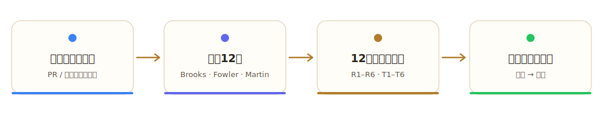
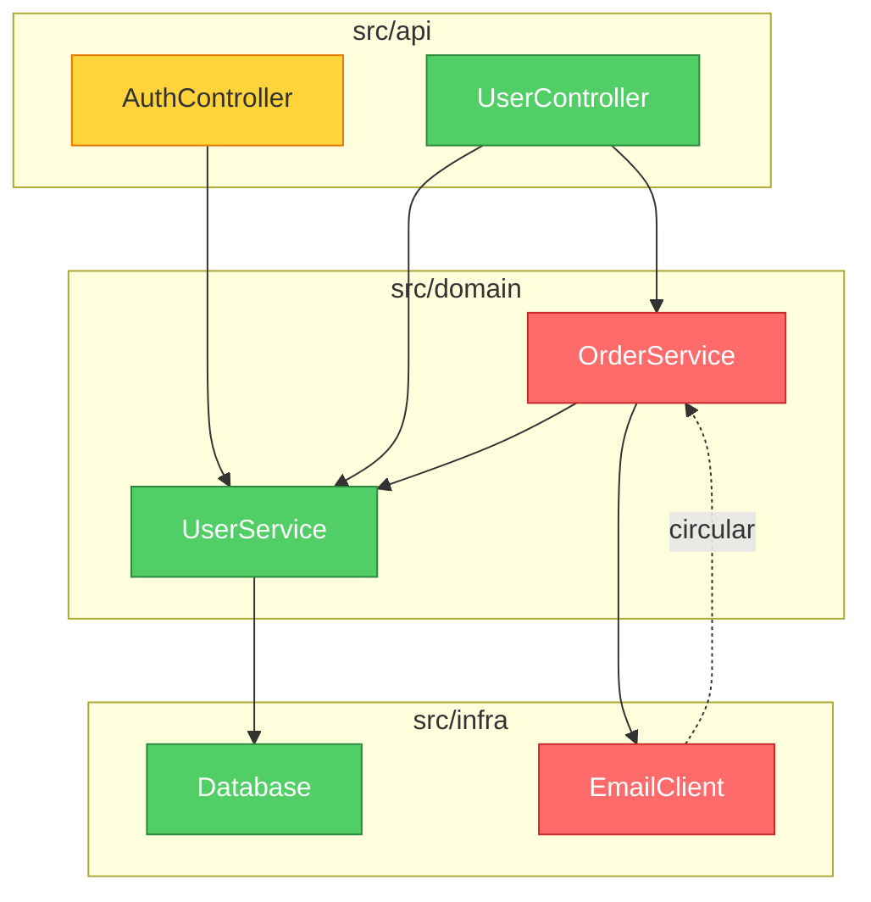

<p align="center">
  
</p>

<h1 align="center">brooks-lint</h1>

<p align="center">
  <strong>十二冊の古典的ソフトウェア工学書に根ざした AI コードレビュー。<br>
  一貫性があり、追跡可能で、実行に移せる。</strong>
</p>

<p align="center">
  <a href="README.md">English</a> ·
  <a href="README.zh-CN.md">简体中文</a> ·
  <a href="README.zh-TW.md">繁體中文</a> ·
  <strong>日本語</strong> ·
  <a href="README.ko.md">한국어</a> ·
  <a href="README.es.md">Español</a>
</p>

<p align="center">
  <a href="#クイックスタート">クイックスタート</a> •
  <a href="#六つの劣化リスク">六つの劣化リスク</a> •
  <a href="#出力イメージ">出力イメージ</a> •
  <a href="#ベンチマーク">ベンチマーク</a> •
  <a href="#インストール">インストール</a>
</p>

<p align="center">
  
  
  
  
  
</p>

<p align="center">
  <a href="https://trendshift.io/repositories/47738" target="_blank"></a>
</p>

<p align="center">
  
</p>

<p align="center">
  <a href="https://hyhmrright.github.io/brooks-lint/"></a>
</p>

<p align="center">
  <strong><a href="https://hyhmrright.github.io/brooks-lint/">→ ウェブサイトを見る</a></strong>
</p>

---

> *"一人の子を産むのに九か月かかるのは、何人の女性を割り当てても変わらない。"*
> — Frederick Brooks, *The Mythical Man-Month*（人月の神話、1975）

**50 年が経った今も Brooks は正しかった——そして McConnell、Fowler、Martin、Hunt & Thomas、Evans、Ousterhout、Winters、Meszaros、Osherove、Feathers、そして Google のテストチームもまた正しかった。**

ほとんどのコード品質ツールは行数と循環的複雑度を数えるだけです。**brooks-lint** はさらに踏み込みます——十二冊の古典的ソフトウェア工学書から統合した六つの劣化リスク次元に照らしてコードを診断し、毎回、書籍の出典・重大度ラベル・具体的な対策を備えた構造化された指摘を生成します。

例外や誤検知ガードを含む「出典—スキル」の完全なマッピングは、
[`skills/_shared/source-coverage.md`](skills/_shared/source-coverage.md) を参照してください。

## クイックスタート

```bash
# Claude Code
/plugin marketplace add hyhmrright/brooks-lint
/plugin install brooks-lint@brooks-lint-marketplace

# その他あらゆる Agent Skills プラットフォーム — Cursor · Codex · Gemini · Copilot · Windsurf · OpenCode · Kiro · …
curl -fsSL https://raw.githubusercontent.com/hyhmrright/brooks-lint/main/scripts/install.sh | bash -s -- <platform>
```

あとは話しかけるだけ（「この PR をレビューして」「アーキテクチャを監査して」）——あるいはコマンドを実行します。

| コマンド | 機能 |
|---------|--------------|
| `/brooks-review` | PR または diff をレビュー |
| `/brooks-audit` | アーキテクチャを監査（+ Mermaid 依存関係グラフ） |
| `/brooks-debt` | 優先順位付けされた技術的負債のロードマップ |
| `/brooks-test` | テストスイートの品質レビュー |
| `/brooks-health` | 全次元を横断する健全性ダッシュボード |
| `/brooks-sweep` | 全次元をスイープし、指摘を自動修正 |

すべての指摘は **症状 → 根源 → 結果 → 対策** の形式で、書籍の出典と 0〜100 の健全性スコアとともに返されます。完全なインストール方法（さらに 8 つのプラットフォーム）、コマンドごとの使い方、CI/CD のセットアップは[以下](#インストール)を参照してください。

## 十二冊の書籍

| 書籍 | 著者 | 寄与する先 |
|------|--------|----------------|
| *The Mythical Man-Month*（人月の神話） | Frederick Brooks | R2, R4, R5 |
| *Code Complete*（コードコンプリート） | Steve McConnell | R1, R4 |
| *Refactoring*（リファクタリング） | Martin Fowler | R1, R2, R3, R4, R6 |
| *Clean Architecture*（クリーンアーキテクチャ） | Robert C. Martin | R2, R5 |
| *The Pragmatic Programmer*（達人プログラマー） | Hunt & Thomas | R2, R3, R4, R5, T2, T3 |
| *Domain-Driven Design*（エリック・エヴァンスのドメイン駆動設計） | Eric Evans | R1, R3, R6 |
| *A Philosophy of Software Design*（ソフトウェア設計の哲学） | John Ousterhout | R1, R4 |
| *Software Engineering at Google*（Google のソフトウェアエンジニアリング） | Winters, Manshreck & Wright | R2, R5 |
| *The Art of Unit Testing*（単体テストの考え方／使い方） | Roy Osherove | T1, T2, T4, T5 |
| *How Google Tests Software*（テストから見えてくるグーグルのソフトウェア開発） | James A. Whittaker, Jason Arbon & Jeff Carollo | T5, T6 |
| *Working Effectively with Legacy Code*（レガシーコード改善ガイド） | Michael Feathers | T4, T5, T6 |
| *xUnit Test Patterns*（xUnit テストパターン） | Gerard Meszaros | T1, T2, T3, T4 |

## 六つの劣化リスク

brooks-lint は、十二冊の古典的ソフトウェア工学書から統合した**六つの本番コード劣化リスク**と**六つのテストスイート劣化リスク**の観点から、あなたのコードを評価します。

| 劣化リスク | 診断のための問い | 出典 |
|------------|---------------------|---------|
| 🧠 認知過負荷 | これを理解するのにどれだけの精神的労力が要るか？ | Code Complete, Refactoring, DDD, Philosophy of SD |
| 🔗 変更の波及 | 1 つの変更でいくつの無関係なものが壊れるか？ | Refactoring, Clean Architecture, Pragmatic, SE@Google |
| 📋 知識の重複 | 同じ決定が複数の場所で表現されていないか？ | Pragmatic, Refactoring, DDD |
| 🌀 偶発的複雑性 | コードは問題そのものより複雑になっていないか？ | Refactoring, Code Complete, Brooks, Philosophy of SD |
| 🏗️ 依存関係の無秩序 | 依存は一貫した方向に流れているか？ | Clean Architecture, Brooks, Pragmatic, SE@Google |
| 🗺️ ドメインモデルの歪み | コードはドメインを忠実に表現しているか？ | DDD, Refactoring |

> Philosophy of SD = *A Philosophy of Software Design*（Ousterhout） · SE@Google = *Software Engineering at Google*（Winters ほか）

## 出力イメージ

次のコードが与えられたとき：

```python
class UserService:
    def update_profile(self, user_id, name, email, avatar_url):
        user = self.db.query(f"SELECT * FROM users WHERE id = {user_id}")
        user['email'] = email
        ...
        if user['email'] != email:   # always False — silent bug
            self.smtp.send(...)
        points = user['login_count'] * 10 + 500
        self.db.execute(f"UPDATE loyalty SET points={points} WHERE user_id={user_id}")
```

brooks-lint は次を生成します：

---

**健全性スコア：28/100**

*このメソッドは四つの無関係なビジネス責務を 1 つの関数に集約し、メールアドレス変更通知を静かに握りつぶすロジックバグを含み、SQL インジェクションに対して無防備です。*

### 🔴 変更の波及 — 単一のメソッドが四つの無関係なビジネス理由で変更される
**症状：** `update_profile` は、プロフィール項目の更新、メールアドレス変更通知、ロイヤルティポイントの再計算、キャッシュの無効化を、すべて 1 つのメソッド本体で実行しています。
**根源：** Fowler — *Refactoring* — Divergent Change（発散的変更）；Hunt & Thomas — *The Pragmatic Programmer* — Orthogonality（直交性）
**結果：** ロイヤルティの計算式を変更すると、メール通知を壊すおそれがあり、その逆もまた然りです。すべての編集が、四つの無関係なドメインに同時にまたがる回帰リスクを背負います。
**対策：** `NotificationService`、`LoyaltyService`、`UserCacheInvalidator` を抽出します。`UserService.update_profile` はそれぞれを呼び出してオーケストレーションするだけにし、自身は実装ロジックを一切持たないようにします。

### 🔴 ドメインモデルの歪み — 静かなロジックバグ：メール通知が決して発火しない
**症状：** `user['email'] = email` が `if user['email'] != email` より前に古い値を上書きするため、条件は常に `False` です。通知はデッドコードです。
**根源：** McConnell — *Code Complete* — 第 17 章：変則的な制御構造
**結果：** ユーザーはメールアドレスを変更しても決して通知されません。静かなデータ整合性の破綻です——システムは正常に動作しているように見えながら、ビジネスルールに違反しています。
**対策：** いかなる変更の前にも `old_email = user['email']` を捕捉します。`user['email']` ではなく `old_email` と比較してください。

*（SQL インジェクション、依存関係の無秩序、マジックナンバーを含む、さらに 6 件の指摘）*

### 依存関係グラフ付きのアーキテクチャ監査

モード 2（アーキテクチャ監査）では、brooks-lint はレポートの先頭に **Mermaid 依存関係グラフ** を生成します。モジュールは重大度で色分けされます：赤 = Critical の指摘、黄 = Warning、緑 = クリーン。



このグラフは GitHub、Notion、その他の Markdown 環境でネイティブにレンダリングされます——追加のツールは不要です。

## さらなる例を見る

[完全ギャラリー](docs/gallery.md) には、Python、TypeScript、Go、Java にわたる brooks-lint の実際の出力が収められています——PR レビュー、Mermaid 依存関係グラフ付きのアーキテクチャ監査、技術的負債の評価、テスト品質レビューを含みます。

劣化リスクが初めてですか？[**劣化リスク実践ガイド**](https://hyhmrright.github.io/brooks-lint/guide.html) が六つすべてを解説します——それぞれの診断のための問い、典型的な症状、出典書籍、そして対策。

---

## ベンチマーク

3 つの実世界シナリオ（PR レビュー、アーキテクチャ監査、技術的負債の評価）でテストしました：

| 評価項目 | brooks-lint | Claude 単独 |
|-----------|:-----------:|:------------:|
| 構造化された指摘（症状 → 根源 → 結果 → 対策） | ✅ 100% | ❌ 0% |
| 指摘ごとの書籍引用 | ✅ 100% | ❌ 0% |
| 重大度ラベル（🔴/🟡/🟢） | ✅ 100% | ❌ 0% |
| 健全性スコア（0〜100） | ✅ 100% | ❌ 0% |
| 「変更の波及」を検出 | ✅ 100% | ✅ 100% |
| **総合合格率** | **94%** | **16%** |

差は Claude が何を見つけ*られる*かではありません——何を*毎回一貫して*、追跡可能な根拠と実行可能な対策とともに見つけるか、です。

### 再現可能なベンチマーク

上の表は説明用です。次の数値は**決定論的であり、ローカルで再現できます**：

**パーサー忠実度** — SARIF エクスポートと CI ゲートは、モデルの Markdown レポートを正しく解析できることに依存しています。全六モードにまたがる**30 件の実在するモデル生成レポートの凍結コーパス**（`evals/benchmark-corpus.json`）に対して——各レポートには**独立して採点された**指摘インベントリ（別のモデルパスによるもので、手作業でスポットチェック済み）が対になっています——出荷されているパーサーは次のスコアを出します。`npm run benchmark` を実行してください：

| 指標（n = 30、凍結コーパス） | 結果 |
|---|:---:|
| 重大度カウントの完全一致（パーサー vs 採点済み真値） | 30 / 30 |
| リスクコードの precision / recall | 100% / 100%（56 件の finding レベルコード、0 FP / 0 FN） |
| 妥当な SARIF 2.1.0 の出力 | 30 / 30 |

パーサーは決定論的で、コーパスは凍結されているため、`npm run benchmark` は誰に対しても同じ結果を返し、`npm test` がこれを回帰として守ります。このコーパスには、クリーンなままであるべき 9 件の誤検知 / トレードオフレポート（例：依存サイクルの*ように見える*ポートとアダプターの設計）が意図的に含まれています。

**スコアリングの決定論性** — 固定された指摘集合（2 Critical / 3 Warning / 1 Suggestion）に対し、厳格度プリセットは `common.md` の表が予測する通りのスコアを正確に算出します：strict **34**、balanced **54**、legacy-friendly **74**——そして上位三件の修正を先頭に示すのは `legacy-friendly` だけです。

**モデル品質** — モデルが実際のコードで*正しい*リスクを見つけられるかは、**57 シナリオの eval スイート**（`evals/evals.json`）で測定されます：`npm run evals`（構造）と `npm run evals:live`（ライブ、`ANTHROPIC_API_KEY` が必要）。

> 範囲と誠実さについて：パーサーの数値は決定論的で、正確に再現可能です。厳格度と eval スイートの数値はモデルに対する単発のライブ測定で、実行ごとにわずかに変動します。パーサーのベンチマークが測るのはレポート解析の忠実度（ツールはレポートに書かれたすべての指摘を読み取れるか）であって、ある指摘が「正しい」かどうかではありません。重大度カウントの一致は完全に独立したシグナルです。リスクコードの一致は、共有された正規の name→code 凡例も反映しています。

## 比較

| | brooks-lint | ESLint / Pylint | GitHub Copilot Review | 素の Claude |
|---|:---:|:---:|:---:|:---:|
| 構文・スタイルの問題を検出 | — | ✅ | ✅ | ~ |
| 構造化された診断チェーン | ✅ | ❌ | ❌ | ❌ |
| 指摘を古典書籍まで遡る | ✅ | ❌ | ❌ | ❌ |
| 一貫した重大度ラベル | ✅ | ✅ | ~ | ❌ |
| アーキテクチャレベルの洞察 | ✅ | ❌ | ~ | ~ |
| ドメインモデル分析 | ✅ | ❌ | ❌ | ~ |
| 設定不要、インストールするプラグインなし | ✅ | ❌ | ✅ | ✅ |
| あらゆる言語で動作 | ✅ | ❌ | ✅ | ✅ |

> `~` = 時々 / 一貫しない

**brooks-lint はあなたの linter を置き換えるものではありません。** それが捉えるのは linter には捉えられないもの——アーキテクチャのドリフト、知識のサイロ化、ドメインモデルの歪みです。これらは、誰かが気づくまで何か月もチームの足を引っ張る問題です。

## インストール

### Claude Code（推奨）

#### プラグインマーケットプレイス経由
```bash
/plugin marketplace add hyhmrright/brooks-lint
/plugin install brooks-lint@brooks-lint-marketplace
```

短縮形コマンド（`/brooks-review`）は、最初のセッション開始時に自動インストールされます。手動でインストールするには：
```bash
bash hooks/session-start
```

#### 手動インストール
```bash
mkdir -p ~/.claude/skills/brooks-lint
cp -r skills/* ~/.claude/skills/brooks-lint/
```

### Gemini CLI

#### 拡張機能経由
```bash
/extensions install https://github.com/hyhmrright/brooks-lint
```

#### 手動インストール
```bash
mkdir -p ~/.gemini/skills
cp -r skills/* ~/.gemini/skills/      # フラット — Gemini はスキルを 1 階層深さまでしか発見しない
```
> または単に：`./scripts/install.sh gemini`

### Codex CLI

#### スキルインストーラー経由（Codex セッション内）
```
Install the brooks-lint skill from hyhmrright/brooks-lint
```

#### コマンドライン
```bash
python3 ~/.codex/skills/.system/skill-installer/scripts/install-skill-from-github.py \
  --repo hyhmrright/brooks-lint --path skills --name brooks-lint
```

#### 手動インストール
```bash
git clone https://github.com/hyhmrright/brooks-lint.git /tmp/brooks-lint
mkdir -p ~/.codex/skills
cp -r /tmp/brooks-lint/skills/* ~/.codex/skills/   # フラット — スキルインストーラーのレイアウトと一致
```
> または単に：`./scripts/install.sh codex`

### さらなるプラットフォーム — OpenCode · Cursor · Windsurf · Antigravity · pi · Copilot · Kiro · Factory Droid

brooks-lint は標準的な [Agent Skills](https://agentskills.io) として配布されています。**Agent
Skills を読み込むエージェントなら、どれも変換なしで六つすべてのモードを実行できます**——1 つのコマンドでインストールできます：

```bash
# プラットフォームを選択；--project はグローバル設定ではなく現在のリポジトリにインストール
curl -fsSL https://raw.githubusercontent.com/hyhmrright/brooks-lint/main/scripts/install.sh | bash -s -- <platform>
#   <platform> = opencode · cursor · windsurf · antigravity · pi · kiro · copilot · droid · gemini · codex · agents
```

インストーラーはスキルをあなたのプラットフォームに適したフォルダへ**フラット**にコピーするため、共有フレームワーク
（`../_shared/`）は常に正しく解決されます——レイアウトを間違えようがありません。あとは話しかけるだけ
（「この PR をレビューして」「アーキテクチャを監査して」）で、該当するスキルがその
`description` に基づいて自動的にトリガーされます。スキルが初めて、または別のエージェントをお使いですか？ **[docs/getting-started.md](docs/getting-started.md)** を参照してください。

<details><summary><b>OpenCode</b></summary>

`./scripts/install.sh opencode` → `~/.config/opencode/skills`（`~/.claude/skills` と
`AGENTS.md` も読み取ります）。完全ガイド：[docs/opencode-setup.md](docs/opencode-setup.md)。
</details>

<details><summary><b>Cursor</b>（2.4+）</summary>

`./scripts/install.sh cursor` → `~/.cursor/skills`（`.agents/skills` も；`AGENTS.md` を読み取ります）。
完全ガイド：[docs/cursor-setup.md](docs/cursor-setup.md)。
</details>

<details><summary><b>Windsurf</b>（Cascade）</summary>

`./scripts/install.sh windsurf` → `~/.codeium/windsurf/skills`（`AGENTS.md` を読み取ります）。
完全ガイド：[docs/windsurf-setup.md](docs/windsurf-setup.md)。
</details>

<details><summary><b>Antigravity</b>（Google）</summary>

`./scripts/install.sh antigravity --project` → `.agent/skills`（`AGENTS.md` / `GEMINI.md` を読み取ります）。
完全ガイド：[docs/antigravity-setup.md](docs/antigravity-setup.md)。
</details>

<details><summary><b>pi</b>（earendil-works）</summary>

`./scripts/install.sh pi` → `~/.pi/agent/skills`、または pi の `skills` 設定をクローンに向けます。
完全ガイド：[docs/pi-setup.md](docs/pi-setup.md)。
</details>

<details><summary><b>GitHub Copilot</b></summary>

`./scripts/install.sh copilot --project` → `.github/skills`（`.claude/skills` も自動検出；
`AGENTS.md` を読み取ります）。完全ガイド：[docs/copilot-setup.md](docs/copilot-setup.md)。
</details>

<details><summary><b>Kiro</b>（AWS）</summary>

`./scripts/install.sh kiro` → `~/.kiro/skills`（`/brooks-review` を自動登録；`AGENTS.md` を読み取ります）。
完全ガイド：[docs/kiro-setup.md](docs/kiro-setup.md)。
</details>

<details><summary><b>Factory Droid</b></summary>

`./scripts/install.sh droid` → `~/.factory/skills`（`/brooks-review` を登録；`AGENTS.md` を読み取ります）。
完全ガイド：[docs/factory-droid-setup.md](docs/factory-droid-setup.md)。
</details>

> **🧪 検証状況。** Claude Code、Gemini CLI、Codex CLI はメンテナーによって検証済みです。上記の八つの
> プラットフォームは各ツールの公式スキル仕様から文書化され、ファイルレイアウトのレベルで検証されています
> （インストーラーはテスト済み）が、メンテナーがすべてのプラットフォームでエンドツーエンドに実行したわけ
> ではまだありません。どれかを試した——動いた **または** 壊れた？ プラットフォーム、バージョン、見たこと
> を添えて [issue を立ててください](https://github.com/hyhmrright/brooks-lint/issues/new)。別の
> Agent-Skills エージェント？ ほぼ確実に同じように動作します——お知らせいただければ追加します。

## スラッシュコマンド

### Claude Code
| コマンド | 短縮形 | アクション |
|---------|------------|--------|
| `/brooks-lint:brooks-review` | `/brooks-review` | PR レベルのコードレビュー |
| `/brooks-lint:brooks-audit` | `/brooks-audit` | 完全なアーキテクチャ監査 |
| `/brooks-lint:brooks-debt` | `/brooks-debt` | 技術的負債の評価 |
| `/brooks-lint:brooks-test` | `/brooks-test` | テストスイートの健全性レビュー |
| `/brooks-lint:brooks-health` | `/brooks-health` | 健全性ダッシュボード — 全四次元 |
| `/brooks-lint:brooks-sweep` | `/brooks-sweep` | 全面スイープ — 全次元を分析し指摘を自動修正 |

> 短縮形コマンドは、session-start フックによって最初のセッション開始時に自動インストールされます。

### Gemini CLI
| コマンド | アクション |
|---------|--------|
| `/brooks-review` | PR レベルのコードレビュー |
| `/brooks-audit` | 完全なアーキテクチャ監査 |
| `/brooks-debt` | 技術的負債の評価 |
| `/brooks-test` | テストスイートの健全性レビュー |
| `/brooks-health` | 健全性ダッシュボード — 全四次元 |
| `/brooks-sweep` | 全面スイープ — 全次元を分析し指摘を自動修正 |

### Codex CLI

| コマンド | アクション |
|---------|--------|
| `$brooks-review` | PR レベルのコードレビュー |
| `$brooks-audit` | 完全なアーキテクチャ監査 |
| `$brooks-debt` | 技術的負債の評価 |
| `$brooks-test` | テストスイートの健全性レビュー |
| `$brooks-health` | 健全性ダッシュボード — 全四次元 |
| `$brooks-sweep` | 全面スイープ — 全次元を分析し指摘を自動修正 |

コード品質、アーキテクチャ、保守性、テストの健全性について話すと、これらのスキルは自動的にもトリガーされます。

### OpenCode · Cursor · Antigravity · pi

これらのプラットフォームは、各スキルの `description` に基づいて Agent Skills を自動的に呼び出します——話しかけるだけ
（「この PR をレビューして」「アーキテクチャを監査して」「うちの最悪の技術的負債はどこ？」）で、該当するモードが
実行されます。明示的に呼び出すには、各プラットフォームのスキルコマンド構文を使います（例：pi は各スキルを
`/skill:brooks-review` として登録します；Cursor と OpenCode はスキルが発見されると `/brooks-review` を公開します）。

## 使い方

### PR レビュー

```
/brooks-review                      # Claude Code（短縮形）/ Gemini CLI
/brooks-lint:brooks-review          # Claude Code（完全形）
$brooks-review                      # Codex CLI
```

diff を貼り付けるか、AI を変更されたファイルに向けてください。六つの劣化リスクそれぞれを、症状 → 根源 → 結果 → 対策 の形式で具体的な指摘とともに診断します。

### アーキテクチャ監査

```
/brooks-audit                       # Claude Code（短縮形）/ Gemini CLI
/brooks-lint:brooks-audit           # Claude Code（完全形）
$brooks-audit                       # Codex CLI
```

プロジェクト構造を説明するか、主要なファイルを共有してください。モジュールの依存関係をマッピングし、循環依存を特定し、コンウェイの法則との整合性をチェックします。

### 技術的負債の評価

```
/brooks-debt                        # Claude Code（短縮形）/ Gemini CLI
/brooks-lint:brooks-debt            # Claude Code（完全形）
$brooks-debt                        # Codex CLI
```

あなたの負債を六つの劣化リスクにわたって分類し、各指摘を 痛み × 広がり の優先度で採点し、Critical / Scheduled / Monitored の分類を備えた優先順位付き返済ロードマップを生成します。

### テスト品質レビュー

```
/brooks-test                        # Claude Code（短縮形）/ Gemini CLI
/brooks-lint:brooks-test            # Claude Code（完全形）
$brooks-test                        # Codex CLI
```

あなたのテストスイートを、六つのテスト空間の劣化リスク——テストの不透明性、テストの脆さ、テストの重複、モックの濫用、カバレッジの幻想、アーキテクチャの不一致——に照らして監査します。出典は xUnit Test Patterns、The Art of Unit Testing、How Google Tests Software、Working Effectively with Legacy Code です。PR レビューには、軽量な Step 7 のクイックテストチェックも自動的に含まれます（ドキュメントのみ、または非本番の diff ではスキップ）。

### 健全性ダッシュボード

```
/brooks-health                      # Claude Code（短縮形）/ Gemini CLI
/brooks-lint:brooks-health          # Claude Code（完全形）
$brooks-health                      # Codex CLI
```

全四つの品質次元にわたって簡略化されたスキャンを実行し、重み付けされた総合健全性スコア（0〜100）を生成します。リリース前、新しいチームのオンボーディング時、あるいは「うちは今どうなっている？」という全体像レポートが欲しいときに使ってください。いずれかの次元についてより深い診断が必要な場合は、代わりに専用スキルを使ってください。

### 全面スイープ

```
/brooks-sweep                       # Claude Code（短縮形）/ Gemini CLI
/brooks-lint:brooks-sweep           # Claude Code（完全形）
$brooks-sweep                       # Codex CLI
```

すべての本番（R1–R6）とテスト（T1–T6）の劣化リスク、加えてアーキテクチャを一度のパスでスキャンし、その後修正を適用します：安全な変更は即座に自動適用され、複数ファイルにまたがる、またはインターフェースに触れる変更は確認を必要とし、複雑なアーキテクチャ上の決定は手動対応項目としてフラグが立てられます。修正ログ、健全性スコアの差分、残存項目リストを出力します。

## 設定

レビューの挙動をカスタマイズするには、プロジェクトのルートに `.brooks-lint.yaml` を置きます：

```yaml
version: 1

strictness: balanced   # strict | balanced (default) | legacy-friendly — softer scoring for legacy code

disable:
  - T5   # skip coverage metrics check — we don't enforce coverage

severity:
  R1: suggestion   # downgrade Cognitive Overload findings for this domain

ignore:
  - "**/*.generated.*"
  - "**/vendor/**"

# custom_risks:   # define project-specific Cx codes — see skills/_shared/custom-risks-guide.md
# suppress:       # downgrade specific findings by risk + path (e.g. accepted legacy debt)
```

出発点として [`.brooks-lint.example.yaml`](.brooks-lint.example.yaml) をコピーしてください。
すべての設定は任意です——ファイルを完全に省略すればデフォルトの挙動になります。

| 設定 | 説明 |
|---------|-------------|
| `strictness` | スコアリングプリセット：`strict`、`balanced`（デフォルト）、または `legacy-friendly`（軽めの減点で、上位の修正を先頭に示す） |
| `disable` | スキップするリスクコード（`R1`–`R6`、`T1`–`T6`） |
| `severity` | 重大度ティアを上書き（`critical` / `warning` / `suggestion`） |
| `ignore` | 除外するファイルの glob パターン |
| `focus` | これらのリスクコードのみを評価（`disable` とは併用不可） |
| `custom_risks` | プロジェクト固有のリスクコードを定義（`C1`、`C2`、…）——[`custom-risks-guide.md`](skills/_shared/custom-risks-guide.md) を参照 |
| `suppress` | リスク + パスで特定の指摘を格下げ（任意の `expires:` 日付付き） |

---

## なぜこれらの書籍か、なぜ今か？

AI 支援コーディングの時代において、私たちはこれまで以上に速く、多くのコードを書いています。しかし、六十年にわたるソフトウェア工学の洞察は変わっていません：

> *"ソフトウェアの複雑性は本質的な性質であって、偶発的な性質ではない。"*
> — Frederick Brooks

AI はコードをより速く書く手助けはできても、あなたが大聖堂を建てているのかタールの穴を掘っているのかは教えてくれません。**brooks-lint はそのギャップを埋めます**——十二冊の古典的ソフトウェア工学書から得られた、苦労して獲得された知恵を、あなたの現代的な開発ワークフローに持ち込みます。

これらの著者が特定した劣化リスクは、かつてないほど切実です：
- **AI アシスタントを追加しても** 認知過負荷やドメインモデルの歪みは解消されません
- **より多くのコードを生成すると** 変更の波及と知識の重複が増大します
- **より速く動くことは** 偶発的複雑性と依存関係の無秩序をいっそう危険にします

## プロジェクト構成

```
brooks-lint/
├── .claude-plugin/              # Claude Code plugin metadata
├── .codex-plugin/               # Codex CLI plugin metadata
├── skills/
│   ├── _shared/                 # Shared framework files
│   │   ├── common.md            # Iron Law, Project Config, Report Template, Health Score
│   │   ├── source-coverage.md   # 12-book coverage matrix, tradeoffs, false-positive guards
│   │   ├── decay-risks.md       # Six decay risks with symptoms and book citations
│   │   ├── test-decay-risks.md  # Six test-space decay risks with book citations
│   │   ├── remedy-guide.md      # --fix mode: actionable Remedy enhancement rules
│   │   └── custom-risks-guide.md  # Template for project-specific risk codes
│   ├── brooks-review/           # Mode 1: PR Review
│   │   ├── SKILL.md
│   │   └── pr-review-guide.md
│   ├── brooks-audit/            # Mode 2: Architecture Audit
│   │   ├── SKILL.md
│   │   └── architecture-guide.md
│   ├── brooks-debt/             # Mode 3: Tech Debt Assessment
│   │   ├── SKILL.md
│   │   └── debt-guide.md
│   ├── brooks-test/             # Mode 4: Test Quality Review
│   │   ├── SKILL.md
│   │   └── test-guide.md
│   ├── brooks-health/           # Mode 5: Health Dashboard
│   │   ├── SKILL.md
│   │   └── health-guide.md
│   └── brooks-sweep/            # Mode 6: Full Sweep & Auto-Fix
│       ├── SKILL.md
│       └── sweep-guide.md
├── hooks/                       # SessionStart hook
├── commands/                    # Short-form command wrappers (auto-installed by hook)
├── evals/                       # Benchmark test cases
│   └── evals.json
└── assets/
    └── logo.svg
```

## CI/CD 統合

GitHub Action を使って、すべての PR で brooks-lint を自動実行します：

```yaml
# .github/workflows/brooks-lint.yml
name: Brooks-Lint PR Review
on:
  pull_request:
    types: [opened, synchronize, reopened]

jobs:
  brooks-lint:
    runs-on: ubuntu-latest
    permissions:
      pull-requests: write
    steps:
      - uses: actions/checkout@v4
        with:
          fetch-depth: 0
      - uses: hyhmrright/brooks-lint/.github/actions/brooks-lint@main
        with:
          mode: review
          anthropic-api-key: ${{ secrets.ANTHROPIC_API_KEY }}
          fail-below: 70
```

完全なテンプレートは [`docs/github-action-example.yml`](docs/github-action-example.yml) を参照してください。

この Action はレビューを PR コメントとして投稿し、必要に応じて健全性スコアがしきい値を下回った場合にチェックを失敗させます。`.brooks-lint-history.json` がリポジトリにコミットされていれば、コメントにはトレンドの差分も含まれます（例：「85 → 82（−3）、直近 3 回の実行」）。

**品質ゲートと Code Scanning。** `fail-below` に加えて、この Action は次を公開しています：

```yaml
        with:
          mode: review
          anthropic-api-key: ${{ secrets.ANTHROPIC_API_KEY }}
          fail-on: critical            # fail on any Critical finding (none | warning | critical)
          fail-on-regression: true     # fail if the Health Score dropped vs the last run
          sarif-file: brooks-lint.sarif  # also upload findings to GitHub Code Scanning
```

`fail-on-regression` は `.brooks-lint-history.json` を読み取るため、そのファイルをコミットすれば「新たな回帰なし」を強制できます。`sarif-file` を設定すると、指摘が PR の **Files changed** タブにインラインで表示されるようになり、ジョブに `security-events: write` 権限が必要になります。

**コスト：** PR 実行ごとにおよそ $0.05〜0.15、diff のサイズとモデルによります。`pull_request` イベントのみで実行することを推奨します。

## ロードマップ

> **現状（v1.4）：** 12 冊の書籍を土台に、6 つの本番劣化リスク（R1–R6）+ 6 つのテスト劣化リスク（T1–T6）、6 つのスキル——PR レビュー、アーキテクチャ監査、技術的負債、テスト品質、健全性ダッシュボード、全面スイープ——に加え、CI 品質ゲート、GitHub Code Scanning 向けの SARIF 出力、厳格度プリセット、そして再現可能なパーサー忠実度ベンチマーク。下の以前のエントリは歴史的なマイルストーンを記述したものであり、現在の機能セットではありません。

- [x] **v0.2**：プラグインインフラ（`.claude-plugin/`、フック、スラッシュコマンド）
- [x] **v0.3**：八つの Brooks 次元、ドキュメント完全性スコアリング
- [x] **v0.4**：六冊の書籍フレームワーク、劣化リスク次元、診断チェーン、ベンチマークスイート
- [x] **v0.5**：テスト品質レビュー（モード 4）——四冊のテスト書籍、六つのテスト劣化リスク
- [x] **v0.6**：アーキテクチャ監査における Mermaid 依存関係グラフ
- [x] **v0.7**：`.brooks-lint.yaml` プロジェクト設定、モード 2 のプロアクティブコンテキスト、10 冊への拡張
- [x] **v0.8**：名前空間付きコマンドを備えた独立スキルアーキテクチャ
- [x] **v0.9**：ステップ検証、自動 diff スコープ、`/brooks-health` ダッシュボード、トレンド追跡、トリアージモード、`--fix` 対策、オンボーディングレポート、GitHub Action
- [x] **v1.0**：eval 自動化（`run-evals-live.mjs`）、カスタムリスク拡張（`Cx` コード）
- [x] **v1.1**：全面スイープスキル（`brooks-sweep`）——統合された多次元自動修正
- [x] **v1.2**：自律的なスイープパイプライン、`npm run bump` によるバージョン伝播
- [x] **v1.3**：Codex マーケットプレイスメタデータ、複数のエージェントプラットフォーム向けのワンコマンドインストーラー、バイリンガル README + ランディングサイト
- [x] **v1.4**：GitHub Code Scanning 向けの SARIF 出力、CI の severity + 回帰ゲート、厳格度プリセット（strict/balanced/legacy-friendly）、57 シナリオの eval スイート、再現可能なパーサー忠実度ベンチマーク（`npm run benchmark`）

手伝いたいですか？ 今もっとも価値ある貢献は、新しい eval テストケースと、より優れた劣化リスクの症状パターンです。[CONTRIBUTING.md](CONTRIBUTING.md) を参照してください。

## 貢献

指摘の追加、ガイドの改善、ベンチマークスイートの拡張の方法は [CONTRIBUTING.md](CONTRIBUTING.md) を参照してください。

あなた自身の PR で `/brooks-review` を実行してください——私たちは、作っているそのツールで貢献をレビューしています。

## ライセンス

MIT License——詳細は [LICENSE](LICENSE) を参照してください。

## 謝辞

このプロジェクトは十二人の巨人の肩の上に立っています：

**本番コードフレームワーク**
- Frederick P. Brooks Jr. — *The Mythical Man-Month*（1975、記念版 1995）
- Steve McConnell — *Code Complete*（1993、第 2 版 2004）
- Martin Fowler — *Refactoring*（1999、第 2 版 2018）
- Robert C. Martin — *Clean Architecture*（2017）
- Andrew Hunt & David Thomas — *The Pragmatic Programmer*（1999、20 周年版 2019）
- Eric Evans — *Domain-Driven Design*（2003）
- John Ousterhout — *A Philosophy of Software Design*（2018）
- Titus Winters, Tom Manshreck, Hyrum Wright — *Software Engineering at Google*（2020）

**テスト品質フレームワーク**
- Gerard Meszaros — *xUnit Test Patterns*（2007）
- Roy Osherove — *The Art of Unit Testing*（2009、第 3 版 2023）
- Google Engineering — *How Google Tests Software*（2012）
- Michael Feathers — *Working Effectively with Legacy Code*（2004）

このツールにエンコードされた劣化リスクは、彼らのアイデアを統合し、現代のコード品質評価に応用した私たちの成果です。

---

## スター履歴

[](https://star-history.com/#hyhmrright/brooks-lint&Date)

---

<p align="center">
  <strong>⭐ このツールがあなたのコードベースを違った目で見る助けになったなら、スターをお願いします！</strong>
</p>
