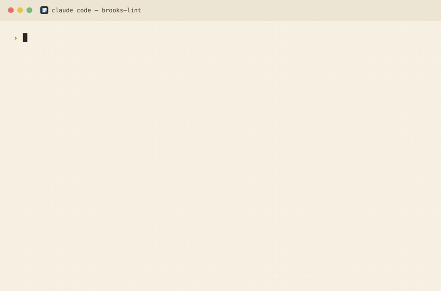
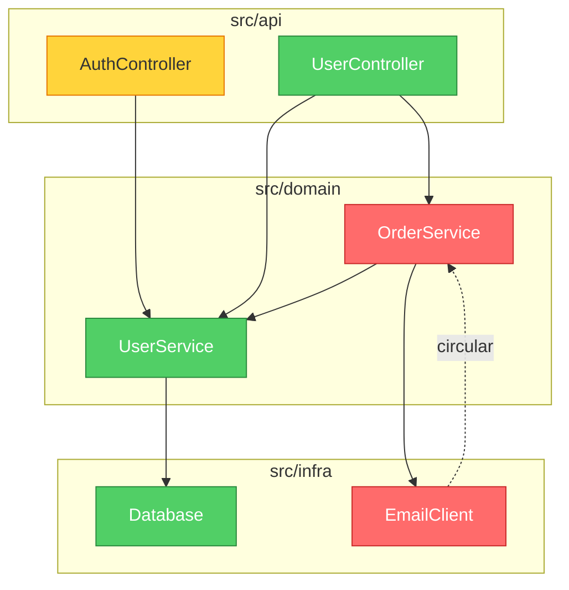

<p align="center">
  
</p>

<h1 align="center">brooks-lint</h1>

<p align="center">
  <strong>十二冊の古典的ソフトウェア工学書に根ざした AI コードレビュー。<br>
  一貫性があり、追跡可能で、実行に移せる。</strong>
</p>

<p align="center">
  <a href="README.md">English</a> ·
  <a href="README.zh-CN.md">简体中文</a> ·
  <a href="README.zh-TW.md">繁體中文</a> ·
  <strong>日本語</strong> ·
  <a href="README.ko.md">한국어</a> ·
  <a href="README.es.md">Español</a>
</p>

<p align="center">
  <a href="#クイックスタート">クイックスタート</a> •
  <a href="#六つの劣化リスク">六つの劣化リスク</a> •
  <a href="#出力イメージ">出力イメージ</a> •
  <a href="#ベンチマーク">ベンチマーク</a> •
  <a href="#インストール">インストール</a>
</p>

<p align="center">
  
  
  
  
  
</p>

<p align="center">
  <a href="https://trendshift.io/repositories/47738" target="_blank"></a>
</p>

<p align="center">
  
</p>

<p align="center">
  <a href="https://hyhmrright.github.io/brooks-lint/"></a>
</p>

<p align="center">
  <strong><a href="https://hyhmrright.github.io/brooks-lint/">→ ウェブサイトを見る</a></strong>
</p>

---

> *"一人の子を産むのに九か月かかるのは、何人の女性を割り当てても変わらない。"*
> — Frederick Brooks, *The Mythical Man-Month*（人月の神話、1975）

**50 年が経った今も Brooks は正しかった——そして McConnell、Fowler、Martin、Hunt & Thomas、Evans、Ousterhout、Winters、Meszaros、Osherove、Feathers、そして Google のテストチームもまた正しかった。**

ほとんどのコード品質ツールは行数と循環的複雑度を数えるだけです。**brooks-lint** はさらに踏み込みます——十二冊の古典的ソフトウェア工学書から統合した六つの劣化リスク次元に照らしてコードを診断し、毎回、書籍の出典・重大度ラベル・具体的な対策を備えた構造化された指摘を生成します。

例外や誤検知ガードを含む「出典—スキル」の完全なマッピングは、
[`skills/_shared/source-coverage.md`](skills/_shared/source-coverage.md) を参照してください。

## クイックスタート

```bash
# Claude Code
/plugin marketplace add hyhmrright/brooks-lint
/plugin install brooks-lint@brooks-lint-marketplace

# その他あらゆる Agent Skills プラットフォーム — Cursor · Codex · Gemini · Copilot · Windsurf · OpenCode · Kiro · …
curl -fsSL https://raw.githubusercontent.com/hyhmrright/brooks-lint/main/scripts/install.sh | bash -s -- <platform>
```

あとは話しかけるだけ（「この PR をレビューして」「アーキテクチャを監査して」）、あるいは六つのコマンドの
いずれかを実行します——`/brooks-review`、`/brooks-audit`、`/brooks-debt`、`/brooks-test`、
`/brooks-health`、`/brooks-sweep`（[それぞれの機能](#スラッシュコマンド)）。

すべての指摘は **症状 → 根源 → 結果 → 対策** の形式で、書籍の出典と 0〜100 の健全性スコアとともに
返されます。完全なインストール方法（さらに 9 つのプラットフォーム）と CI/CD のセットアップは
[以下](#インストール)を参照してください。

## 十二冊の書籍

| 書籍 | 著者 | 寄与する先 |
|------|--------|----------------|
| *The Mythical Man-Month*（人月の神話、1975） | Frederick P. Brooks Jr. | R2, R4, R5 |
| *Code Complete*（コードコンプリート、1993、第2版 2004） | Steve McConnell | R1, R4 |
| *Refactoring*（リファクタリング、1999、第2版 2018） | Martin Fowler | R1, R2, R3, R4, R6 |
| *Clean Architecture*（クリーンアーキテクチャ、2017） | Robert C. Martin | R2, R5 |
| *The Pragmatic Programmer*（達人プログラマー、1999、20周年版 2019） | Andrew Hunt & David Thomas | R2, R3, R4, R5, T2, T3 |
| *Domain-Driven Design*（エリック・エヴァンスのドメイン駆動設計、2003） | Eric Evans | R1, R3, R6 |
| *A Philosophy of Software Design*（ソフトウェア設計の哲学、2018） | John Ousterhout | R1, R4 |
| *Software Engineering at Google*（Google のソフトウェアエンジニアリング、2020） | Winters, Manshreck & Wright | R2, R5 |
| *The Art of Unit Testing*（単体テストの考え方／使い方、2009、第3版 2023） | Roy Osherove | T1, T2, T4, T5 |
| *How Google Tests Software*（テストから見えてくるグーグルのソフトウェア開発、2012） | Whittaker, Arbon & Carollo | T5, T6 |
| *Working Effectively with Legacy Code*（レガシーコード改善ガイド、2004） | Michael Feathers | T4, T5, T6 |
| *xUnit Test Patterns*（xUnit テストパターン、2007） | Gerard Meszaros | T1, T2, T3, T4 |

## 六つの劣化リスク

brooks-lint は、十二冊の古典的ソフトウェア工学書から統合した**六つの本番コード劣化リスク**と**六つのテストスイート劣化リスク**の観点から、あなたのコードを評価します。

| 劣化リスク | 診断のための問い | 出典 |
|------------|---------------------|---------|
| 🧠 認知過負荷 | これを理解するのにどれだけの精神的労力が要るか？ | Code Complete, Refactoring, DDD, Philosophy of SD |
| 🔗 変更の波及 | 1 つの変更でいくつの無関係なものが壊れるか？ | Refactoring, Clean Architecture, Pragmatic, SE@Google |
| 📋 知識の重複 | 同じ決定が複数の場所で表現されていないか？ | Pragmatic, Refactoring, DDD |
| 🌀 偶発的複雑性 | コードは問題そのものより複雑になっていないか？ | Refactoring, Code Complete, Brooks, Philosophy of SD |
| 🏗️ 依存関係の無秩序 | 依存は一貫した方向に流れているか？ | Clean Architecture, Brooks, Pragmatic, SE@Google |
| 🗺️ ドメインモデルの歪み | コードはドメインを忠実に表現しているか？ | DDD, Refactoring |

> Philosophy of SD = *A Philosophy of Software Design*（Ousterhout） · SE@Google = *Software Engineering at Google*（Winters ほか）

## 出力イメージ

次のコードが与えられたとき：

```python
class UserService:
    def update_profile(self, user_id, name, email, avatar_url):
        user = self.db.query(f"SELECT * FROM users WHERE id = {user_id}")
        user['email'] = email
        ...
        if user['email'] != email:   # always False — silent bug
            self.smtp.send(...)
        points = user['login_count'] * 10 + 500
        self.db.execute(f"UPDATE loyalty SET points={points} WHERE user_id={user_id}")
```

brooks-lint は次を生成します：

---

**健全性スコア：28/100**

*このメソッドは四つの無関係なビジネス責務を 1 つの関数に集約し、メールアドレス変更通知を静かに握りつぶすロジックバグを含み、SQL インジェクションに対して無防備です。*

### 🔴 変更の波及 — 単一のメソッドが四つの無関係なビジネス理由で変更される
**症状：** `update_profile` は、プロフィール項目の更新、メールアドレス変更通知、ロイヤルティポイントの再計算、キャッシュの無効化を、すべて 1 つのメソッド本体で実行しています。
**根源：** Fowler — *Refactoring* — Divergent Change（発散的変更）；Hunt & Thomas — *The Pragmatic Programmer* — Orthogonality（直交性）
**結果：** ロイヤルティの計算式を変更すると、メール通知を壊すおそれがあり、その逆もまた然りです。すべての編集が、四つの無関係なドメインに同時にまたがる回帰リスクを背負います。
**対策：** `NotificationService`、`LoyaltyService`、`UserCacheInvalidator` を抽出します。`UserService.update_profile` はそれぞれを呼び出してオーケストレーションするだけにし、自身は実装ロジックを一切持たないようにします。

### 🔴 ドメインモデルの歪み — 静かなロジックバグ：メール通知が決して発火しない
**症状：** `user['email'] = email` が `if user['email'] != email` より前に古い値を上書きするため、条件は常に `False` です。通知はデッドコードです。
**根源：** McConnell — *Code Complete* — 第 17 章：変則的な制御構造
**結果：** ユーザーはメールアドレスを変更しても決して通知されません。静かなデータ整合性の破綻です——システムは正常に動作しているように見えながら、ビジネスルールに違反しています。
**対策：** いかなる変更の前にも `old_email = user['email']` を捕捉します。`user['email']` ではなく `old_email` と比較してください。

*（SQL インジェクション、依存関係の無秩序、マジックナンバーを含む、さらに 6 件の指摘）*

### 依存関係グラフ付きのアーキテクチャ監査

モード 2（アーキテクチャ監査）では、brooks-lint はレポートの先頭に **Mermaid 依存関係グラフ** を生成します。モジュールは重大度で色分けされます：赤 = Critical の指摘、黄 = Warning、緑 = クリーン。


```mermaid
graph TD
    subgraph src/api
        AuthController
        UserController
    end
    subgraph src/domain
        UserService
        OrderService
    end
    subgraph src/infra
        Database
        EmailClient
    end

    AuthController --> UserService
    UserController --> UserService
    UserController --> OrderService
    OrderService --> UserService
    OrderService --> EmailClient
    UserService --> Database
    EmailClient -.->|circular| OrderService

    classDef critical fill:#ff6b6b,stroke:#c92a2a,color:#fff
    classDef warning fill:#ffd43b,stroke:#e67700
    classDef clean fill:#51cf66,stroke:#2b8a3e,color:#fff

    class OrderService,EmailClient critical
    class AuthController warning
    class UserService,UserController,Database clean
```

このグラフは GitHub、Notion、その他の Markdown 環境でネイティブにレンダリングされます——追加のツールは不要です。

## さらなる例を見る

[完全ギャラリー](docs/gallery.md) には、Python、TypeScript、Go、Java にわたる brooks-lint の実際の出力が収められています——PR レビュー、Mermaid 依存関係グラフ付きのアーキテクチャ監査、技術的負債の評価、テスト品質レビューを含みます。

劣化リスクが初めてですか？[**劣化リスク実践ガイド**](https://hyhmrright.github.io/brooks-lint/guide.html) が六つすべてを解説します——それぞれの診断のための問い、典型的な症状、出典書籍、そして対策。

---

## ベンチマーク

3 つの実世界シナリオ（PR レビュー、アーキテクチャ監査、技術的負債の評価）でテストしました：

| 評価項目 | brooks-lint | Claude 単独 |
|-----------|:-----------:|:------------:|
| 構造化された指摘（症状 → 根源 → 結果 → 対策） | ✅ 100% | ❌ 0% |
| 指摘ごとの書籍引用 | ✅ 100% | ❌ 0% |
| 重大度ラベル（🔴/🟡/🟢） | ✅ 100% | ❌ 0% |
| 健全性スコア（0〜100） | ✅ 100% | ❌ 0% |
| 「変更の波及」を検出 | ✅ 100% | ✅ 100% |
| **総合合格率** | **94%** | **16%** |

差は Claude が何を見つけ*られる*かではありません——何を*毎回一貫して*、追跡可能な根拠と実行可能な対策とともに見つけるか、です。

### 再現可能なベンチマーク

上の表は説明用です。次の数値は**決定論的であり、ローカルで再現できます**：

**パーサー忠実度** — SARIF エクスポートと CI ゲートは、モデルの Markdown レポートを正しく解析できることに依存しています。全六モードにまたがる**30 件の実在するモデル生成レポートの凍結コーパス**（`evals/benchmark-corpus.json`）に対して——各レポートには**独立して採点された**指摘インベントリ（別のモデルパスによるもので、手作業でスポットチェック済み）が対になっています——出荷されているパーサーは次のスコアを出します。`npm run benchmark` を実行してください：

| 指標（n = 30、凍結コーパス） | 結果 |
|---|:---:|
| 重大度カウントの完全一致（パーサー vs 採点済み真値） | 30 / 30 |
| リスクコードの precision / recall | 100% / 100%（56 件の finding レベルコード、0 FP / 0 FN） |
| 妥当な SARIF 2.1.0 の出力 | 30 / 30 |

パーサーは決定論的で、コーパスは凍結されているため、`npm run benchmark` は誰に対しても同じ結果を返し、`npm test` がこれを回帰として守ります。このコーパスには、クリーンなままであるべき 9 件の誤検知 / トレードオフレポート（例：依存サイクルの*ように見える*ポートとアダプターの設計）が意図的に含まれています。

**スコアリングの決定論性** — 固定された指摘集合（2 Critical / 3 Warning / 1 Suggestion）に対し、厳格度プリセットは `common.md` の表が予測する通りのスコアを正確に算出します：strict **34**、balanced **54**、legacy-friendly **74**——そして上位三件の修正を先頭に示すのは `legacy-friendly` だけです。

**モデル品質** — モデルが実際のコードで*正しい*リスクを見つけられるかは、**57 シナリオの eval スイート**（`evals/evals.json`）で測定されます：`npm run evals`（構造）と `npm run evals:live`（ライブ、`ANTHROPIC_API_KEY` が必要）。

> 範囲と誠実さについて：パーサーの数値は決定論的で、正確に再現可能です。厳格度と eval スイートの数値はモデルに対する単発のライブ測定で、実行ごとにわずかに変動します。パーサーのベンチマークが測るのはレポート解析の忠実度（ツールはレポートに書かれたすべての指摘を読み取れるか）であって、ある指摘が「正しい」かどうかではありません。重大度カウントの一致は完全に独立したシグナルです。リスクコードの一致は、共有された正規の name→code 凡例も反映しています。

## 比較

| | brooks-lint | ESLint / Pylint | GitHub Copilot Review | 素の Claude |
|---|:---:|:---:|:---:|:---:|
| 構文・スタイルの問題を検出 | — | ✅ | ✅ | ~ |
| 構造化された診断チェーン | ✅ | ❌ | ❌ | ❌ |
| 指摘を古典書籍まで遡る | ✅ | ❌ | ❌ | ❌ |
| 一貫した重大度ラベル | ✅ | ✅ | ~ | ❌ |
| アーキテクチャレベルの洞察 | ✅ | ❌ | ~ | ~ |
| ドメインモデル分析 | ✅ | ❌ | ❌ | ~ |
| 設定不要、インストールするプラグインなし | ✅ | ❌ | ✅ | ✅ |
| あらゆる言語で動作 | ✅ | ❌ | ✅ | ✅ |

> `~` = 時々 / 一貫しない

**brooks-lint はあなたの linter を置き換えるものではありません。** それが捉えるのは linter には捉えられないもの——アーキテクチャのドリフト、知識のサイロ化、ドメインモデルの歪みです。これらは、誰かが気づくまで何か月もチームの足を引っ張る問題です。

## インストール

### Claude Code（推奨）

```bash
/plugin marketplace add hyhmrright/brooks-lint
/plugin install brooks-lint@brooks-lint-marketplace
```

短縮コマンド（`/brooks-review`）は最初のセッション開始時に自動インストールされます——自分で
`bash hooks/session-start` を実行しても構いません。マーケットプレイスを使わない場合：
`mkdir -p ~/.claude/skills/brooks-lint && cp -r skills/* ~/.claude/skills/brooks-lint/`。

### Gemini CLI · Codex CLI

```bash
/extensions install https://github.com/hyhmrright/brooks-lint   # Gemini CLI
```
```
Install the brooks-lint skill from hyhmrright/brooks-lint       # Codex セッション内で話しかける
```

または下記のインストーラーを使用：`./scripts/install.sh gemini` / `./scripts/install.sh codex`。

### その他すべてのプラットフォーム — OpenCode · Cursor · Windsurf · Antigravity · pi · Copilot · Kiro · Factory Droid · DeepSeek Harness

brooks-lint は標準的な [Agent Skills](https://agentskills.io) として配布されています。**Agent
Skills を読み込むエージェントなら、どれも変換なしで六つすべてのモードを実行できます**——1 つのコマンドでインストールできます：

```bash
# プラットフォームを選択；--project はグローバル設定ではなく現在のリポジトリにインストール
curl -fsSL https://raw.githubusercontent.com/hyhmrright/brooks-lint/main/scripts/install.sh | bash -s -- <platform>
#   <platform> = opencode · cursor · windsurf · antigravity · pi · kiro · copilot · droid · dsh · gemini · codex · agents
```

インストーラーはスキルをあなたのプラットフォームに適したフォルダへ**フラット**にコピーするため、共有フレームワーク
（`../_shared/`）は常に正しく解決されます——レイアウトを間違えようがありません。あとは話しかけるだけ
（「この PR をレビューして」「アーキテクチャを監査して」）で、該当するスキルがその `description` に基づいて
自動的にトリガーされます。

| プラットフォーム | インストール先 | 併せて読む | ガイド |
|---|---|---|---|
| OpenCode | `~/.config/opencode/skills` | `~/.claude/skills`、`AGENTS.md` | [設定](docs/opencode-setup.md) |
| Cursor（2.4+） | `~/.cursor/skills` | `.agents/skills`、`AGENTS.md` | [設定](docs/cursor-setup.md) |
| Windsurf（Cascade） | `~/.codeium/windsurf/skills` | `AGENTS.md` | [設定](docs/windsurf-setup.md) |
| Antigravity（Google） | `.agent/skills`（`--project`） | `AGENTS.md`、`GEMINI.md` | [設定](docs/antigravity-setup.md) |
| pi（earendil-works） | `~/.pi/agent/skills` | — | [設定](docs/pi-setup.md) |
| GitHub Copilot | `.github/skills`（`--project`） | `.claude/skills`、`AGENTS.md` | [設定](docs/copilot-setup.md) |
| Kiro（AWS） | `~/.kiro/skills` | `AGENTS.md` | [設定](docs/kiro-setup.md) |
| Factory Droid | `~/.factory/skills` | `AGENTS.md` | [設定](docs/factory-droid-setup.md) |
| DeepSeek Harness（`dsh`） | `~/.dsh/skills` | `~/.agents/skills`、`AGENTS.md` | [設定](docs/dsh-setup.md) |

Kiro、Factory Droid、DeepSeek Harness は `/brooks-review` も自動登録します。スキルが初めて、または
上記にないエージェントをお使いですか？ **[docs/getting-started.md](docs/getting-started.md)** を参照してください。

> **🧪 検証状況。** Claude Code、Gemini CLI、Codex CLI はメンテナーによって検証済みです。上記の九つの
> プラットフォームは各ツールの公式スキル仕様から文書化され、ファイルレイアウトのレベルで検証されています
> （インストーラーはテスト済み）が、メンテナーがすべてのプラットフォームでエンドツーエンドに実行したわけ
> ではまだありません。どれかを試した——動いた **または** 壊れた？ プラットフォーム、バージョン、見たこと
> を添えて [issue を立ててください](https://github.com/hyhmrright/brooks-lint/issues/new)。別の
> Agent-Skills エージェント？ ほぼ確実に同じように動作します——お知らせいただければ追加します。

## スラッシュコマンド

| コマンド | 内容 |
|---------|--------------|
| `/brooks-review` | diff を貼り付けるか、変更されたファイルを AI に指し示します。症状 → 出典 → 帰結 → 対策 の形式で六つの劣化リスクをそれぞれ診断します。 |
| `/brooks-audit` | モジュール依存関係を（Mermaid グラフ付きで）マッピングし、循環依存を特定し、コンウェイの法則との整合性を確認します。 |
| `/brooks-debt` | 負債を六つの劣化リスクで分類し、痛み × 波及範囲で優先度を付け、Critical / Scheduled / Monitored の階層を持つ返済ロードマップを生成します。 |
| `/brooks-test` | 六つのテスト空間の劣化リスク——テストの不明瞭さ、テストの脆さ、テストの重複、モックの濫用、カバレッジの幻想、アーキテクチャの不整合——に照らしてテストスイートを監査します。 |
| `/brooks-health` | 四つの品質次元すべてを簡略スキャンし、加重された総合ヘルススコアを 1 つ算出します。リリース前やチームのオンボーディング時に。 |
| `/brooks-sweep` | R1–R6、T1–T6、アーキテクチャを一括スキャンし、修正を適用します：安全な変更は自動適用、複数ファイルにまたがる変更は確認、アーキテクチャ上の判断は手動項目としてフラグ。修正ログとスコア差分を出力します。 |

**プラットフォーム別の構文。** Claude Code は名前空間付きの完全形 `/brooks-lint:brooks-review` も受け付けます
——短縮形は session-start フックが最初のセッション開始時に自動インストールします。Codex CLI は
`$brooks-review`。Gemini CLI は上の表のとおり。OpenCode、Cursor、Antigravity、pi、DeepSeek Harness は
各スキルの `description` から Agent Skills を呼び出すので、話しかけるだけで十分です（「この PR をレビューして」
「最悪の技術的負債はどこ？」）。明示的に呼び出す場合は各プラットフォームの構文を使います（pi は各スキルを
`/skill:brooks-review` として登録。dsh は上の表のとおりで、`/` メニューから選ぶか直接入力）。どの
プラットフォームでも、コード品質・アーキテクチャ・テストの健全性に
ついて話すと、スキルは自動的にトリガーされます。

> PR レビューには軽量な Step 7 クイックテストチェックが自動的に含まれます（ドキュメントのみの diff では
> スキップ）。完全なテスト監査には `/brooks-test` を、単一次元の深掘りには `/brooks-health` ではなく
> その次元専用のスキルを使ってください。

## 設定

レビューの挙動をカスタマイズするには、プロジェクトのルートに `.brooks-lint.yaml` を置きます：

```yaml
version: 1

strictness: balanced   # strict | balanced (default) | legacy-friendly — softer scoring for legacy code

disable:
  - T5   # skip coverage metrics check — we don't enforce coverage

severity:
  R1: suggestion   # downgrade Cognitive Overload findings for this domain

ignore:
  - "**/*.generated.*"
  - "**/vendor/**"

# custom_risks:   # define project-specific Cx codes — see skills/_shared/custom-risks-guide.md
# suppress:       # downgrade specific findings by risk + path (e.g. accepted legacy debt)
```

出発点として [`.brooks-lint.example.yaml`](.brooks-lint.example.yaml) をコピーしてください。
すべての設定は任意です——ファイルを完全に省略すればデフォルトの挙動になります。

| 設定 | 説明 |
|---------|-------------|
| `strictness` | スコアリングプリセット：`strict`、`balanced`（デフォルト）、または `legacy-friendly`（軽めの減点で、上位の修正を先頭に示す） |
| `disable` | スキップするリスクコード（`R1`–`R6`、`T1`–`T6`） |
| `severity` | 重大度ティアを上書き（`critical` / `warning` / `suggestion`） |
| `ignore` | 除外するファイルの glob パターン |
| `focus` | これらのリスクコードのみを評価（`disable` とは併用不可） |
| `custom_risks` | プロジェクト固有のリスクコードを定義（`C1`、`C2`、…）——[`custom-risks-guide.md`](skills/_shared/custom-risks-guide.md) を参照 |
| `suppress` | リスク + パスで特定の指摘を格下げ（任意の `expires:` 日付付き） |

---

## なぜこれらの書籍か、なぜ今か？

> *「ソフトウェアの複雑さは本質的な性質であり、偶有的なものではない。」*
> — Frederick Brooks

AI はコードを速く書く手助けはできても、あなたが大聖堂を建てているのかタールの穴を掘っているのかは
教えてくれません——そして生成が安くなるほど、これらの著者が特定した劣化リスクは鋭くなります。AI
アシスタントを導入しても認知的過負荷やドメインモデルの歪みは直りません。コードを多く生成すれば変更の
波及と知識の重複が増えます。速く動くほど、偶発的複雑性と依存関係の混乱は危険になります。

## プロジェクト構成

各スキルは 1 つの `SKILL.md`（トリガー + プロセスの骨格）と、それ専用のガイドで構成されます：

```
brooks-lint/
├── .claude-plugin/ · .codex-plugin/  # プラットフォーム別プラグインメタデータ
├── skills/
│   ├── _shared/          # common.md（鉄則、設定、レポートテンプレート、ヘルススコア）
│   │                     # source-coverage.md · decay-risks.md（R1–R6）
│   │                     # test-decay-risks.md（T1–T6）· remedy-guide.md · custom-risks-guide.md
│   ├── brooks-review/    # モード 1：PR レビュー          → pr-review-guide.md
│   ├── brooks-audit/     # モード 2：アーキテクチャ監査   → architecture-guide.md、onboarding-guide.md
│   ├── brooks-debt/      # モード 3：技術的負債           → debt-guide.md
│   ├── brooks-test/      # モード 4：テスト品質           → test-guide.md
│   ├── brooks-health/    # モード 5：健全性ダッシュボード → health-guide.md
│   └── brooks-sweep/     # モード 6：全面スイープ         → sweep-guide.md
├── hooks/                # SessionStart フック
├── commands/             # 短縮コマンドのラッパー（フックが自動インストール）
├── evals/                # 57 シナリオの eval スイート + 凍結されたパーサー忠実度コーパス
└── assets/               # ロゴ、バナー、デモ
```

## CI/CD 統合

GitHub Action を使って、すべての PR で brooks-lint を自動実行します：

```yaml
# .github/workflows/brooks-lint.yml
name: Brooks-Lint PR Review
on:
  pull_request:
    types: [opened, synchronize, reopened]

jobs:
  brooks-lint:
    runs-on: ubuntu-latest
    permissions:
      pull-requests: write
    steps:
      - uses: actions/checkout@v4
        with:
          fetch-depth: 0
      - uses: hyhmrright/brooks-lint/.github/actions/brooks-lint@v1.4.3
        with:
          mode: review
          anthropic-api-key: ${{ secrets.ANTHROPIC_API_KEY }}
          fail-below: 70
```

完全なテンプレートは [`docs/github-action-example.yml`](docs/github-action-example.yml) を参照してください。

この Action はレビューを PR コメントとして投稿し、必要に応じて健全性スコアがしきい値を下回った場合にチェックを失敗させます。`.brooks-lint-history.json` がリポジトリにコミットされていれば、コメントにはトレンドの差分も含まれます（例：「85 → 82（−3）、直近 3 回の実行」）。

**品質ゲートと Code Scanning。** `fail-below` に加えて、この Action は次を公開しています：

```yaml
        with:
          mode: review
          anthropic-api-key: ${{ secrets.ANTHROPIC_API_KEY }}
          fail-on: critical            # fail on any Critical finding (none | warning | critical)
          fail-on-regression: true     # fail if the Health Score dropped vs the last run
          sarif-file: brooks-lint.sarif  # also upload findings to GitHub Code Scanning
```

`fail-on-regression` は `.brooks-lint-history.json` を読み取るため、そのファイルをコミットすれば「新たな回帰なし」を強制できます。`sarif-file` を設定すると、指摘が PR の **Files changed** タブにインラインで表示されるようになり、ジョブに `security-events: write` 権限が必要になります。

**コスト：** PR 実行ごとにおよそ $0.05〜0.15、diff のサイズとモデルによります。`pull_request` イベントのみで実行することを推奨します。

## ロードマップ

**現在の状態（v1.4）：** 12 冊の書籍を基礎に、6 つの本番劣化リスク（R1–R6）+ 6 つのテスト劣化リスク
（T1–T6）、6 つのスキル、CI 品質ゲート、GitHub Code Scanning 向け SARIF 出力、厳格度プリセット、
そして再現可能なパーサー忠実度ベンチマーク。

<details><summary>マイルストーン v0.2 → v1.4</summary>

- **v0.2–v0.4**：プラグイン基盤、六冊フレームワーク、劣化リスク次元、ベンチマークスイート
- **v0.5–v0.7**：テスト品質レビュー、Mermaid 依存グラフ、`.brooks-lint.yaml`、10 冊への拡張
- **v0.8–v0.9**：独立スキルアーキテクチャ、ステップ検証、自動 diff スコープ、`/brooks-health`、トレンド追跡、トリアージモード、`--fix` 対策、GitHub Action
- **v1.0–v1.2**：eval 自動化、カスタム `Cx` リスクコード、全面スイープスキル、`npm run bump` によるバージョン伝播
- **v1.3**：Codex マーケットプレイスメタデータ、マルチプラットフォーム一発インストーラー、多言語 README + ランディングサイト
- **v1.4**：SARIF 出力、CI 重大度 + リグレッションゲート、厳格度プリセット、57 シナリオ eval スイート、`npm run benchmark`
</details>

## 貢献

[CONTRIBUTING.md](CONTRIBUTING.md) を参照してください。現在もっとも価値ある貢献は、新しい eval
テストケースと、より良い劣化リスクの症状パターンです。ご自分の PR で `/brooks-review` を実行して
みてください——私たちは作っているツールそのもので貢献をレビューしています。

## ライセンス

MIT License — 詳細は [LICENSE](LICENSE) を参照してください。

## 謝辞

本プロジェクトは十二人の巨人の肩の上に立っています——版を含む全リストは上記の
[十二冊の書籍](#十二冊の書籍)を参照してください。本ツールに符号化された劣化リスクは、彼らの思想を
現代のコード品質評価に応用した私たちの統合です。

---

## スター履歴

[](https://star-history.com/#hyhmrright/brooks-lint&Date)

---

<p align="center">
  <strong>⭐ このツールがあなたのコードベースを違った目で見る助けになったなら、スターをお願いします！</strong>
</p>
