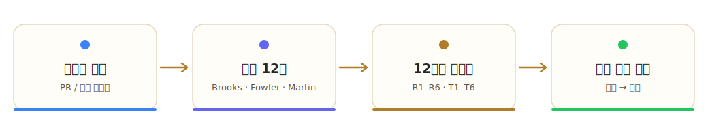
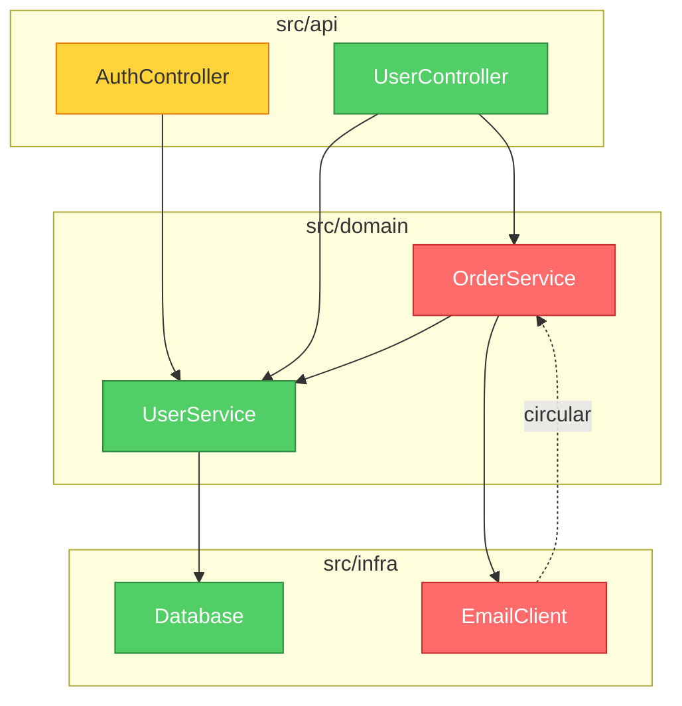

<p align="center">
  
</p>

<h1 align="center">brooks-lint</h1>

<p align="center">
  <strong>열두 권의 고전 엔지니어링 도서에 뿌리를 둔 AI 코드 리뷰.<br>
  일관적이고, 추적 가능하며, 실행 가능합니다.</strong>
</p>

<p align="center">
  <a href="README.md">English</a> ·
  <a href="README.zh-CN.md">简体中文</a> ·
  <a href="README.zh-TW.md">繁體中文</a> ·
  <a href="README.ja.md">日本語</a> ·
  <strong>한국어</strong> ·
  <a href="README.es.md">Español</a>
</p>

<p align="center">
  <a href="#빠른-시작">빠른 시작</a> •
  <a href="#여섯-가지-쇠퇴-위험">여섯 가지 쇠퇴 위험</a> •
  <a href="#실제-결과물">실제 결과물</a> •
  <a href="#벤치마크">벤치마크</a> •
  <a href="#설치">설치</a>
</p>

<p align="center">
  
  
  
  
  
</p>

<p align="center">
  <a href="https://trendshift.io/repositories/47738" target="_blank"></a>
</p>

<p align="center">
  
</p>

<p align="center">
  <a href="https://hyhmrright.github.io/brooks-lint/"></a>
</p>

<p align="center">
  <strong><a href="https://hyhmrright.github.io/brooks-lint/">→ 웹사이트 방문하기</a></strong>
</p>

---

> *"아이를 낳는 데는 아홉 달이 걸린다. 몇 명의 여성을 투입하든 마찬가지다."*
> — Frederick Brooks, *The Mythical Man-Month*（맨먼스 미신, 1975）

**50년이 지난 지금도 Brooks는 여전히 옳았습니다 — 그리고 McConnell, Fowler, Martin, Hunt & Thomas, Evans, Ousterhout, Winters, Meszaros, Osherove, Feathers, 그리고 Google 테스팅 팀 역시 마찬가지였습니다.**

대부분의 코드 품질 도구는 줄 수와 순환 복잡도만 셉니다. **brooks-lint**는 한 걸음 더 나아갑니다 — 열두 권의 고전 엔지니어링 도서에서 종합한 여섯 가지 쇠퇴 위험 차원에 비추어 당신의 코드를 진단하며, 매번 도서 출처, 심각도 라벨, 구체적인 처방이 담긴 구조화된 진단을 산출합니다.

예외와 오탐 방지 장치를 포함한 전체 "출처-스킬" 매핑은
[`skills/_shared/source-coverage.md`](skills/_shared/source-coverage.md)를 참고하세요.

## 빠른 시작

```bash
# Claude Code
/plugin marketplace add hyhmrright/brooks-lint
/plugin install brooks-lint@brooks-lint-marketplace

# Any other Agent Skills platform — Cursor · Codex · Gemini · Copilot · Windsurf · OpenCode · Kiro · …
curl -fsSL https://raw.githubusercontent.com/hyhmrright/brooks-lint/main/scripts/install.sh | bash -s -- <platform>
```

설치한 뒤에는 그냥 요청하거나("이 PR을 리뷰해줘", "아키텍처를 감사해줘") — 명령을 실행하세요:

| 명령 | 하는 일 |
|---------|--------------|
| `/brooks-review` | PR 또는 diff 리뷰 |
| `/brooks-audit` | 아키텍처 감사（+ Mermaid 의존성 그래프） |
| `/brooks-debt` | 우선순위가 매겨진 기술 부채 로드맵 |
| `/brooks-test` | 테스트 스위트 품질 리뷰 |
| `/brooks-health` | 모든 차원에 걸친 건강 대시보드 |
| `/brooks-sweep` | 전 차원을 훑어 진단 결과를 자동 수정 |

모든 진단은 도서 출처와 0–100 건강 점수와 함께 **증상 → 근원 → 결과 → 처방** 형태로 돌아옵니다. 전체 설치 옵션（추가 8개 플랫폼）, 명령별 사용법, CI/CD 설정은 [아래](#설치)를 참고하세요.

## 열두 권의 책

| 책 | 저자 | 기여하는 위험 |
|------|--------|----------------|
| *The Mythical Man-Month*（맨먼스 미신） | Frederick Brooks | R2, R4, R5 |
| *Code Complete*（코드 컴플리트） | Steve McConnell | R1, R4 |
| *Refactoring*（리팩토링） | Martin Fowler | R1, R2, R3, R4, R6 |
| *Clean Architecture*（클린 아키텍처） | Robert C. Martin | R2, R5 |
| *The Pragmatic Programmer*（실용주의 프로그래머） | Hunt & Thomas | R2, R3, R4, R5, T2, T3 |
| *Domain-Driven Design*（도메인 주도 설계） | Eric Evans | R1, R3, R6 |
| *A Philosophy of Software Design*（소프트웨어 설계의 철학） | John Ousterhout | R1, R4 |
| *Software Engineering at Google*（구글 엔지니어링 best practice） | Winters, Manshreck & Wright | R2, R5 |
| *The Art of Unit Testing*（단위 테스트의 기술） | Roy Osherove | T1, T2, T4, T5 |
| *How Google Tests Software*（구글은 소프트웨어를 어떻게 테스트하는가） | James A. Whittaker, Jason Arbon & Jeff Carollo | T5, T6 |
| *Working Effectively with Legacy Code*（레거시 코드 활용 전략） | Michael Feathers | T4, T5, T6 |
| *xUnit Test Patterns*（xUnit 테스트 패턴） | Gerard Meszaros | T1, T2, T3, T4 |

## 여섯 가지 쇠퇴 위험

brooks-lint는 열두 권의 고전 엔지니어링 도서에서 종합한 **여섯 가지 프로덕션 코드 쇠퇴 위험**과 **여섯 가지 테스트 스위트 쇠퇴 위험**의 관점에서 당신의 코드를 평가합니다:

| 쇠퇴 위험 | 진단 질문 | 출처 |
|------------|---------------------|---------|
| 🧠 인지 과부하 | 이 코드를 이해하는 데 얼마나 많은 정신적 노력이 드는가? | Code Complete, Refactoring, DDD, Philosophy of SD |
| 🔗 변경 전파 | 한 곳을 고치면 관련 없는 것이 얼마나 깨지는가? | Refactoring, Clean Architecture, Pragmatic, SE@Google |
| 📋 지식 중복 | 같은 결정이 여러 곳에서 표현되고 있는가? | Pragmatic, Refactoring, DDD |
| 🌀 우발적 복잡도 | 코드가 문제 자체보다 더 복잡한가? | Refactoring, Code Complete, Brooks, Philosophy of SD |
| 🏗️ 의존성 무질서 | 의존성이 일관된 방향으로 흐르는가? | Clean Architecture, Brooks, Pragmatic, SE@Google |
| 🗺️ 도메인 모델 왜곡 | 코드가 도메인을 충실히 표현하는가? | DDD, Refactoring |

> Philosophy of SD = *A Philosophy of Software Design*（Ousterhout） · SE@Google = *Software Engineering at Google*（Winters 외）

## 실제 결과물

다음 코드가 주어졌을 때:

```python
class UserService:
    def update_profile(self, user_id, name, email, avatar_url):
        user = self.db.query(f"SELECT * FROM users WHERE id = {user_id}")
        user['email'] = email
        ...
        if user['email'] != email:   # always False — silent bug
            self.smtp.send(...)
        points = user['login_count'] * 10 + 500
        self.db.execute(f"UPDATE loyalty SET points={points} WHERE user_id={user_id}")
```

brooks-lint는 다음을 산출합니다:

---

**건강 점수: 28/100**

*이 메서드는 서로 무관한 네 가지 비즈니스 책임을 하나의 함수에 집중시키고, 이메일 변경 알림을 조용히 억제하는 논리 버그를 포함하며, SQL 인젝션에 무방비로 노출되어 있습니다.*

### 🔴 변경 전파 — 단일 메서드가 서로 무관한 네 가지 비즈니스 이유로 변경됨
**증상:** `update_profile`이 프로필 필드 업데이트, 이메일 변경 알림, 적립 포인트 재계산, 캐시 무효화를 모두 하나의 메서드 본문에서 수행합니다.
**근원:** Fowler — *Refactoring* — 발산적 변경（Divergent Change）; Hunt & Thomas — *The Pragmatic Programmer* — 직교성（Orthogonality）
**결과:** 적립 포인트 공식에 대한 어떤 변경이든 이메일 알림을 깨뜨릴 위험이 있고, 그 반대도 마찬가지입니다. 모든 수정이 서로 무관한 네 도메인에 걸친 회귀 위험을 동시에 떠안습니다.
**처방:** `NotificationService`, `LoyaltyService`, `UserCacheInvalidator`를 추출하세요. `UserService.update_profile`은 각각을 호출하며 조율하는 역할만 해야 하며 — 그 자체로는 어떤 구현 로직도 보유해서는 안 됩니다.

### 🔴 도메인 모델 왜곡 — 조용한 논리 버그: 이메일 알림이 결코 발송되지 않음
**증상:** `user['email'] = email`이 `if user['email'] != email`보다 먼저 옛 값을 덮어쓰므로 — 조건이 항상 `False`입니다. 알림은 죽은 코드입니다.
**근원:** McConnell — *Code Complete* — 17장: 비정상적 제어 구조
**결과:** 사용자가 이메일 주소를 변경해도 결코 알림을 받지 못합니다. 조용한 데이터 무결성 실패입니다 — 시스템은 정상 동작하는 것처럼 보이지만 실제로는 비즈니스 규칙을 위반하고 있습니다.
**처방:** 어떤 변경이든 그 전에 `old_email = user['email']`을 포착하세요. `user['email']`이 아니라 `old_email`과 비교하세요.

*（SQL 인젝션, 의존성 무질서, 매직 넘버를 포함해 6개 진단 추가）*

### 의존성 그래프를 포함한 아키텍처 감사

모드 2（아키텍처 감사）에서 brooks-lint는 보고서 상단에 **Mermaid 의존성 그래프**를 생성합니다. 모듈은 심각도에 따라 색으로 구분됩니다: 빨강 = Critical 진단, 노랑 = Warning, 초록 = 깨끗함.



이 그래프는 GitHub, Notion 등 Markdown 환경에서 별도 도구 없이 네이티브로 렌더링됩니다.

## 더 많은 예시 보기

[전체 갤러리](docs/gallery.md)에는 Python, TypeScript, Go, Java에 걸친 실제 brooks-lint 출력이 담겨 있습니다 — PR 리뷰, Mermaid 의존성 그래프가 포함된 아키텍처 감사, 기술 부채 평가, 테스트 품질 리뷰를 망라합니다.

쇠퇴 위험이 처음이신가요? [**쇠퇴 위험 실전 가이드**](https://hyhmrright.github.io/brooks-lint/guide.html)가 여섯 가지를 모두 설명합니다 — 각각의 진단 질문, 대표 증상, 출처 도서, 처방을 다룹니다.

---

## 벤치마크

3개의 실제 시나리오（PR 리뷰, 아키텍처 감사, 기술 부채 평가）에서 테스트했습니다:

| 평가 항목 | brooks-lint | Claude 단독 |
|-----------|:-----------:|:------------:|
| 구조화된 진단（증상 → 근원 → 결과 → 처방） | ✅ 100% | ❌ 0% |
| 진단마다 도서 출처 | ✅ 100% | ❌ 0% |
| 심각도 라벨（🔴/🟡/🟢） | ✅ 100% | ❌ 0% |
| 건강 점수（0–100） | ✅ 100% | ❌ 0% |
| 변경 전파 탐지 | ✅ 100% | ✅ 100% |
| **전체 통과율** | **94%** | **16%** |

격차는 Claude가 무엇을 *발견할 수 있는가*가 아니라 — 매번 추적 가능한 근거와 실행 가능한 처방을 곁들여 무엇을 *일관되게* 발견하는가에 있습니다.

### 재현 가능한 벤치마크

위 표는 예시용입니다. 아래 수치들은 **확정적이며 로컬에서 직접 재현할 수 있습니다**:

**파서 충실도** — SARIF 내보내기와 CI 게이트는 모델의 Markdown 보고서를 올바르게 파싱하는 데 달려 있습니다. 여섯 가지 모드 전체를 아우르는 **30개의 실제 모델 생성 보고서로 구성된 동결 코퍼스**（`evals/benchmark-corpus.json`）에 대해, 각각 **독립적으로 채점된** 진단 목록（별도의 모델 패스로 채점한 뒤 수작업으로 표본 검증）과 짝지어, 실제 배포되는 파서의 점수는 다음과 같습니다 — `npm run benchmark`를 실행하세요:

| 지표（n = 30, 동결 코퍼스） | 결과 |
|---|:---:|
| 심각도 카운트 정확 일치（파서 vs 채점된 진실값） | 30 / 30 |
| 위험 코드 precision / recall | 100% / 100%（56개 finding-level 코드, 0 FP / 0 FN） |
| 유효한 SARIF 2.1.0 산출 | 30 / 30 |

파서가 결정론적이고 코퍼스가 동결되어 있기 때문에 `npm run benchmark`는 누구에게나 동일한 결과를 주며, `npm test`가 이를 회귀 테스트로 지킵니다. 이 코퍼스는 깨끗하게 유지되어야 하는 9개의 오탐 / 트레이드오프 보고서（예: 의존성 순환처럼 *보이지만* 실제로는 포트-앤-어댑터 설계인 경우）를 의도적으로 포함합니다.

**점수 결정성** — 고정된 진단 집합（2 Critical / 3 Warning / 1 Suggestion）에 대해, strictness 프리셋은 각자의 `common.md` 표가 예측하는 점수를 정확히 산출합니다: strict **34**, balanced **54**, legacy-friendly **74** — 그리고 `legacy-friendly`만이 상위 세 개의 수정으로 시작합니다.

**모델 품질** — 모델이 실제 코드에서 *올바른* 위험을 찾아내는지는 **57개 시나리오 eval 스위트**（`evals/evals.json`）로 측정합니다: `npm run evals`（구조 검증）와 `npm run evals:live`（실측, `ANTHROPIC_API_KEY` 필요）.

> 범위와 정직성: 파서 수치는 결정론적이며 정확히 재현됩니다. strictness 및 eval 스위트 수치는 모델에 대한 단일 실행 실측치로, 실행마다 약간씩 변동합니다. 파서 벤치마크는 보고서 파싱 충실도（도구가 보고서에 기재된 모든 진단을 읽어내는가?）를 측정하는 것이지, 특정 진단이 "옳은지"를 측정하는 것이 아닙니다. 심각도 카운트 일치가 완전히 독립적인 신호입니다; 위험 코드 일치는 공유된 표준 name→code 범례 또한 반영합니다.

## 비교 우위

| | brooks-lint | ESLint / Pylint | GitHub Copilot Review | 순수 Claude |
|---|:---:|:---:|:---:|:---:|
| 문법 및 스타일 문제 탐지 | — | ✅ | ✅ | ~ |
| 구조화된 진단 체인 | ✅ | ❌ | ❌ | ❌ |
| 진단을 고전 도서로 추적 | ✅ | ❌ | ❌ | ❌ |
| 일관된 심각도 라벨 | ✅ | ✅ | ~ | ❌ |
| 아키텍처 수준의 통찰 | ✅ | ❌ | ~ | ~ |
| 도메인 모델 분석 | ✅ | ❌ | ❌ | ~ |
| 무설정, 설치할 플러그인 없음 | ✅ | ❌ | ✅ | ✅ |
| 어떤 언어에서도 동작 | ✅ | ❌ | ✅ | ✅ |

> `~` = 가끔 / 일관되지 않음

**brooks-lint는 당신의 linter를 대체하지 않습니다.** 그것은 linter가 잡을 수 없는 것을 포착합니다: 아키텍처 표류, 지식 사일로, 도메인 모델 왜곡 — 누군가 알아채기 전 몇 달 동안 팀을 더디게 만드는 문제들입니다.

## 설치

### Claude Code（권장）

#### 플러그인 마켓플레이스를 통해
```bash
/plugin marketplace add hyhmrright/brooks-lint
/plugin install brooks-lint@brooks-lint-marketplace
```

단축 명령（`/brooks-review`）은 첫 세션 시작 시 자동으로 설치됩니다. 수동으로 설치하려면:
```bash
bash hooks/session-start
```

#### 수동 설치
```bash
mkdir -p ~/.claude/skills/brooks-lint
cp -r skills/* ~/.claude/skills/brooks-lint/
```

### Gemini CLI

#### 확장을 통해
```bash
/extensions install https://github.com/hyhmrright/brooks-lint
```

#### 수동 설치
```bash
mkdir -p ~/.gemini/skills
cp -r skills/* ~/.gemini/skills/      # flat — Gemini discovers skills only one level deep
```
> 또는 간단히: `./scripts/install.sh gemini`

### Codex CLI

#### 스킬 설치기를 통해（Codex 세션 안에서）
```
Install the brooks-lint skill from hyhmrright/brooks-lint
```

#### 커맨드 라인
```bash
python3 ~/.codex/skills/.system/skill-installer/scripts/install-skill-from-github.py \
  --repo hyhmrright/brooks-lint --path skills --name brooks-lint
```

#### 수동 설치
```bash
git clone https://github.com/hyhmrright/brooks-lint.git /tmp/brooks-lint
mkdir -p ~/.codex/skills
cp -r /tmp/brooks-lint/skills/* ~/.codex/skills/   # flat — matches the skill-installer layout
```
> 또는 간단히: `./scripts/install.sh codex`

### 더 많은 플랫폼 — OpenCode · Cursor · Windsurf · Antigravity · pi · Copilot · Kiro · Factory Droid

brooks-lint는 표준 [Agent Skills](https://agentskills.io) 형태로 배포됩니다. **Agent
Skills를 로드하는 모든 에이전트는 변환 없이 여섯 가지 모드를 모두 실행합니다** — 한 줄의 명령으로 설치됩니다:

```bash
# pick your platform; --project installs into the current repo instead of your global config
curl -fsSL https://raw.githubusercontent.com/hyhmrright/brooks-lint/main/scripts/install.sh | bash -s -- <platform>
#   <platform> = opencode · cursor · windsurf · antigravity · pi · kiro · copilot · droid · gemini · codex · agents
```

설치기는 스킬을 당신의 플랫폼에 맞는 폴더로 **평평하게** 복사하므로, 공유
프레임워크（`../_shared/`）가 항상 올바르게 해석됩니다 — 레이아웃을 잘못 잡을 수가 없습니다. 그런 다음 그냥 요청하면
（"이 PR을 리뷰해줘", "아키텍처를 감사해줘"）, 일치하는 스킬이 자신의
`description`에서 자동으로 트리거됩니다. 스킬이 처음이거나 다른 에이전트를 쓰시나요? **[docs/getting-started.md](docs/getting-started.md)**를 참고하세요.

<details><summary><b>OpenCode</b></summary>

`./scripts/install.sh opencode` → `~/.config/opencode/skills`（`~/.claude/skills`와
`AGENTS.md`도 읽음）. 전체 가이드: [docs/opencode-setup.md](docs/opencode-setup.md).
</details>

<details><summary><b>Cursor</b> (2.4+)</summary>

`./scripts/install.sh cursor` → `~/.cursor/skills`（`.agents/skills`도; `AGENTS.md` 읽음）.
전체 가이드: [docs/cursor-setup.md](docs/cursor-setup.md).
</details>

<details><summary><b>Windsurf</b> (Cascade)</summary>

`./scripts/install.sh windsurf` → `~/.codeium/windsurf/skills`（`AGENTS.md` 읽음）.
전체 가이드: [docs/windsurf-setup.md](docs/windsurf-setup.md).
</details>

<details><summary><b>Antigravity</b> (Google)</summary>

`./scripts/install.sh antigravity --project` → `.agent/skills`（`AGENTS.md` / `GEMINI.md` 읽음）.
전체 가이드: [docs/antigravity-setup.md](docs/antigravity-setup.md).
</details>

<details><summary><b>pi</b> (earendil-works)</summary>

`./scripts/install.sh pi` → `~/.pi/agent/skills`, 또는 pi의 `skills` 설정이 클론을 가리키게 하세요.
전체 가이드: [docs/pi-setup.md](docs/pi-setup.md).
</details>

<details><summary><b>GitHub Copilot</b></summary>

`./scripts/install.sh copilot --project` → `.github/skills`（`.claude/skills`도 자동 감지; `AGENTS.md`
읽음）. 전체 가이드: [docs/copilot-setup.md](docs/copilot-setup.md).
</details>

<details><summary><b>Kiro</b> (AWS)</summary>

`./scripts/install.sh kiro` → `~/.kiro/skills`（`/brooks-review` 자동 등록; `AGENTS.md` 읽음）.
전체 가이드: [docs/kiro-setup.md](docs/kiro-setup.md).
</details>

<details><summary><b>Factory Droid</b></summary>

`./scripts/install.sh droid` → `~/.factory/skills`（`/brooks-review` 등록; `AGENTS.md` 읽음）.
전체 가이드: [docs/factory-droid-setup.md](docs/factory-droid-setup.md).
</details>

> **🧪 검증 상태.** Claude Code, Gemini CLI, Codex CLI는 메인테이너가 검증했습니다. 위
> 여덟 개 플랫폼은 각 도구의 공식 스킬 명세를 토대로 문서화되었고 파일 레이아웃
> 수준에서 검증되었으나（설치기는 테스트되었음）, 메인테이너가 모든 플랫폼에서 end-to-end로 직접 실행해 보지는
> 못했습니다. 어떤 것을 시도해 보셨나요 — 잘 되든 **안 되든**? 플랫폼, 버전, 본 결과를 담아
> [이슈를 열어 주세요](https://github.com/hyhmrright/brooks-lint/issues/new).
> 다른 Agent-Skills 에이전트인가요? 거의 확실히 같은
> 방식으로 동작합니다 — 알려주시면 추가하겠습니다.

## 슬래시 명령

### Claude Code
| 명령 | 단축형 | 동작 |
|---------|------------|--------|
| `/brooks-lint:brooks-review` | `/brooks-review` | PR 수준 코드 리뷰 |
| `/brooks-lint:brooks-audit` | `/brooks-audit` | 전체 아키텍처 감사 |
| `/brooks-lint:brooks-debt` | `/brooks-debt` | 기술 부채 평가 |
| `/brooks-lint:brooks-test` | `/brooks-test` | 테스트 스위트 건강 리뷰 |
| `/brooks-lint:brooks-health` | `/brooks-health` | 건강 대시보드 — 네 가지 차원 전체 |
| `/brooks-lint:brooks-sweep` | `/brooks-sweep` | 전면 스윕 — 모든 차원을 분석하고 진단을 자동 수정 |

> 단축 명령은 session-start 훅이 첫 세션 시작 시 자동으로 설치합니다.

### Gemini CLI
| 명령 | 동작 |
|---------|--------|
| `/brooks-review` | PR 수준 코드 리뷰 |
| `/brooks-audit` | 전체 아키텍처 감사 |
| `/brooks-debt` | 기술 부채 평가 |
| `/brooks-test` | 테스트 스위트 건강 리뷰 |
| `/brooks-health` | 건강 대시보드 — 네 가지 차원 전체 |
| `/brooks-sweep` | 전면 스윕 — 모든 차원을 분석하고 진단을 자동 수정 |

### Codex CLI

| 명령 | 동작 |
|---------|--------|
| `$brooks-review` | PR 수준 코드 리뷰 |
| `$brooks-audit` | 전체 아키텍처 감사 |
| `$brooks-debt` | 기술 부채 평가 |
| `$brooks-test` | 테스트 스위트 건강 리뷰 |
| `$brooks-health` | 건강 대시보드 — 네 가지 차원 전체 |
| `$brooks-sweep` | 전면 스윕 — 모든 차원을 분석하고 진단을 자동 수정 |

코드 품질, 아키텍처, 유지보수성, 테스트 건강에 대해 이야기할 때도 이 스킬들은 자동으로 트리거됩니다.

### OpenCode · Cursor · Antigravity · pi

이 플랫폼들은 각 스킬의 `description`에서 Agent Skills를 자동으로 호출합니다 — 그냥 요청하면
（"이 PR을 리뷰해줘", "아키텍처를 감사해줘", "우리의 최악의 기술 부채는 어디 있지?"） 일치하는 모드가
실행됩니다. 명시적으로 호출하려면 해당 플랫폼의 스킬 명령 구문을 사용하세요（예: pi는 각 스킬을
`/skill:brooks-review`로 등록하고; Cursor와 OpenCode는 스킬이 발견되면 `/brooks-review`를 노출합니다）.

## 사용법

### PR 리뷰

```
/brooks-review                      # Claude Code (short form) / Gemini CLI
/brooks-lint:brooks-review          # Claude Code (full form)
$brooks-review                      # Codex CLI
```

diff를 붙여 넣거나 AI가 변경된 파일을 가리키게 하세요. 여섯 가지 쇠퇴 위험 각각을 증상 → 근원 → 결과 → 처방 형식의 구체적인 진단으로 진단합니다.

### 아키텍처 감사

```
/brooks-audit                       # Claude Code (short form) / Gemini CLI
/brooks-lint:brooks-audit           # Claude Code (full form)
$brooks-audit                       # Codex CLI
```

프로젝트 구조를 설명하거나 핵심 파일을 공유하세요. 모듈 의존성을 매핑하고, 순환 의존성을 식별하며, Conway의 법칙 정합성을 점검합니다.

### 기술 부채 평가

```
/brooks-debt                        # Claude Code (short form) / Gemini CLI
/brooks-lint:brooks-debt            # Claude Code (full form)
$brooks-debt                        # Codex CLI
```

부채를 여섯 가지 쇠퇴 위험에 걸쳐 분류하고, 각 진단을 Pain × Spread 우선순위로 점수화하며, Critical / Scheduled / Monitored 분류가 담긴 우선순위 상환 로드맵을 산출합니다.

### 테스트 품질 리뷰

```
/brooks-test                        # Claude Code (short form) / Gemini CLI
/brooks-lint:brooks-test            # Claude Code (full form)
$brooks-test                        # Codex CLI
```

테스트 스위트를 여섯 가지 테스트 공간 쇠퇴 위험에 비추어 감사합니다 — 테스트 모호성, 테스트 취약성, 테스트 중복, Mock 남용, 커버리지 환상, 아키텍처 불일치 — 출처는 xUnit Test Patterns, The Art of Unit Testing, How Google Tests Software, Working Effectively with Legacy Code입니다. PR 리뷰에는 가벼운 Step 7 빠른 테스트 점검도 자동으로 포함됩니다（문서 전용 또는 비프로덕션 diff에서는 건너뜀）.

### 건강 대시보드

```
/brooks-health                      # Claude Code (short form) / Gemini CLI
/brooks-lint:brooks-health          # Claude Code (full form)
$brooks-health                      # Codex CLI
```

네 가지 품질 차원 전체에 걸쳐 축약된 스캔을 실행하고 가중 종합 건강 점수（0–100）를 산출합니다. 릴리스 전에, 새 팀을 온보딩할 때, 또는 "우리는 어떻게 하고 있나?"에 대한 큰 그림 보고서가 필요할 때 사용하세요. 특정 차원에 대한 심층 진단이 필요하면 대신 해당 전문 스킬을 사용하세요.

### 전면 스윕

```
/brooks-sweep                       # Claude Code (short form) / Gemini CLI
/brooks-lint:brooks-sweep           # Claude Code (full form)
$brooks-sweep                       # Codex CLI
```

모든 프로덕션（R1–R6）과 테스트（T1–T6） 쇠퇴 위험 그리고 아키텍처를 한 번에 통합 스캔한 뒤 수정을 적용합니다: 안전한 변경은 즉시 자동 적용되고, 여러 파일에 걸치거나 인터페이스를 건드리는 변경은 확인이 필요하며, 복잡한 아키텍처 결정은 수동 처리 항목으로 표시됩니다. 수정 로그, 건강 점수 변화량, 잔여 항목 목록을 출력합니다.

## 설정

리뷰 동작을 커스터마이즈하려면 프로젝트 루트에 `.brooks-lint.yaml`을 두세요:

```yaml
version: 1

strictness: balanced   # strict | balanced (default) | legacy-friendly — softer scoring for legacy code

disable:
  - T5   # skip coverage metrics check — we don't enforce coverage

severity:
  R1: suggestion   # downgrade Cognitive Overload findings for this domain

ignore:
  - "**/*.generated.*"
  - "**/vendor/**"

# custom_risks:   # define project-specific Cx codes — see skills/_shared/custom-risks-guide.md
# suppress:       # downgrade specific findings by risk + path (e.g. accepted legacy debt)
```

[`.brooks-lint.example.yaml`](.brooks-lint.example.yaml)을 출발점으로 복사하세요.
모든 설정은 선택 사항입니다 — 파일을 통째로 생략하면 기본 동작이 적용됩니다.

| 설정 | 설명 |
|---------|-------------|
| `strictness` | 점수 프리셋: `strict`, `balanced`（기본）, 또는 `legacy-friendly`（더 가벼운 감점, 상위 수정으로 시작） |
| `disable` | 건너뛸 위험 코드（`R1`–`R6`, `T1`–`T6`） |
| `severity` | 심각도 등급 재정의（`critical` / `warning` / `suggestion`） |
| `ignore` | 제외할 파일의 glob 패턴 |
| `focus` | 이 위험 코드만 평가（`disable`과 함께 사용 불가） |
| `custom_risks` | 프로젝트 전용 위험 코드 정의（`C1`, `C2`, …） — [`custom-risks-guide.md`](skills/_shared/custom-risks-guide.md) 참고 |
| `suppress` | 위험 코드 + 경로로 특정 진단의 심각도 하향（선택적 `expires:` 만료일） |

---

## 왜 이 책들인가, 왜 지금인가?

AI 보조 코딩의 시대에 우리는 그 어느 때보다 빠르게, 더 많은 코드를 쓰고 있습니다. 하지만 60년에 걸친 소프트웨어 엔지니어링의 통찰은 변하지 않았습니다:

> *"소프트웨어의 복잡성은 우발적 속성이 아니라 본질적 속성이다."*
> — Frederick Brooks

AI는 코드를 더 빨리 쓰도록 도와줄 수 있지만, 당신이 대성당을 짓고 있는지 타르 구덩이를 파고 있는지는 알려주지 못합니다. **brooks-lint는 그 간극을 메웁니다** — 열두 권의 고전 엔지니어링 도서에서 어렵게 얻은 지혜를 당신의 현대적인 개발 워크플로로 가져옵니다.

이 저자들이 식별한 쇠퇴 위험은 그 어느 때보다 더 적실합니다:
- **AI 어시스턴트를 추가한다고** 인지 과부하나 도메인 모델 왜곡이 고쳐지지는 않습니다
- **더 많은 코드를 생성하면** 변경 전파와 지식 중복이 늘어납니다
- **더 빨리 움직이는 것은** 우발적 복잡도와 의존성 무질서를 한층 더 위험하게 만듭니다

## 프로젝트 구조

```
brooks-lint/
├── .claude-plugin/              # Claude Code plugin metadata
├── .codex-plugin/               # Codex CLI plugin metadata
├── skills/
│   ├── _shared/                 # Shared framework files
│   │   ├── common.md            # Iron Law, Project Config, Report Template, Health Score
│   │   ├── source-coverage.md   # 12-book coverage matrix, tradeoffs, false-positive guards
│   │   ├── decay-risks.md       # Six decay risks with symptoms and book citations
│   │   ├── test-decay-risks.md  # Six test-space decay risks with book citations
│   │   ├── remedy-guide.md      # --fix mode: actionable Remedy enhancement rules
│   │   └── custom-risks-guide.md  # Template for project-specific risk codes
│   ├── brooks-review/           # Mode 1: PR Review
│   │   ├── SKILL.md
│   │   └── pr-review-guide.md
│   ├── brooks-audit/            # Mode 2: Architecture Audit
│   │   ├── SKILL.md
│   │   └── architecture-guide.md
│   ├── brooks-debt/             # Mode 3: Tech Debt Assessment
│   │   ├── SKILL.md
│   │   └── debt-guide.md
│   ├── brooks-test/             # Mode 4: Test Quality Review
│   │   ├── SKILL.md
│   │   └── test-guide.md
│   ├── brooks-health/           # Mode 5: Health Dashboard
│   │   ├── SKILL.md
│   │   └── health-guide.md
│   └── brooks-sweep/            # Mode 6: Full Sweep & Auto-Fix
│       ├── SKILL.md
│       └── sweep-guide.md
├── hooks/                       # SessionStart hook
├── commands/                    # Short-form command wrappers (auto-installed by hook)
├── evals/                       # Benchmark test cases
│   └── evals.json
└── assets/
    └── logo.svg
```

## CI/CD 통합

GitHub Action을 사용해 모든 PR에서 brooks-lint를 자동으로 실행하세요:

```yaml
# .github/workflows/brooks-lint.yml
name: Brooks-Lint PR Review
on:
  pull_request:
    types: [opened, synchronize, reopened]

jobs:
  brooks-lint:
    runs-on: ubuntu-latest
    permissions:
      pull-requests: write
    steps:
      - uses: actions/checkout@v4
        with:
          fetch-depth: 0
      - uses: hyhmrright/brooks-lint/.github/actions/brooks-lint@main
        with:
          mode: review
          anthropic-api-key: ${{ secrets.ANTHROPIC_API_KEY }}
          fail-below: 70
```

전체 템플릿은 [`docs/github-action-example.yml`](docs/github-action-example.yml)을 참고하세요.

이 Action은 리뷰를 PR 댓글로 게시하며, 건강 점수가 임계값 아래로 떨어지면 선택적으로 체크를 실패시킵니다. `.brooks-lint-history.json`이 저장소에 커밋되어 있으면 댓글에 추세 변화도 포함됩니다（예: "85 → 82 (−3) over last 3 runs"）.

**품질 게이트와 Code Scanning.** `fail-below` 외에도 이 Action은 다음을 제공합니다:

```yaml
        with:
          mode: review
          anthropic-api-key: ${{ secrets.ANTHROPIC_API_KEY }}
          fail-on: critical            # fail on any Critical finding (none | warning | critical)
          fail-on-regression: true     # fail if the Health Score dropped vs the last run
          sarif-file: brooks-lint.sarif  # also upload findings to GitHub Code Scanning
```

`fail-on-regression`은 `.brooks-lint-history.json`을 읽으므로, "새로운 회귀 없음"을 강제하려면 그 파일을 커밋하세요. `sarif-file`을 설정하면 진단이 PR의 **Files changed** 탭에 인라인으로 나타나며, job에 `security-events: write` 권한이 필요합니다.

**비용:** PR 실행당 약 $0.05–0.15로, diff 크기와 모델에 따라 다릅니다. `pull_request` 이벤트에서만 실행할 것을 권장합니다.

## 로드맵

> **현재 상태（v1.4）:** 12권 도서 기반, 6가지 프로덕션 쇠퇴 위험（R1–R6） + 6가지 테스트 쇠퇴 위험（T1–T6）, 6개 스킬 — PR 리뷰, 아키텍처 감사, 기술 부채, 테스트 품질, 건강 대시보드, 전면 스윕 — 여기에 CI 품질 게이트, GitHub Code Scanning용 SARIF 출력, strictness 프리셋, 재현 가능한 파서 충실도 벤치마크를 더했습니다. 아래의 이전 항목들은 현재 기능 집합이 아니라 역사적 마일스톤을 기술합니다.

- [x] **v0.2**: 플러그인 인프라（`.claude-plugin/`, 훅, 슬래시 명령）
- [x] **v0.3**: 여덟 가지 Brooks 차원, 문서 완성도 점수화
- [x] **v0.4**: 여섯 권 도서 프레임워크, 쇠퇴 위험 차원, 진단 체인, 벤치마크 스위트
- [x] **v0.5**: 테스트 품질 리뷰（모드 4） — 네 권의 테스트 도서, 여섯 가지 테스트 쇠퇴 위험
- [x] **v0.6**: 아키텍처 감사의 Mermaid 의존성 그래프
- [x] **v0.7**: `.brooks-lint.yaml` 프로젝트 설정, 모드 2 능동 컨텍스트, 10권 도서로 확장
- [x] **v0.8**: 네임스페이스 명령을 갖춘 독립 스킬 아키텍처
- [x] **v0.9**: 단계 검증, 자동 diff 범위, `/brooks-health` 대시보드, 추세 추적, 트리아지 모드, `--fix` 처방, 온보딩 보고서, GitHub Action
- [x] **v1.0**: eval 자동화（`run-evals-live.mjs`）, 커스텀 위험 확장（`Cx` 코드）
- [x] **v1.1**: 전면 스윕 스킬（`brooks-sweep`） — 통합 다차원 자동 수정
- [x] **v1.2**: 자율 스윕 파이프라인, `npm run bump` 버전 전파
- [x] **v1.3**: Codex 마켓플레이스 메타데이터, 여러 에이전트 플랫폼을 위한 한 줄 명령 설치기, 다국어 README + 랜딩 사이트
- [x] **v1.4**: GitHub Code Scanning용 SARIF 출력, CI severity + 회귀 게이트, strictness 프리셋（strict/balanced/legacy-friendly）, 57개 시나리오 eval 스위트, 재현 가능한 파서 충실도 벤치마크（`npm run benchmark`）

도움을 주고 싶으신가요? 지금 가장 좋은 기여는 새로운 eval 테스트 케이스와 개선된 쇠퇴 위험 증상 패턴입니다. [CONTRIBUTING.md](CONTRIBUTING.md)를 참고하세요.

## 기여

진단을 추가하거나, 가이드를 개선하거나, 벤치마크 스위트를 확장하는 방법은 [CONTRIBUTING.md](CONTRIBUTING.md)를 참고하세요.

당신 자신의 PR에 `/brooks-review`를 실행해 보세요 — 우리는 우리가 만들고 있는 도구로 기여를 리뷰합니다.

## 라이선스

MIT License — 자세한 내용은 [LICENSE](LICENSE)를 참고하세요.

## 감사의 말

이 프로젝트는 열두 거인의 어깨 위에 서 있습니다:

**프로덕션 코드 프레임워크**
- Frederick P. Brooks Jr. — *The Mythical Man-Month*（1975, 기념판 1995）
- Steve McConnell — *Code Complete*（1993, 2판 2004）
- Martin Fowler — *Refactoring*（1999, 2판 2018）
- Robert C. Martin — *Clean Architecture*（2017）
- Andrew Hunt & David Thomas — *The Pragmatic Programmer*（1999, 20주년판 2019）
- Eric Evans — *Domain-Driven Design*（2003）
- John Ousterhout — *A Philosophy of Software Design*（2018）
- Titus Winters, Tom Manshreck, Hyrum Wright — *Software Engineering at Google*（2020）

**테스트 품질 프레임워크**
- Gerard Meszaros — *xUnit Test Patterns*（2007）
- Roy Osherove — *The Art of Unit Testing*（2009, 3판 2023）
- Google Engineering — *How Google Tests Software*（2012）
- Michael Feathers — *Working Effectively with Legacy Code*（2004）

이 도구에 인코딩된 쇠퇴 위험은 그들의 사상을 현대 코드 품질 평가에 적용한 우리의 종합입니다.

---

## Star 히스토리

[](https://star-history.com/#hyhmrright/brooks-lint&Date)

---

<p align="center">
  <strong>⭐ 이 도구가 당신의 코드베이스를 다르게 보는 데 도움이 되었다면, star를 눌러 주세요!</strong>
</p>
