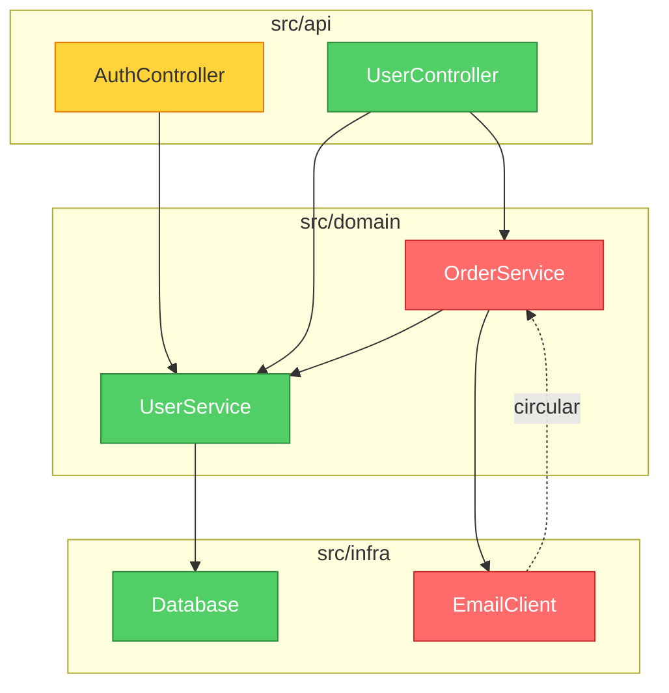

<p align="center">
  
</p>

<h1 align="center">brooks-lint</h1>

<p align="center">
  <strong>植根于十二本经典工程著作的 AI 代码审查。<br>
  一致、可溯源、可落地。</strong>
</p>

<p align="center">
  <a href="README.md">English</a> · <strong>简体中文</strong>
</p>

<p align="center">
  <a href="#六类衰退风险">六类衰退风险</a> •
  <a href="#实际效果">实际效果</a> •
  <a href="#基准测试">基准测试</a> •
  <a href="#安装">安装</a>
</p>

<p align="center">
  
  
  
  
  
</p>

<p align="center">
  <a href="https://hyhmrright.github.io/brooks-lint/"></a>
</p>

<p align="center">
  <strong><a href="https://hyhmrright.github.io/brooks-lint/">→ 访问官网</a></strong>
</p>

---

> *"一个孩子要十月怀胎，无论派多少人去都一样。"*
> —— Frederick Brooks，《人月神话》（1975）

**五十年过去，Brooks 依然正确——McConnell、Fowler、Martin、Hunt & Thomas、Evans、Ousterhout、Winters、Meszaros、Osherove、Feathers 以及 Google 测试团队同样如此。**

大多数代码质量工具只数行数和圈复杂度。**brooks-lint** 更进一步——它对照六个衰退风险维度（综合自十二本经典工程著作）诊断你的代码，每一次都产出带书目出处、严重度标签和具体对策的结构化诊断。

完整的"书目—技能"映射（含例外与误报防护），见
[`skills/_shared/source-coverage.md`](skills/_shared/source-coverage.md)。

## 十二本书

| 书名 | 作者 | 贡献于 |
|------|--------|----------------|
| *The Mythical Man-Month*（人月神话） | Frederick Brooks | R2、R4、R5 |
| *Code Complete*（代码大全） | Steve McConnell | R1、R4 |
| *Refactoring*（重构） | Martin Fowler | R1、R2、R3、R4、R6 |
| *Clean Architecture*（架构整洁之道） | Robert C. Martin | R2、R5 |
| *The Pragmatic Programmer*（程序员修炼之道） | Hunt & Thomas | R2、R3、R4、R5、T2、T3 |
| *Domain-Driven Design*（领域驱动设计） | Eric Evans | R1、R3、R6 |
| *A Philosophy of Software Design*（软件设计的哲学） | John Ousterhout | R1、R4 |
| *Software Engineering at Google*（Google 软件工程） | Winters, Manshreck & Wright | R2、R5 |
| *The Art of Unit Testing*（单元测试的艺术） | Roy Osherove | T1、T2、T4、T5 |
| *How Google Tests Software*（Google 测试之道） | Whittaker, Arbon & Carollo | T5、T6 |
| *Working Effectively with Legacy Code*（修改代码的艺术） | Michael Feathers | T4、T5、T6 |
| *xUnit Test Patterns*（xUnit 测试模式） | Gerard Meszaros | T1、T2、T3、T4 |

## 六类衰退风险

brooks-lint 从**六类生产代码衰退风险**和**六类测试代码衰退风险**两个角度评估你的代码，这些维度综合自十二本经典工程著作：

| 衰退风险 | 诊断问题 | 出处 |
|------------|---------------------|---------|
| 🧠 认知过载 | 理解这段代码要花多少脑力？ | Code Complete、Refactoring、DDD、Philosophy of SD |
| 🔗 变更扩散 | 改一处会牵连多少不相干的东西？ | Refactoring、Clean Architecture、Pragmatic、SE@Google |
| 📋 知识重复 | 同一个决策是否在多处被表达？ | Pragmatic、Refactoring、DDD |
| 🌀 偶发复杂度 | 代码是否比问题本身更复杂？ | Refactoring、Code Complete、Brooks、Philosophy of SD |
| 🏗️ 依赖失序 | 依赖是否朝一致的方向流动？ | Clean Architecture、Brooks、Pragmatic、SE@Google |
| 🗺️ 领域模型失真 | 代码是否忠实地表达了业务领域？ | DDD、Refactoring |

> Philosophy of SD = *A Philosophy of Software Design*（Ousterhout） · SE@Google = *Software Engineering at Google*（Winters 等）

## 实际效果

给定这段代码：

```python
class UserService:
    def update_profile(self, user_id, name, email, avatar_url):
        user = self.db.query(f"SELECT * FROM users WHERE id = {user_id}")
        user['email'] = email
        ...
        if user['email'] != email:   # 永远为 False —— 隐性 bug
            self.smtp.send(...)
        points = user['login_count'] * 10 + 500
        self.db.execute(f"UPDATE loyalty SET points={points} WHERE user_id={user_id}")
```

brooks-lint 产出：

---

**健康分：28/100**

*这个方法把四个不相干的业务职责塞进同一个函数，含有一个会静默吞掉"邮箱变更通知"的逻辑 bug，并且对 SQL 注入门户大开。*

### 🔴 变更扩散 —— 单个方法因四个不相干的业务原因而改动
**症状：** `update_profile` 在同一个方法体里完成资料字段更新、邮箱变更通知、积分重算和缓存失效。
**根源：** Fowler — *Refactoring* — 发散式变更（Divergent Change）；Hunt & Thomas — *The Pragmatic Programmer* — 正交性（Orthogonality）
**后果：** 任何对积分公式的改动都可能破坏邮件通知，反之亦然。每次修改都同时背负着四个不相干领域的回归风险。
**对策：** 抽出 `NotificationService`、`LoyaltyService` 和 `UserCacheInvalidator`。`UserService.update_profile` 应只做编排、逐一调用它们——本身不持有任何实现逻辑。

### 🔴 领域模型失真 —— 隐性逻辑 bug：邮箱通知永不触发
**症状：** `user['email'] = email` 在 `if user['email'] != email` 之前就覆盖了旧值——条件恒为 `False`，通知是死代码。
**根源：** McConnell — *Code Complete* — 第 17 章：非常规控制结构
**后果：** 用户改邮箱时永远收不到通知。这是静默的数据完整性失效——系统看似正常运转，实则违反了业务规则。
**对策：** 在任何修改之前先捕获 `old_email = user['email']`，拿它（而非 `user['email']`）做比较。

*（另有 6 条诊断，含 SQL 注入、依赖失序、魔法数字）*

### 带依赖图的架构审查

在模式 2（架构审查）中，brooks-lint 会在报告顶部生成一张 **Mermaid 依赖图**。模块按严重度着色：红=Critical，黄=Warning，绿=干净。



该图在 GitHub、Notion 等 Markdown 环境中原生渲染——无需额外工具。

## 更多示例

[完整画廊](docs/gallery.md) 收录了 brooks-lint 在 Python、TypeScript、Go、Java 上的真实输出——涵盖 PR 审查、带 Mermaid 依赖图的架构审查、技术债评估和测试质量审查。

初次接触这些衰退风险？[**衰退风险实战指南**](https://hyhmrright.github.io/brooks-lint/guide.html) 逐一讲解全部六类——每类的诊断问题、代表症状、出处书目与对策。

---

## 基准测试

在 3 个真实场景（PR 审查、架构审查、技术债评估）上测试：

| 评估项 | brooks-lint | 仅用 Claude |
|-----------|:-----------:|:------------:|
| 结构化诊断（症状 → 根源 → 后果 → 对策） | ✅ 100% | ❌ 0% |
| 每条诊断带书目出处 | ✅ 100% | ❌ 0% |
| 严重度标签（🔴/🟡/🟢） | ✅ 100% | ❌ 0% |
| 健康分（0–100） | ✅ 100% | ❌ 0% |
| 识别"变更扩散" | ✅ 100% | ✅ 100% |
| **整体通过率** | **94%** | **16%** |

差距不在于 Claude *能不能*发现问题——而在于它能否*每一次都稳定地*发现，并附上可溯源的证据和可落地的对策。

### 可复现基准

上表是示意性的。下面这些数字**确定、可在本地复算**：

**parser 保真度** —— SARIF 输出与 CI 闸门都依赖于正确解析模型的 Markdown 报告。在一个**冻结的 30 份真实模型报告语料**上（覆盖全部六种 mode，`evals/benchmark-corpus.json`），每份都配有**独立评分**的发现清单（由另一遍模型评分、并经人工抽查），实际发布的 parser 跑分如下——执行 `npm run benchmark`：

| 指标（n = 30，冻结语料） | 结果 |
|---|:---:|
| 严重度计数精确吻合（parser vs 人工标注真值） | 30 / 30 |
| 风险码 precision / recall | 100% / 100%（56 个 finding-level 码，0 假阳 / 0 假阴） |
| 产出合法 SARIF 2.1.0 | 30 / 30 |

由于 parser 是确定性的、语料是冻结的，`npm run benchmark` 对任何人都给出相同结果，`npm test` 也将其作为回归守卫。该语料**有意**包含 9 份假阳性 / tradeoff 报告（例如一个*看起来像*循环依赖、实则是端口与适配器的设计），它们必须保持干净。

**打分确定性** —— 给定一组固定发现（2 Critical / 3 Warning / 1 Suggestion），三个 strictness 预设产出的分数与其 `common.md` 表的预测分毫不差：strict **34**、balanced **54**、legacy-friendly **74**——且只有 `legacy-friendly` 会优先列出前三高杠杆修复。

**模型质量** —— 模型能否在真实代码上找到*正确的*风险，由 **57 场景 eval 套件**（`evals/evals.json`）衡量：`npm run evals`（结构校验）与 `npm run evals:live`（实测，需 `ANTHROPIC_API_KEY`）。

> 范围与诚实说明：parser 数字是确定性的、可精确复算；strictness 与 eval 套件的数字是对模型的单次实测，会有轻微跑动差异。parser 基准衡量的是报告解析保真度（工具是否读出了报告里写的每条发现），而非某条发现"是否正确"。严重度计数吻合是完全独立的信号；风险码一致性还反映了 parser 与 grader 共用同一套权威 name→code 映射。

## 横向对比

| | brooks-lint | ESLint / Pylint | GitHub Copilot Review | 原生 Claude |
|---|:---:|:---:|:---:|:---:|
| 检测语法与风格问题 | — | ✅ | ✅ | ~ |
| 结构化诊断链 | ✅ | ❌ | ❌ | ❌ |
| 将诊断溯源到经典著作 | ✅ | ❌ | ❌ | ❌ |
| 一致的严重度标签 | ✅ | ✅ | ~ | ❌ |
| 架构层面的洞察 | ✅ | ❌ | ~ | ~ |
| 领域模型分析 | ✅ | ❌ | ❌ | ~ |
| 零配置、无需安装插件 | ✅ | ❌ | ✅ | ✅ |
| 适用于任何语言 | ✅ | ❌ | ✅ | ✅ |

> `~` = 偶尔 / 不稳定

**brooks-lint 不是要取代你的 linter。** 它捕捉的是 linter 抓不到的东西：架构漂移、知识孤岛、领域模型失真——这些问题往往在无人察觉的几个月里持续拖慢团队。

## 安装

### Claude Code（推荐）

#### 通过插件市场
```bash
/plugin marketplace add hyhmrright/brooks-lint
/plugin install brooks-lint@brooks-lint-marketplace
```

短命令（`/brooks-review`）会在首次会话启动时自动安装。手动安装：
```bash
cp commands/*.md ~/.claude/commands/
```

#### 手动安装
```bash
mkdir -p ~/.claude/skills/brooks-lint
cp -r skills/* ~/.claude/skills/brooks-lint/
```

### Gemini CLI

#### 通过扩展
```bash
/extensions install https://github.com/hyhmrright/brooks-lint
```

#### 手动安装
```bash
mkdir -p ~/.gemini/skills
cp -r skills/* ~/.gemini/skills/      # 扁平——Gemini 只发现一层深的技能
```
> 或直接：`./scripts/install.sh gemini`

### Codex CLI

#### 通过技能安装器（在 Codex 会话中）
```
Install the brooks-lint skill from hyhmrright/brooks-lint
```

#### 命令行
```bash
python3 ~/.codex/skills/.system/skill-installer/scripts/install-skill-from-github.py \
  --repo hyhmrright/brooks-lint --path skills --name brooks-lint
```

#### 手动安装
```bash
git clone https://github.com/hyhmrright/brooks-lint.git /tmp/brooks-lint
mkdir -p ~/.codex/skills
cp -r /tmp/brooks-lint/skills/* ~/.codex/skills/   # 扁平——与技能安装器布局一致
```
> 或直接：`./scripts/install.sh codex`

### 更多平台——OpenCode · Cursor · Windsurf · Antigravity · pi · Copilot · Kiro · Factory Droid

brooks-lint 以标准 [Agent Skills](https://agentskills.io) 形式分发。**任何加载 Agent Skills 的 agent
都能无需任何转换运行全部六种模式**——一条命令即可安装：

```bash
# 选择你的平台；加 --project 装进当前仓库而非全局配置
curl -fsSL https://raw.githubusercontent.com/hyhmrright/brooks-lint/main/scripts/install.sh | bash -s -- <平台>
#   <平台> = opencode · cursor · windsurf · antigravity · pi · kiro · copilot · droid · gemini · codex · agents
```

安装器会把技能**扁平**拷进该平台对应的文件夹，让共享框架（`../_shared/`）始终正确解析——你不可能装错布局。
装好后直接提问（"审查这个 PR"、"审查架构"），对应技能就会依据 `description` 自动触发。
不熟悉 skills、或用的是别的 agent？见 **[docs/getting-started.md](docs/getting-started.md)**。

<details><summary><b>OpenCode</b></summary>

`./scripts/install.sh opencode` → `~/.config/opencode/skills`（同时读取 `~/.claude/skills` 与
`AGENTS.md`）。完整指南：[docs/opencode-setup.md](docs/opencode-setup.md)。
</details>

<details><summary><b>Cursor</b>（2.4+）</summary>

`./scripts/install.sh cursor` → `~/.cursor/skills`（也读 `.agents/skills`；读取 `AGENTS.md`）。
完整指南：[docs/cursor-setup.md](docs/cursor-setup.md)。
</details>

<details><summary><b>Windsurf</b>（Cascade）</summary>

`./scripts/install.sh windsurf` → `~/.codeium/windsurf/skills`（读取 `AGENTS.md`）。
完整指南：[docs/windsurf-setup.md](docs/windsurf-setup.md)。
</details>

<details><summary><b>Antigravity</b>（Google）</summary>

`./scripts/install.sh antigravity --project` → `.agent/skills`（读取 `AGENTS.md` / `GEMINI.md`）。
完整指南：[docs/antigravity-setup.md](docs/antigravity-setup.md)。
</details>

<details><summary><b>pi</b>（earendil-works）</summary>

`./scripts/install.sh pi` → `~/.pi/agent/skills`，或让 pi 的 `skills` 设置指向一个克隆。
完整指南：[docs/pi-setup.md](docs/pi-setup.md)。
</details>

<details><summary><b>GitHub Copilot</b></summary>

`./scripts/install.sh copilot --project` → `.github/skills`（也自动识别 `.claude/skills`；读取
`AGENTS.md`）。完整指南：[docs/copilot-setup.md](docs/copilot-setup.md)。
</details>

<details><summary><b>Kiro</b>（AWS）</summary>

`./scripts/install.sh kiro` → `~/.kiro/skills`（自动注册 `/brooks-review`；读取 `AGENTS.md`）。
完整指南：[docs/kiro-setup.md](docs/kiro-setup.md)。
</details>

<details><summary><b>Factory Droid</b></summary>

`./scripts/install.sh droid` → `~/.factory/skills`（注册 `/brooks-review`；读取 `AGENTS.md`）。
完整指南：[docs/factory-droid-setup.md](docs/factory-droid-setup.md)。
</details>

> **🧪 验证状态。** Claude Code、Gemini CLI、Codex CLI 已由维护者验证。上面八个平台依据各工具官方技能规范编写，
> 并已在文件布局层面验证（安装器经过测试），但维护者尚未在每个平台端到端实跑。在某平台试过了——无论成功**还是**失败？
> 请[提一个 issue](https://github.com/hyhmrright/brooks-lint/issues/new)，附上平台、版本和你看到的结果。
> 用的是其它兼容 Agent Skills 的 agent？它几乎肯定以同样方式工作——告诉我们，我们会补上。

## 斜杠命令

### Claude Code
| 命令 | 短命令 | 作用 |
|---------|------------|--------|
| `/brooks-lint:brooks-review` | `/brooks-review` | PR 级代码审查 |
| `/brooks-lint:brooks-audit` | `/brooks-audit` | 完整架构审查 |
| `/brooks-lint:brooks-debt` | `/brooks-debt` | 技术债评估 |
| `/brooks-lint:brooks-test` | `/brooks-test` | 测试套件健康审查 |
| `/brooks-lint:brooks-health` | `/brooks-health` | 健康仪表盘——全部四个维度 |
| `/brooks-lint:brooks-sweep` | `/brooks-sweep` | 全面扫描——分析所有维度并自动修复 |

> 短命令由 session-start 钩子在首次会话启动时自动安装。

### Gemini CLI
| 命令 | 作用 |
|---------|--------|
| `/brooks-review` | PR 级代码审查 |
| `/brooks-audit` | 完整架构审查 |
| `/brooks-debt` | 技术债评估 |
| `/brooks-test` | 测试套件健康审查 |
| `/brooks-health` | 健康仪表盘——全部四个维度 |
| `/brooks-sweep` | 全面扫描——分析所有维度并自动修复 |

### Codex CLI

| 命令 | 作用 |
|---------|--------|
| `$brooks-review` | PR 级代码审查 |
| `$brooks-audit` | 完整架构审查 |
| `$brooks-debt` | 技术债评估 |
| `$brooks-test` | 测试套件健康审查 |
| `$brooks-health` | 健康仪表盘——全部四个维度 |
| `$brooks-sweep` | 全面扫描——分析所有维度并自动修复 |

当你讨论代码质量、架构、可维护性或测试健康时，这些技能也会自动触发。

### OpenCode · Cursor · Antigravity · pi

这些平台依据每个技能的 `description` 自动调用 Agent Skills——直接提问（"审查这个 PR"、"审查架构"、
"我们最糟的技术债在哪"）就会运行对应模式。需要显式调用时，使用各平台的技能命令语法（例如 pi 把每个技能注册为
`/skill:brooks-review`；Cursor 与 OpenCode 在技能被发现后暴露 `/brooks-review`）。

## 使用

### PR 审查

```
/brooks-review                      # Claude Code（短命令）/ Gemini CLI
/brooks-lint:brooks-review          # Claude Code（完整形式）
$brooks-review                      # Codex CLI
```

粘贴一段 diff，或让 AI 指向改动的文件。它会以 症状 → 根源 → 后果 → 对策 的格式，逐一诊断六类衰退风险并给出具体诊断。

### 架构审查

```
/brooks-audit                       # Claude Code（短命令）/ Gemini CLI
/brooks-lint:brooks-audit           # Claude Code（完整形式）
$brooks-audit                       # Codex CLI
```

描述你的项目结构或分享关键文件。它会梳理模块依赖、识别循环依赖，并检查是否符合康威定律。

### 技术债评估

```
/brooks-debt                        # Claude Code（短命令）/ Gemini CLI
/brooks-lint:brooks-debt            # Claude Code（完整形式）
$brooks-debt                        # Codex CLI
```

按六类衰退风险对技术债分类，以 痛感 × 扩散面 为每条诊断打优先级，产出带 Critical / Scheduled / Monitored 分级的偿还路线图。

### 测试质量审查

```
/brooks-test                        # Claude Code（短命令）/ Gemini CLI
/brooks-lint:brooks-test            # Claude Code（完整形式）
$brooks-test                        # Codex CLI
```

对照六类测试空间衰退风险审查你的测试套件——测试晦涩、测试脆弱、测试重复、Mock 滥用、覆盖率幻觉、架构错配——出处为 xUnit Test Patterns、The Art of Unit Testing、How Google Tests Software 和 Working Effectively with Legacy Code。PR 审查还会自动包含一个轻量的第 7 步快速测试检查（对纯文档或非生产代码 diff 会跳过）。

### 健康仪表盘

```
/brooks-health                      # Claude Code（短命令）/ Gemini CLI
/brooks-lint:brooks-health          # Claude Code（完整形式）
$brooks-health                      # Codex CLI
```

对全部四个质量维度做精简扫描，产出加权综合健康分（0–100）。适合发版前、新团队上手时，或任何你想要一份"我们现在怎么样？"全局报告的场景。需要某个维度的深度诊断时，请改用对应的专项技能。

### 全面扫描

```
/brooks-sweep                       # Claude Code（短命令）/ Gemini CLI
/brooks-lint:brooks-sweep           # Claude Code（完整形式）
$brooks-sweep                       # Codex CLI
```

一次性扫描全部生产（R1–R6）与测试（T1–T6）衰退风险以及架构，然后施加修复：安全改动立即自动应用，跨文件或触及接口的改动需确认，复杂的架构决策则标记为人工处理项。输出修复日志、健康分变化和遗留项清单。

## 配置

在项目根目录放一个 `.brooks-lint.yaml` 来定制审查行为：

```yaml
version: 1

strictness: balanced   # strict | balanced（默认）| legacy-friendly——对遗留代码更宽松的打分

disable:
  - T5   # 跳过覆盖率指标检查——我们不强制覆盖率

severity:
  R1: suggestion   # 在该领域下调"认知过载"诊断的严重度

ignore:
  - "**/*.generated.*"
  - "**/vendor/**"

# custom_risks:   # 定义项目专属 Cx 风险码——见 skills/_shared/custom-risks-guide.md
# suppress:       # 按风险码 + 路径下调特定诊断（如已接受的遗留债务）
```

可复制 [`.brooks-lint.example.yaml`](.brooks-lint.example.yaml) 作为起点。
所有设置均为可选——完全省略该文件即使用默认行为。

| 设置 | 说明 |
|---------|-------------|
| `strictness` | 打分预设：`strict`、`balanced`（默认）或 `legacy-friendly`（更轻的扣分，并优先列出高杠杆修复项） |
| `disable` | 要跳过的风险码（`R1`–`R6`、`T1`–`T6`） |
| `severity` | 覆盖严重度等级（`critical` / `warning` / `suggestion`） |
| `ignore` | 要排除的文件 glob 模式 |
| `focus` | 只评估这些风险码（不能与 `disable` 同时使用） |
| `custom_risks` | 定义项目专属风险码（`C1`、`C2`……）——见 [`custom-risks-guide.md`](skills/_shared/custom-risks-guide.md) |
| `suppress` | 按风险码 + 路径下调特定诊断的严重度（可带 `expires:` 过期日期） |

---

## 为什么是这些书，为什么是现在？

在 AI 辅助编程的时代，我们写代码比以往任何时候都更快、更多。但六十年软件工程沉淀下来的洞见并没有改变：

> *"软件的复杂性是本质属性，而非偶然属性。"*
> —— Frederick Brooks

AI 能帮你更快地写代码，却无法告诉你正在建造的是大教堂还是焦油坑。**brooks-lint 弥合了这道鸿沟**——它把十二本经典工程著作中来之不易的智慧，带进你现代的开发工作流。

这些作者识别出的衰退风险，如今比以往更切题：
- **接入 AI 助手** 并不能修复认知过载或领域模型失真
- **生成更多代码** 会加剧变更扩散和知识重复
- **跑得更快** 让偶发复杂度和依赖失序更加危险

## 项目结构

```
brooks-lint/
├── .claude-plugin/              # Claude Code 插件元数据
├── .codex-plugin/               # Codex CLI 插件元数据
├── skills/
│   ├── _shared/                 # 共享框架文件
│   │   ├── common.md            # 铁律、项目配置、报告模板、健康分
│   │   ├── source-coverage.md   # 12 本书覆盖矩阵、权衡、误报防护
│   │   ├── decay-risks.md       # 六类衰退风险及症状与书目出处
│   │   ├── test-decay-risks.md  # 六类测试空间衰退风险及书目出处
│   │   ├── remedy-guide.md      # --fix 模式：可落地的对策增强规则
│   │   └── custom-risks-guide.md  # 项目自定义风险码模板
│   ├── brooks-review/           # 模式 1：PR 审查
│   │   ├── SKILL.md
│   │   └── pr-review-guide.md
│   ├── brooks-audit/            # 模式 2：架构审查
│   │   ├── SKILL.md
│   │   └── architecture-guide.md
│   ├── brooks-debt/             # 模式 3：技术债评估
│   │   ├── SKILL.md
│   │   └── debt-guide.md
│   ├── brooks-test/             # 模式 4：测试质量审查
│   │   ├── SKILL.md
│   │   └── test-guide.md
│   ├── brooks-health/           # 模式 5：健康仪表盘
│   │   ├── SKILL.md
│   │   └── health-guide.md
│   └── brooks-sweep/            # 模式 6：全面扫描与自动修复
│       ├── SKILL.md
│       └── sweep-guide.md
├── hooks/                       # SessionStart 钩子
├── commands/                    # 短命令包装（由钩子自动安装）
├── evals/                       # 基准测试用例
│   └── evals.json
└── assets/
    └── logo.svg
```

## CI/CD 集成

用 GitHub Action 在每个 PR 上自动运行 brooks-lint：

```yaml
# .github/workflows/brooks-lint.yml
name: Brooks-Lint PR Review
on:
  pull_request:
    types: [opened, synchronize, reopened]

jobs:
  brooks-lint:
    runs-on: ubuntu-latest
    permissions:
      pull-requests: write
    steps:
      - uses: actions/checkout@v4
        with:
          fetch-depth: 0
      - uses: hyhmrright/brooks-lint/.github/actions/brooks-lint@main
        with:
          mode: review
          anthropic-api-key: ${{ secrets.ANTHROPIC_API_KEY }}
          fail-below: 70
```

完整模板见 [`docs/github-action-example.yml`](docs/github-action-example.yml)。

该 Action 会把审查结果作为 PR 评论发布，并可在健康分跌破阈值时让检查失败。若仓库中提交了 `.brooks-lint-history.json`，评论还会包含趋势变化（如 "85 → 82（−3），近 3 次运行"）。

**质量闸门与 Code Scanning。** 除 `fail-below` 外，该 Action 还提供：

```yaml
        with:
          mode: review
          anthropic-api-key: ${{ secrets.ANTHROPIC_API_KEY }}
          fail-on: critical            # 出现任何 Critical 即失败（none | warning | critical）
          fail-on-regression: true     # 健康分较上次运行下降则失败
          sarif-file: brooks-lint.sarif  # 同时把诊断上传到 GitHub Code Scanning
```

`fail-on-regression` 读取 `.brooks-lint-history.json`，因此提交该文件即可强制"无新增回归"。设置 `sarif-file` 会让诊断直接显示在 PR 的 **Files changed** 标签页，并需要 job 具备 `security-events: write` 权限。

**成本：** 每次 PR 运行约 $0.05–0.15，取决于 diff 大小和模型。建议仅在 `pull_request` 事件上运行。

## 路线图

> **当前状态（v1.3）：** 12 本书地基，6 类生产衰退风险（R1–R6）+ 6 类测试衰退风险（T1–T6），6 个技能——PR 审查、架构审查、技术债、测试质量、健康仪表盘、全量扫描。下方较早的条目记录的是历史里程碑，而非当前功能集。

- [x] **v0.2**：插件基础设施（`.claude-plugin/`、钩子、斜杠命令）
- [x] **v0.3**：八个 Brooks 维度、文档完整度评分
- [x] **v0.4**：六本书框架、衰退风险维度、诊断链、基准套件
- [x] **v0.5**：测试质量审查（模式 4）——四本测试书、六类测试衰退风险
- [x] **v0.6**：架构审查中的 Mermaid 依赖图
- [x] **v0.7**：`.brooks-lint.yaml` 项目配置、模式 2 主动上下文、扩展到 10 本书
- [x] **v0.8**：带命名空间命令的独立技能架构
- [x] **v0.9**：步骤校验、自动 diff 范围、`/brooks-health` 仪表盘、趋势追踪、分诊模式、`--fix` 对策、上手报告、GitHub Action
- [x] **v1.0**：评测自动化（`run-evals-live.mjs`）、自定义风险扩展（`Cx` 码）
- [x] **v1.1**：全量扫描技能（`brooks-sweep`）——跨维度统一分析 + 自动修复
- [x] **v1.2**：自主化 sweep 管线、`npm run bump` 版本传播
- [x] **v1.3**：Codex 市场元数据、多平台一键安装脚本、双语 README + 落地页

想出一份力？现在最有价值的贡献是新的评测用例和更好的衰退风险症状模式。见 [CONTRIBUTING.md](CONTRIBUTING.md)。

## 贡献

如何新增诊断、改进指南或扩展基准套件，见 [CONTRIBUTING.md](CONTRIBUTING.md)。

在你自己的 PR 上跑一遍 `/brooks-review`——我们用正在打造的工具来审查贡献。

## 许可证

MIT License——详见 [LICENSE](LICENSE)。

## 致谢

本项目站在十二位巨人的肩膀上：

**生产代码框架**
- Frederick P. Brooks Jr. — *The Mythical Man-Month*（1975，纪念版 1995）
- Steve McConnell — *Code Complete*（1993，第 2 版 2004）
- Martin Fowler — *Refactoring*（1999，第 2 版 2018）
- Robert C. Martin — *Clean Architecture*（2017）
- Andrew Hunt & David Thomas — *The Pragmatic Programmer*（1999，20 周年版 2019）
- Eric Evans — *Domain-Driven Design*（2003）
- John Ousterhout — *A Philosophy of Software Design*（2018）
- Titus Winters、Tom Manshreck、Hyrum Wright — *Software Engineering at Google*（2020）

**测试质量框架**
- Gerard Meszaros — *xUnit Test Patterns*（2007）
- Roy Osherove — *The Art of Unit Testing*（2009，第 3 版 2023）
- Google Engineering — *How Google Tests Software*（2012）
- Michael Feathers — *Working Effectively with Legacy Code*（2004）

本工具中编码的衰退风险，是我们对他们思想的综合，并应用于现代代码质量评估。

---

## Star 历史

[](https://star-history.com/#hyhmrright/brooks-lint&Date)

---

<p align="center">
  <strong>⭐ 如果这个工具让你以不同的眼光看待自己的代码库，请给它点个 star！</strong>
</p>
