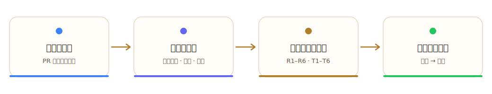
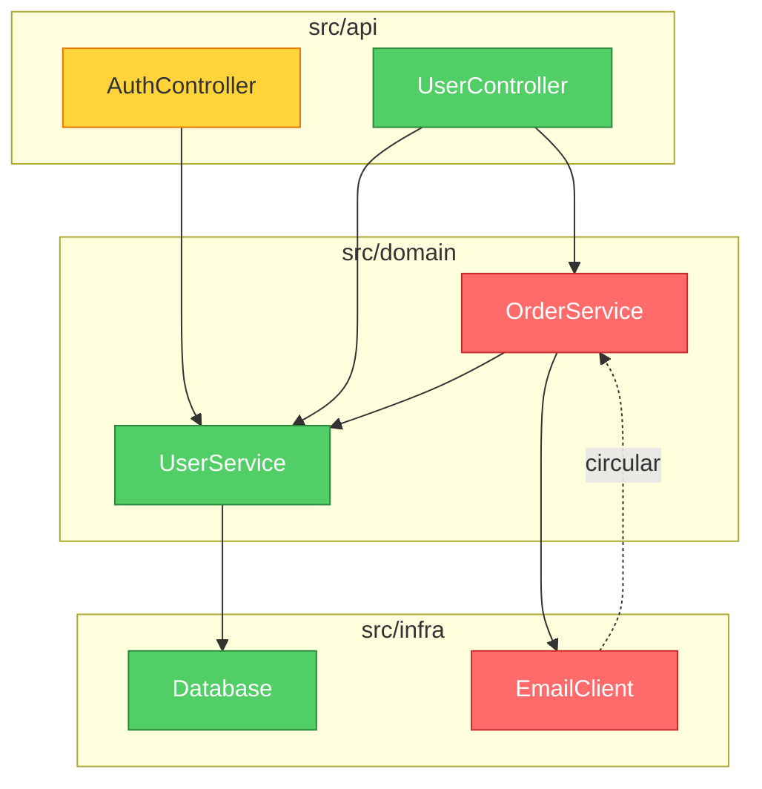

<p align="center">
  
</p>

<h1 align="center">brooks-lint</h1>

<p align="center">
  <strong>植根於十二本經典工程著作的 AI 程式碼審查。<br>
  一致、可溯源、可落地。</strong>
</p>

<p align="center">
  <a href="README.md">English</a> ·
  <a href="README.zh-CN.md">简体中文</a> ·
  <strong>繁體中文</strong> ·
  <a href="README.ja.md">日本語</a> ·
  <a href="README.ko.md">한국어</a> ·
  <a href="README.es.md">Español</a>
</p>

<p align="center">
  <a href="#快速上手">快速上手</a> •
  <a href="#六類衰退風險">六類衰退風險</a> •
  <a href="#實際效果">實際效果</a> •
  <a href="#基準測試">基準測試</a> •
  <a href="#安裝">安裝</a>
</p>

<p align="center">
  
  
  
  
  
</p>

<p align="center">
  <a href="https://trendshift.io/repositories/47738" target="_blank"></a>
</p>

<p align="center">
  
</p>

<p align="center">
  <a href="https://hyhmrright.github.io/brooks-lint/"></a>
</p>

<p align="center">
  <strong><a href="https://hyhmrright.github.io/brooks-lint/">→ 造訪官網</a></strong>
</p>

---

> *"一個孩子要十月懷胎，無論派多少人去都一樣。"*
> —— Frederick Brooks，《人月神話》（1975）

**五十年過去，Brooks 依然正確——McConnell、Fowler、Martin、Hunt & Thomas、Evans、Ousterhout、Winters、Meszaros、Osherove、Feathers 以及 Google 測試團隊同樣如此。**

大多數程式碼品質工具只數行數和循環複雜度。**brooks-lint** 更進一步——它對照六個衰退風險維度（綜合自十二本經典工程著作）診斷你的程式碼，每一次都產出帶書目出處、嚴重度標籤和具體對策的結構化診斷。

完整的「書目—技能」對應（含例外與誤報防護），見
[`skills/_shared/source-coverage.md`](skills/_shared/source-coverage.md)。

## 快速上手

```bash
# Claude Code
/plugin marketplace add hyhmrright/brooks-lint
/plugin install brooks-lint@brooks-lint-marketplace

# 其他任意 Agent Skills 平台 —— Cursor · Codex · Gemini · Copilot · Windsurf · OpenCode · Kiro · …
curl -fsSL https://raw.githubusercontent.com/hyhmrright/brooks-lint/main/scripts/install.sh | bash -s -- <平台>
```

裝好後直接開口（「審查這個 PR」「稽核架構」）——或執行命令：

| 命令 | 作用 |
|------|------|
| `/brooks-review` | 審查一個 PR 或 diff |
| `/brooks-audit` | 架構稽核（含 Mermaid 相依圖） |
| `/brooks-debt` | 排好優先順序的技術債路線圖 |
| `/brooks-test` | 測試套件品質審查 |
| `/brooks-health` | 跨所有維度的健康儀表板 |
| `/brooks-sweep` | 全維度掃描並自動修復 |

每條診斷都以 **症狀 → 根源 → 後果 → 對策** 回傳，附書目出處和 0–100 健康分。完整安裝方式（另外 8 個平台）、逐命令用法、CI/CD 設定見[下文](#安裝)。

## 十二本書

| 書名 | 作者 | 貢獻於 |
|------|--------|----------------|
| *The Mythical Man-Month*（人月神話） | Frederick Brooks | R2、R4、R5 |
| *Code Complete*（程式碼大全） | Steve McConnell | R1、R4 |
| *Refactoring*（重構） | Martin Fowler | R1、R2、R3、R4、R6 |
| *Clean Architecture*（無瑕的程式碼：整潔的軟體設計與架構篇） | Robert C. Martin | R2、R5 |
| *The Pragmatic Programmer*（務實的程式設計師） | Hunt & Thomas | R2、R3、R4、R5、T2、T3 |
| *Domain-Driven Design*（領域驅動設計） | Eric Evans | R1、R3、R6 |
| *A Philosophy of Software Design*（軟體設計的哲學） | John Ousterhout | R1、R4 |
| *Software Engineering at Google*（Google 軟體工程） | Winters, Manshreck & Wright | R2、R5 |
| *The Art of Unit Testing*（單元測試的藝術） | Roy Osherove | T1、T2、T4、T5 |
| *How Google Tests Software*（Google 測試之道） | Whittaker, Arbon & Carollo | T5、T6 |
| *Working Effectively with Legacy Code*（修改軟體的藝術） | Michael Feathers | T4、T5、T6 |
| *xUnit Test Patterns*（xUnit 測試模式） | Gerard Meszaros | T1、T2、T3、T4 |

## 六類衰退風險

brooks-lint 從**六類生產程式碼衰退風險**和**六類測試程式碼衰退風險**兩個角度評估你的程式碼，這些維度綜合自十二本經典工程著作：

| 衰退風險 | 診斷問題 | 出處 |
|------------|---------------------|---------|
| 🧠 認知過載 | 理解這段程式碼要花多少腦力？ | Code Complete、Refactoring、DDD、Philosophy of SD |
| 🔗 變更擴散 | 改一處會牽連多少不相干的東西？ | Refactoring、Clean Architecture、Pragmatic、SE@Google |
| 📋 知識重複 | 同一個決策是否在多處被表達？ | Pragmatic、Refactoring、DDD |
| 🌀 偶發複雜度 | 程式碼是否比問題本身更複雜？ | Refactoring、Code Complete、Brooks、Philosophy of SD |
| 🏗️ 相依失序 | 相依關係是否朝一致的方向流動？ | Clean Architecture、Brooks、Pragmatic、SE@Google |
| 🗺️ 領域模型失真 | 程式碼是否忠實地表達了業務領域？ | DDD、Refactoring |

> Philosophy of SD = *A Philosophy of Software Design*（Ousterhout） · SE@Google = *Software Engineering at Google*（Winters 等）

## 實際效果

給定這段程式碼：

```python
class UserService:
    def update_profile(self, user_id, name, email, avatar_url):
        user = self.db.query(f"SELECT * FROM users WHERE id = {user_id}")
        user['email'] = email
        ...
        if user['email'] != email:   # 永遠為 False —— 隱性 bug
            self.smtp.send(...)
        points = user['login_count'] * 10 + 500
        self.db.execute(f"UPDATE loyalty SET points={points} WHERE user_id={user_id}")
```

brooks-lint 產出：

---

**健康分：28/100**

*這個方法把四個不相干的業務職責塞進同一個函式，含有一個會靜默吞掉「信箱變更通知」的邏輯 bug，並且對 SQL 注入門戶大開。*

### 🔴 變更擴散 —— 單個方法因四個不相干的業務原因而改動
**症狀：** `update_profile` 在同一個方法主體裡完成資料欄位更新、信箱變更通知、點數重算和快取失效。
**根源：** Fowler — *Refactoring* — 發散式變更（Divergent Change）；Hunt & Thomas — *The Pragmatic Programmer* — 正交性（Orthogonality）
**後果：** 任何對點數公式的改動都可能破壞郵件通知，反之亦然。每次修改都同時背負著四個不相干領域的回歸風險。
**對策：** 抽出 `NotificationService`、`LoyaltyService` 和 `UserCacheInvalidator`。`UserService.update_profile` 應只做編排、逐一呼叫它們——本身不持有任何實作邏輯。

### 🔴 領域模型失真 —— 隱性邏輯 bug：信箱通知永不觸發
**症狀：** `user['email'] = email` 在 `if user['email'] != email` 之前就覆寫了舊值——條件恆為 `False`，通知是死程式碼。
**根源：** McConnell — *Code Complete* — 第 17 章：非常規控制結構
**後果：** 使用者改信箱時永遠收不到通知。這是靜默的資料完整性失效——系統看似正常運作，實則違反了業務規則。
**對策：** 在任何修改之前先擷取 `old_email = user['email']`，拿它（而非 `user['email']`）做比較。

*（另有 6 條診斷，含 SQL 注入、相依失序、魔術數字）*

### 帶相依圖的架構審查

在模式 2（架構審查）中，brooks-lint 會在報告頂部產生一張 **Mermaid 相依圖**。模組按嚴重度著色：紅=Critical，黃=Warning，綠=乾淨。



該圖在 GitHub、Notion 等 Markdown 環境中原生算繪——無需額外工具。

## 更多範例

[完整畫廊](docs/gallery.md) 收錄了 brooks-lint 在 Python、TypeScript、Go、Java 上的真實輸出——涵蓋 PR 審查、帶 Mermaid 相依圖的架構審查、技術債評估和測試品質審查。

初次接觸這些衰退風險？[**衰退風險實戰指南**](https://hyhmrright.github.io/brooks-lint/guide.html) 逐一講解全部六類——每類的診斷問題、代表症狀、出處書目與對策。

---

## 基準測試

在 3 個真實情境（PR 審查、架構審查、技術債評估）上測試：

| 評估項 | brooks-lint | 僅用 Claude |
|-----------|:-----------:|:------------:|
| 結構化診斷（症狀 → 根源 → 後果 → 對策） | ✅ 100% | ❌ 0% |
| 每條診斷帶書目出處 | ✅ 100% | ❌ 0% |
| 嚴重度標籤（🔴/🟡/🟢） | ✅ 100% | ❌ 0% |
| 健康分（0–100） | ✅ 100% | ❌ 0% |
| 識別「變更擴散」 | ✅ 100% | ✅ 100% |
| **整體通過率** | **94%** | **16%** |

差距不在於 Claude *能不能*發現問題——而在於它能否*每一次都穩定地*發現，並附上可溯源的證據和可落地的對策。

### 可復現基準

上表是示意性的。下面這些數字**確定、可在本地復算**：

**parser 保真度** —— SARIF 輸出與 CI 閘門都依賴於正確解析模型的 Markdown 報告。在一個**凍結的 30 份真實模型報告語料**上（涵蓋全部六種 mode，`evals/benchmark-corpus.json`），每份都配有**獨立評分**的發現清單（由另一遍模型評分、並經人工抽查），實際發布的 parser 跑分如下——執行 `npm run benchmark`：

| 指標（n = 30，凍結語料） | 結果 |
|---|:---:|
| 嚴重度計數精確吻合（parser vs 人工標註真值） | 30 / 30 |
| 風險碼 precision / recall | 100% / 100%（56 個 finding-level 碼，0 偽陽 / 0 偽陰） |
| 產出合法 SARIF 2.1.0 | 30 / 30 |

由於 parser 是確定性的、語料是凍結的，`npm run benchmark` 對任何人都給出相同結果，`npm test` 也將其作為回歸守衛。該語料**有意**包含 9 份偽陽性 / tradeoff 報告（例如一個*看起來像*循環相依、實則是埠與配接器（ports-and-adapters）的設計），它們必須保持乾淨。

**評分確定性** —— 給定一組固定發現（2 Critical / 3 Warning / 1 Suggestion），三個 strictness 預設產出的分數與其 `common.md` 表的預測分毫不差：strict **34**、balanced **54**、legacy-friendly **74**——且只有 `legacy-friendly` 會優先列出前三高槓桿修復。

**模型品質** —— 模型能否在真實程式碼上找到*正確的*風險，由 **57 情境 eval 套件**（`evals/evals.json`）衡量：`npm run evals`（結構校驗）與 `npm run evals:live`（實測，需 `ANTHROPIC_API_KEY`）。

> 範圍與誠實說明：parser 數字是確定性的、可精確復算；strictness 與 eval 套件的數字是對模型的單次實測，會有輕微跑動差異。parser 基準衡量的是報告解析保真度（工具是否讀出了報告裡寫的每條發現），而非某條發現「是否正確」。嚴重度計數吻合是完全獨立的訊號；風險碼一致性還反映了 parser 與 grader 共用同一套權威 name→code 對應。

## 橫向對比

| | brooks-lint | ESLint / Pylint | GitHub Copilot Review | 原生 Claude |
|---|:---:|:---:|:---:|:---:|
| 偵測語法與風格問題 | — | ✅ | ✅ | ~ |
| 結構化診斷鏈 | ✅ | ❌ | ❌ | ❌ |
| 將診斷溯源到經典著作 | ✅ | ❌ | ❌ | ❌ |
| 一致的嚴重度標籤 | ✅ | ✅ | ~ | ❌ |
| 架構層面的洞察 | ✅ | ❌ | ~ | ~ |
| 領域模型分析 | ✅ | ❌ | ❌ | ~ |
| 零設定、無需安裝外掛 | ✅ | ❌ | ✅ | ✅ |
| 適用於任何語言 | ✅ | ❌ | ✅ | ✅ |

> `~` = 偶爾 / 不穩定

**brooks-lint 不是要取代你的 linter。** 它捕捉的是 linter 抓不到的東西：架構漂移、知識孤島、領域模型失真——這些問題往往在無人察覺的幾個月裡持續拖慢團隊。

## 安裝

### Claude Code（推薦）

#### 透過外掛市集
```bash
/plugin marketplace add hyhmrright/brooks-lint
/plugin install brooks-lint@brooks-lint-marketplace
```

短命令（`/brooks-review`）會在首次工作階段啟動時自動安裝。手動安裝：
```bash
cp commands/*.md ~/.claude/commands/
```

#### 手動安裝
```bash
mkdir -p ~/.claude/skills/brooks-lint
cp -r skills/* ~/.claude/skills/brooks-lint/
```

### Gemini CLI

#### 透過擴充功能
```bash
/extensions install https://github.com/hyhmrright/brooks-lint
```

#### 手動安裝
```bash
mkdir -p ~/.gemini/skills
cp -r skills/* ~/.gemini/skills/      # 扁平——Gemini 只探索一層深的技能
```
> 或直接：`./scripts/install.sh gemini`

### Codex CLI

#### 透過技能安裝器（在 Codex 工作階段中）
```
Install the brooks-lint skill from hyhmrright/brooks-lint
```

#### 命令列
```bash
python3 ~/.codex/skills/.system/skill-installer/scripts/install-skill-from-github.py \
  --repo hyhmrright/brooks-lint --path skills --name brooks-lint
```

#### 手動安裝
```bash
git clone https://github.com/hyhmrright/brooks-lint.git /tmp/brooks-lint
mkdir -p ~/.codex/skills
cp -r /tmp/brooks-lint/skills/* ~/.codex/skills/   # 扁平——與技能安裝器佈局一致
```
> 或直接：`./scripts/install.sh codex`

### 更多平台——OpenCode · Cursor · Windsurf · Antigravity · pi · Copilot · Kiro · Factory Droid

brooks-lint 以標準 [Agent Skills](https://agentskills.io) 形式散布。**任何載入 Agent Skills 的 agent
都能無需任何轉換執行全部六種模式**——一條命令即可安裝：

```bash
# 選擇你的平台；加 --project 裝進當前儲存庫而非全域設定
curl -fsSL https://raw.githubusercontent.com/hyhmrright/brooks-lint/main/scripts/install.sh | bash -s -- <平台>
#   <平台> = opencode · cursor · windsurf · antigravity · pi · kiro · copilot · droid · gemini · codex · agents
```

安裝器會把技能**扁平**複製進該平台對應的資料夾，讓共享框架（`../_shared/`）始終正確解析——你不可能裝錯佈局。
裝好後直接提問（「審查這個 PR」、「稽核架構」），對應技能就會依據 `description` 自動觸發。
不熟悉 skills、或用的是別的 agent？見 **[docs/getting-started.md](docs/getting-started.md)**。

<details><summary><b>OpenCode</b></summary>

`./scripts/install.sh opencode` → `~/.config/opencode/skills`（同時讀取 `~/.claude/skills` 與
`AGENTS.md`）。完整指南：[docs/opencode-setup.md](docs/opencode-setup.md)。
</details>

<details><summary><b>Cursor</b>（2.4+）</summary>

`./scripts/install.sh cursor` → `~/.cursor/skills`（也讀 `.agents/skills`；讀取 `AGENTS.md`）。
完整指南：[docs/cursor-setup.md](docs/cursor-setup.md)。
</details>

<details><summary><b>Windsurf</b>（Cascade）</summary>

`./scripts/install.sh windsurf` → `~/.codeium/windsurf/skills`（讀取 `AGENTS.md`）。
完整指南：[docs/windsurf-setup.md](docs/windsurf-setup.md)。
</details>

<details><summary><b>Antigravity</b>（Google）</summary>

`./scripts/install.sh antigravity --project` → `.agent/skills`（讀取 `AGENTS.md` / `GEMINI.md`）。
完整指南：[docs/antigravity-setup.md](docs/antigravity-setup.md)。
</details>

<details><summary><b>pi</b>（earendil-works）</summary>

`./scripts/install.sh pi` → `~/.pi/agent/skills`，或讓 pi 的 `skills` 設定指向一個克隆。
完整指南：[docs/pi-setup.md](docs/pi-setup.md)。
</details>

<details><summary><b>GitHub Copilot</b></summary>

`./scripts/install.sh copilot --project` → `.github/skills`（也自動辨識 `.claude/skills`；讀取
`AGENTS.md`）。完整指南：[docs/copilot-setup.md](docs/copilot-setup.md)。
</details>

<details><summary><b>Kiro</b>（AWS）</summary>

`./scripts/install.sh kiro` → `~/.kiro/skills`（自動註冊 `/brooks-review`；讀取 `AGENTS.md`）。
完整指南：[docs/kiro-setup.md](docs/kiro-setup.md)。
</details>

<details><summary><b>Factory Droid</b></summary>

`./scripts/install.sh droid` → `~/.factory/skills`（註冊 `/brooks-review`；讀取 `AGENTS.md`）。
完整指南：[docs/factory-droid-setup.md](docs/factory-droid-setup.md)。
</details>

> **🧪 驗證狀態。** Claude Code、Gemini CLI、Codex CLI 已由維護者驗證。上面八個平台依據各工具官方技能規範撰寫，
> 並已在檔案佈局層面驗證（安裝器經過測試），但維護者尚未在每個平台端到端實跑。在某平台試過了——無論成功**還是**失敗？
> 請[提一個 issue](https://github.com/hyhmrright/brooks-lint/issues/new)，附上平台、版本和你看到的結果。
> 用的是其他相容 Agent Skills 的 agent？它幾乎肯定以同樣方式運作——告訴我們，我們會補上。

## 斜線命令

### Claude Code
| 命令 | 短命令 | 作用 |
|---------|------------|--------|
| `/brooks-lint:brooks-review` | `/brooks-review` | PR 級程式碼審查 |
| `/brooks-lint:brooks-audit` | `/brooks-audit` | 完整架構審查 |
| `/brooks-lint:brooks-debt` | `/brooks-debt` | 技術債評估 |
| `/brooks-lint:brooks-test` | `/brooks-test` | 測試套件健康審查 |
| `/brooks-lint:brooks-health` | `/brooks-health` | 健康儀表板——全部四個維度 |
| `/brooks-lint:brooks-sweep` | `/brooks-sweep` | 全面掃描——分析所有維度並自動修復 |

> 短命令由 session-start 掛鉤在首次工作階段啟動時自動安裝。

### Gemini CLI
| 命令 | 作用 |
|---------|--------|
| `/brooks-review` | PR 級程式碼審查 |
| `/brooks-audit` | 完整架構審查 |
| `/brooks-debt` | 技術債評估 |
| `/brooks-test` | 測試套件健康審查 |
| `/brooks-health` | 健康儀表板——全部四個維度 |
| `/brooks-sweep` | 全面掃描——分析所有維度並自動修復 |

### Codex CLI

| 命令 | 作用 |
|---------|--------|
| `$brooks-review` | PR 級程式碼審查 |
| `$brooks-audit` | 完整架構審查 |
| `$brooks-debt` | 技術債評估 |
| `$brooks-test` | 測試套件健康審查 |
| `$brooks-health` | 健康儀表板——全部四個維度 |
| `$brooks-sweep` | 全面掃描——分析所有維度並自動修復 |

當你討論程式碼品質、架構、可維護性或測試健康時，這些技能也會自動觸發。

### OpenCode · Cursor · Antigravity · pi

這些平台依據每個技能的 `description` 自動呼叫 Agent Skills——直接提問（「審查這個 PR」、「稽核架構」、
「我們最糟的技術債在哪」）就會執行對應模式。需要顯式呼叫時，使用各平台的技能命令語法（例如 pi 把每個技能註冊為
`/skill:brooks-review`；Cursor 與 OpenCode 在技能被探索到後暴露 `/brooks-review`）。

## 使用

### PR 審查

```
/brooks-review                      # Claude Code（短命令）/ Gemini CLI
/brooks-lint:brooks-review          # Claude Code（完整形式）
$brooks-review                      # Codex CLI
```

貼上一段 diff，或讓 AI 指向改動的檔案。它會以 症狀 → 根源 → 後果 → 對策 的格式，逐一診斷六類衰退風險並給出具體診斷。

### 架構審查

```
/brooks-audit                       # Claude Code（短命令）/ Gemini CLI
/brooks-lint:brooks-audit           # Claude Code（完整形式）
$brooks-audit                       # Codex CLI
```

描述你的專案結構或分享關鍵檔案。它會梳理模組相依、識別循環相依，並檢查是否符合康威定律。

### 技術債評估

```
/brooks-debt                        # Claude Code（短命令）/ Gemini CLI
/brooks-lint:brooks-debt            # Claude Code（完整形式）
$brooks-debt                        # Codex CLI
```

按六類衰退風險對技術債分類，以 痛感 × 擴散面 為每條診斷打優先順序，產出帶 Critical / Scheduled / Monitored 分級的償還路線圖。

### 測試品質審查

```
/brooks-test                        # Claude Code（短命令）/ Gemini CLI
/brooks-lint:brooks-test            # Claude Code（完整形式）
$brooks-test                        # Codex CLI
```

對照六類測試空間衰退風險審查你的測試套件——測試晦澀、測試脆弱、測試重複、Mock 濫用、覆蓋率幻覺、架構錯配——出處為 xUnit Test Patterns、The Art of Unit Testing、How Google Tests Software 和 Working Effectively with Legacy Code。PR 審查還會自動包含一個輕量的第 7 步快速測試檢查（對純文件或非生產程式碼 diff 會略過）。

### 健康儀表板

```
/brooks-health                      # Claude Code（短命令）/ Gemini CLI
/brooks-lint:brooks-health          # Claude Code（完整形式）
$brooks-health                      # Codex CLI
```

對全部四個品質維度做精簡掃描，產出加權綜合健康分（0–100）。適合發版前、新團隊上手時，或任何你想要一份「我們現在怎麼樣？」全局報告的場景。需要某個維度的深度診斷時，請改用對應的專項技能。

### 全面掃描

```
/brooks-sweep                       # Claude Code（短命令）/ Gemini CLI
/brooks-lint:brooks-sweep           # Claude Code（完整形式）
$brooks-sweep                       # Codex CLI
```

一次性掃描全部生產（R1–R6）與測試（T1–T6）衰退風險以及架構，然後施加修復：安全改動立即自動套用，跨檔案或觸及介面的改動需確認，複雜的架構決策則標記為人工處理項。輸出修復記錄、健康分變化和遺留項清單。

## 設定

在專案根目錄放一個 `.brooks-lint.yaml` 來客製化審查行為：

```yaml
version: 1

strictness: balanced   # strict | balanced（預設）| legacy-friendly——對遺留程式碼更寬鬆的評分

disable:
  - T5   # 略過覆蓋率指標檢查——我們不強制覆蓋率

severity:
  R1: suggestion   # 在該領域下調「認知過載」診斷的嚴重度

ignore:
  - "**/*.generated.*"
  - "**/vendor/**"

# custom_risks:   # 定義專案專屬 Cx 風險碼——見 skills/_shared/custom-risks-guide.md
# suppress:       # 按風險碼 + 路徑下調特定診斷（如已接受的遺留債務）
```

可複製 [`.brooks-lint.example.yaml`](.brooks-lint.example.yaml) 作為起點。
所有設定均為選用——完全省略該檔案即使用預設行為。

| 設定 | 說明 |
|---------|-------------|
| `strictness` | 評分預設：`strict`、`balanced`（預設）或 `legacy-friendly`（更輕的扣分，並優先列出高槓桿修復項） |
| `disable` | 要略過的風險碼（`R1`–`R6`、`T1`–`T6`） |
| `severity` | 覆寫嚴重度等級（`critical` / `warning` / `suggestion`） |
| `ignore` | 要排除的檔案 glob 模式 |
| `focus` | 只評估這些風險碼（不能與 `disable` 同時使用） |
| `custom_risks` | 定義專案專屬風險碼（`C1`、`C2`……）——見 [`custom-risks-guide.md`](skills/_shared/custom-risks-guide.md) |
| `suppress` | 按風險碼 + 路徑下調特定診斷的嚴重度（可帶 `expires:` 到期日期） |

---

## 為什麼是這些書，為什麼是現在？

在 AI 輔助編程的時代，我們寫程式碼比以往任何時候都更快、更多。但六十年軟體工程沉澱下來的洞見並沒有改變：

> *"軟體的複雜性是本質屬性，而非偶然屬性。"*
> —— Frederick Brooks

AI 能幫你更快地寫程式碼，卻無法告訴你正在建造的是大教堂還是焦油坑。**brooks-lint 彌合了這道鴻溝**——它把十二本經典工程著作中得來不易的智慧，帶進你現代的開發工作流程。

這些作者識別出的衰退風險，如今比以往更切題：
- **接入 AI 助手** 並不能修復認知過載或領域模型失真
- **產生更多程式碼** 會加劇變更擴散和知識重複
- **跑得更快** 讓偶發複雜度和相依失序更加危險

## 專案結構

```
brooks-lint/
├── .claude-plugin/              # Claude Code 外掛中繼資料
├── .codex-plugin/               # Codex CLI 外掛中繼資料
├── skills/
│   ├── _shared/                 # 共享框架檔案
│   │   ├── common.md            # 鐵律、專案設定、報告範本、健康分
│   │   ├── source-coverage.md   # 12 本書涵蓋矩陣、權衡、誤報防護
│   │   ├── decay-risks.md       # 六類衰退風險及症狀與書目出處
│   │   ├── test-decay-risks.md  # 六類測試空間衰退風險及書目出處
│   │   ├── remedy-guide.md      # --fix 模式：可落地的對策強化規則
│   │   └── custom-risks-guide.md  # 專案自訂風險碼範本
│   ├── brooks-review/           # 模式 1：PR 審查
│   │   ├── SKILL.md
│   │   └── pr-review-guide.md
│   ├── brooks-audit/            # 模式 2：架構審查
│   │   ├── SKILL.md
│   │   └── architecture-guide.md
│   ├── brooks-debt/             # 模式 3：技術債評估
│   │   ├── SKILL.md
│   │   └── debt-guide.md
│   ├── brooks-test/             # 模式 4：測試品質審查
│   │   ├── SKILL.md
│   │   └── test-guide.md
│   ├── brooks-health/           # 模式 5：健康儀表板
│   │   ├── SKILL.md
│   │   └── health-guide.md
│   └── brooks-sweep/            # 模式 6：全面掃描與自動修復
│       ├── SKILL.md
│       └── sweep-guide.md
├── hooks/                       # SessionStart 掛鉤
├── commands/                    # 短命令包裝（由掛鉤自動安裝）
├── evals/                       # 基準測試案例
│   └── evals.json
└── assets/
    └── logo.svg
```

## CI/CD 整合

用 GitHub Action 在每個 PR 上自動執行 brooks-lint：

```yaml
# .github/workflows/brooks-lint.yml
name: Brooks-Lint PR Review
on:
  pull_request:
    types: [opened, synchronize, reopened]

jobs:
  brooks-lint:
    runs-on: ubuntu-latest
    permissions:
      pull-requests: write
    steps:
      - uses: actions/checkout@v4
        with:
          fetch-depth: 0
      - uses: hyhmrright/brooks-lint/.github/actions/brooks-lint@main
        with:
          mode: review
          anthropic-api-key: ${{ secrets.ANTHROPIC_API_KEY }}
          fail-below: 70
```

完整範本見 [`docs/github-action-example.yml`](docs/github-action-example.yml)。

該 Action 會把審查結果作為 PR 留言發布，並可在健康分跌破閾值時讓檢查失敗。若儲存庫中提交了 `.brooks-lint-history.json`，留言還會包含趨勢變化（如 "85 → 82（−3），近 3 次執行"）。

**品質閘門與 Code Scanning。** 除 `fail-below` 外，該 Action 還提供：

```yaml
        with:
          mode: review
          anthropic-api-key: ${{ secrets.ANTHROPIC_API_KEY }}
          fail-on: critical            # 出現任何 Critical 即失敗（none | warning | critical）
          fail-on-regression: true     # 健康分較上次執行下降則失敗
          sarif-file: brooks-lint.sarif  # 同時把診斷上傳到 GitHub Code Scanning
```

`fail-on-regression` 讀取 `.brooks-lint-history.json`，因此提交該檔案即可強制「無新增回歸」。設定 `sarif-file` 會讓診斷直接顯示在 PR 的 **Files changed** 分頁，並需要 job 具備 `security-events: write` 權限。

**成本：** 每次 PR 執行約 $0.05–0.15，取決於 diff 大小和模型。建議僅在 `pull_request` 事件上執行。

## 路線圖

> **目前狀態（v1.4）：** 12 本書地基，6 類生產衰退風險（R1–R6）+ 6 類測試衰退風險（T1–T6），6 個技能——PR 審查、架構審查、技術債、測試品質、健康儀表板、全量掃描——外加 CI 品質閘門、面向 GitHub Code Scanning 的 SARIF 輸出、嚴格度預設，以及一個可復現的 parser 保真度基準。下方較早的條目記錄的是歷史里程碑，而非目前功能集。

- [x] **v0.2**：外掛基礎設施（`.claude-plugin/`、掛鉤、斜線命令）
- [x] **v0.3**：八個 Brooks 維度、文件完整度評分
- [x] **v0.4**：六本書框架、衰退風險維度、診斷鏈、基準套件
- [x] **v0.5**：測試品質審查（模式 4）——四本測試書、六類測試衰退風險
- [x] **v0.6**：架構審查中的 Mermaid 相依圖
- [x] **v0.7**：`.brooks-lint.yaml` 專案設定、模式 2 主動上下文、擴展到 10 本書
- [x] **v0.8**：帶命名空間命令的獨立技能架構
- [x] **v0.9**：步驟校驗、自動 diff 範圍、`/brooks-health` 儀表板、趨勢追蹤、分診模式、`--fix` 對策、上手報告、GitHub Action
- [x] **v1.0**：評測自動化（`run-evals-live.mjs`）、自訂風險擴充（`Cx` 碼）
- [x] **v1.1**：全量掃描技能（`brooks-sweep`）——跨維度統一分析 + 自動修復
- [x] **v1.2**：自主化 sweep 管線、`npm run bump` 版本傳播
- [x] **v1.3**：Codex 市集中繼資料、多平台一鍵安裝指令碼、雙語 README + 落地頁
- [x] **v1.4**：SARIF 輸出（GitHub Code Scanning）、CI severity + 回歸閘門、嚴格度預設（strict/balanced/legacy-friendly）、57 情境 eval 套件、可復現的 parser 保真度基準（`npm run benchmark`）

想出一份力？現在最有價值的貢獻是新的評測案例和更好的衰退風險症狀模式。見 [CONTRIBUTING.md](CONTRIBUTING.md)。

## 貢獻

如何新增診斷、改進指南或擴充基準套件，見 [CONTRIBUTING.md](CONTRIBUTING.md)。

在你自己的 PR 上跑一遍 `/brooks-review`——我們用正在打造的工具來審查貢獻。

## 授權條款

MIT License——詳見 [LICENSE](LICENSE)。

## 致謝

本專案站在十二位巨人的肩膀上：

**生產程式碼框架**
- Frederick P. Brooks Jr. — *The Mythical Man-Month*（1975，紀念版 1995）
- Steve McConnell — *Code Complete*（1993，第 2 版 2004）
- Martin Fowler — *Refactoring*（1999，第 2 版 2018）
- Robert C. Martin — *Clean Architecture*（2017）
- Andrew Hunt & David Thomas — *The Pragmatic Programmer*（1999，20 週年版 2019）
- Eric Evans — *Domain-Driven Design*（2003）
- John Ousterhout — *A Philosophy of Software Design*（2018）
- Titus Winters、Tom Manshreck、Hyrum Wright — *Software Engineering at Google*（2020）

**測試品質框架**
- Gerard Meszaros — *xUnit Test Patterns*（2007）
- Roy Osherove — *The Art of Unit Testing*（2009，第 3 版 2023）
- Google Engineering — *How Google Tests Software*（2012）
- Michael Feathers — *Working Effectively with Legacy Code*（2004）

本工具中編碼的衰退風險，是我們對他們思想的綜合，並應用於現代程式碼品質評估。

---

## Star 歷史

[](https://star-history.com/#hyhmrright/brooks-lint&Date)

---

<p align="center">
  <strong>⭐ 如果這個工具讓你以不同的眼光看待自己的程式碼庫，請給它點個 star！</strong>
</p>
