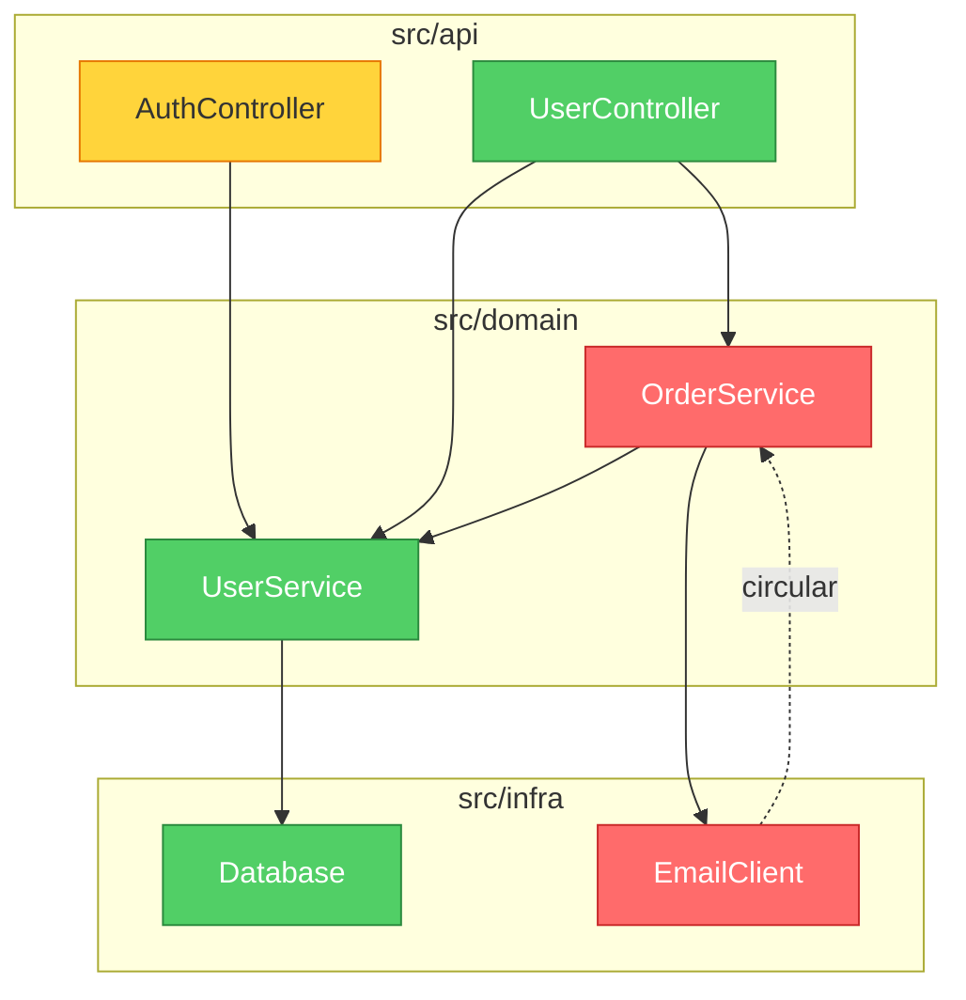

<p align="center">
  
</p>

<h1 align="center">brooks-lint</h1>

<p align="center">
  <strong>植根於十二本經典工程著作的 AI 程式碼審查。<br>
  一致、可溯源、可落地。</strong>
</p>

<p align="center">
  <a href="README.md">English</a> ·
  <a href="README.zh-CN.md">简体中文</a> ·
  <strong>繁體中文</strong> ·
  <a href="README.ja.md">日本語</a> ·
  <a href="README.ko.md">한국어</a> ·
  <a href="README.es.md">Español</a>
</p>

<p align="center">
  <a href="#快速上手">快速上手</a> •
  <a href="#六類衰退風險">六類衰退風險</a> •
  <a href="#實際效果">實際效果</a> •
  <a href="#基準測試">基準測試</a> •
  <a href="#安裝">安裝</a>
</p>

<p align="center">
  
  
  
  
  
</p>

<p align="center">
  <a href="https://trendshift.io/repositories/47738" target="_blank"></a>
</p>

<p align="center">
  
</p>

<p align="center">
  <a href="https://hyhmrright.github.io/brooks-lint/"></a>
</p>

<p align="center">
  <strong><a href="https://hyhmrright.github.io/brooks-lint/">→ 造訪官網</a></strong>
</p>

---

> *"一個孩子要十月懷胎，無論派多少人去都一樣。"*
> —— Frederick Brooks，《人月神話》（1975）

**五十年過去，Brooks 依然正確——McConnell、Fowler、Martin、Hunt & Thomas、Evans、Ousterhout、Winters、Meszaros、Osherove、Feathers 以及 Google 測試團隊同樣如此。**

大多數程式碼品質工具只數行數和循環複雜度。**brooks-lint** 更進一步——它對照六個衰退風險維度（綜合自十二本經典工程著作）診斷你的程式碼，每一次都產出帶書目出處、嚴重度標籤和具體對策的結構化診斷。

完整的「書目—技能」對應（含例外與誤報防護），見
[`skills/_shared/source-coverage.md`](skills/_shared/source-coverage.md)。

## 快速上手

```bash
# Claude Code
/plugin marketplace add hyhmrright/brooks-lint
/plugin install brooks-lint@brooks-lint-marketplace

# 其他任意 Agent Skills 平台 —— Cursor · Codex · Gemini · Copilot · Windsurf · OpenCode · Kiro · …
curl -fsSL https://raw.githubusercontent.com/hyhmrright/brooks-lint/main/scripts/install.sh | bash -s -- <平台>
```

裝好後直接開口（「審查這個 PR」「稽核架構」），或執行六個命令之一——`/brooks-review`、`/brooks-audit`、
`/brooks-debt`、`/brooks-test`、`/brooks-health`、`/brooks-sweep`（[各自的作用](#斜線命令)）。

每條診斷都以 **症狀 → 根源 → 後果 → 對策** 回傳，附書目出處和 0–100 健康分。完整安裝方式（另外 9 個
平台）和 CI/CD 設定見[下文](#安裝)。

## 十二本書

| 書名 | 作者 | 貢獻於 |
|------|--------|----------------|
| *The Mythical Man-Month*（人月神話，1975） | Frederick P. Brooks Jr. | R2、R4、R5 |
| *Code Complete*（程式碼大全，1993，第 2 版 2004） | Steve McConnell | R1、R4 |
| *Refactoring*（重構，1999，第 2 版 2018） | Martin Fowler | R1、R2、R3、R4、R6 |
| *Clean Architecture*（無瑕的程式碼：整潔的軟體設計與架構篇，2017） | Robert C. Martin | R2、R5 |
| *The Pragmatic Programmer*（務實的程式設計師，1999，20 週年版 2019） | Andrew Hunt & David Thomas | R2、R3、R4、R5、T2、T3 |
| *Domain-Driven Design*（領域驅動設計，2003） | Eric Evans | R1、R3、R6 |
| *A Philosophy of Software Design*（軟體設計的哲學，2018） | John Ousterhout | R1、R4 |
| *Software Engineering at Google*（Google 軟體工程，2020） | Winters, Manshreck & Wright | R2、R5 |
| *The Art of Unit Testing*（單元測試的藝術，2009，第 3 版 2023） | Roy Osherove | T1、T2、T4、T5 |
| *How Google Tests Software*（Google 測試之道，2012） | Whittaker, Arbon & Carollo | T5、T6 |
| *Working Effectively with Legacy Code*（修改軟體的藝術，2004） | Michael Feathers | T4、T5、T6 |
| *xUnit Test Patterns*（xUnit 測試模式，2007） | Gerard Meszaros | T1、T2、T3、T4 |

## 六類衰退風險

brooks-lint 從**六類生產程式碼衰退風險**和**六類測試程式碼衰退風險**兩個角度評估你的程式碼，這些維度綜合自十二本經典工程著作：

| 衰退風險 | 診斷問題 | 出處 |
|------------|---------------------|---------|
| 🧠 認知過載 | 理解這段程式碼要花多少腦力？ | Code Complete、Refactoring、DDD、Philosophy of SD |
| 🔗 變更擴散 | 改一處會牽連多少不相干的東西？ | Refactoring、Clean Architecture、Pragmatic、SE@Google |
| 📋 知識重複 | 同一個決策是否在多處被表達？ | Pragmatic、Refactoring、DDD |
| 🌀 偶發複雜度 | 程式碼是否比問題本身更複雜？ | Refactoring、Code Complete、Brooks、Philosophy of SD |
| 🏗️ 相依失序 | 相依關係是否朝一致的方向流動？ | Clean Architecture、Brooks、Pragmatic、SE@Google |
| 🗺️ 領域模型失真 | 程式碼是否忠實地表達了業務領域？ | DDD、Refactoring |

> Philosophy of SD = *A Philosophy of Software Design*（Ousterhout） · SE@Google = *Software Engineering at Google*（Winters 等）

## 實際效果

給定這段程式碼：

```python
class UserService:
    def update_profile(self, user_id, name, email, avatar_url):
        user = self.db.query(f"SELECT * FROM users WHERE id = {user_id}")
        user['email'] = email
        ...
        if user['email'] != email:   # 永遠為 False —— 隱性 bug
            self.smtp.send(...)
        points = user['login_count'] * 10 + 500
        self.db.execute(f"UPDATE loyalty SET points={points} WHERE user_id={user_id}")
```

brooks-lint 產出：

---

**健康分：28/100**

*這個方法把四個不相干的業務職責塞進同一個函式，含有一個會靜默吞掉「信箱變更通知」的邏輯 bug，並且對 SQL 注入門戶大開。*

### 🔴 變更擴散 —— 單個方法因四個不相干的業務原因而改動
**症狀：** `update_profile` 在同一個方法主體裡完成資料欄位更新、信箱變更通知、點數重算和快取失效。
**根源：** Fowler — *Refactoring* — 發散式變更（Divergent Change）；Hunt & Thomas — *The Pragmatic Programmer* — 正交性（Orthogonality）
**後果：** 任何對點數公式的改動都可能破壞郵件通知，反之亦然。每次修改都同時背負著四個不相干領域的回歸風險。
**對策：** 抽出 `NotificationService`、`LoyaltyService` 和 `UserCacheInvalidator`。`UserService.update_profile` 應只做編排、逐一呼叫它們——本身不持有任何實作邏輯。

### 🔴 領域模型失真 —— 隱性邏輯 bug：信箱通知永不觸發
**症狀：** `user['email'] = email` 在 `if user['email'] != email` 之前就覆寫了舊值——條件恆為 `False`，通知是死程式碼。
**根源：** McConnell — *Code Complete* — 第 17 章：非常規控制結構
**後果：** 使用者改信箱時永遠收不到通知。這是靜默的資料完整性失效——系統看似正常運作，實則違反了業務規則。
**對策：** 在任何修改之前先擷取 `old_email = user['email']`，拿它（而非 `user['email']`）做比較。

*（另有 6 條診斷，含 SQL 注入、相依失序、魔術數字）*

### 帶相依圖的架構審查

在模式 2（架構審查）中，brooks-lint 會在報告頂部產生一張 **Mermaid 相依圖**。模組按嚴重度著色：紅=Critical，黃=Warning，綠=乾淨。


```mermaid
graph TD
    subgraph src/api
        AuthController
        UserController
    end
    subgraph src/domain
        UserService
        OrderService
    end
    subgraph src/infra
        Database
        EmailClient
    end

    AuthController --> UserService
    UserController --> UserService
    UserController --> OrderService
    OrderService --> UserService
    OrderService --> EmailClient
    UserService --> Database
    EmailClient -.->|circular| OrderService

    classDef critical fill:#ff6b6b,stroke:#c92a2a,color:#fff
    classDef warning fill:#ffd43b,stroke:#e67700
    classDef clean fill:#51cf66,stroke:#2b8a3e,color:#fff

    class OrderService,EmailClient critical
    class AuthController warning
    class UserService,UserController,Database clean
```

該圖在 GitHub、Notion 等 Markdown 環境中原生算繪——無需額外工具。

## 更多範例

[完整畫廊](docs/gallery.md) 收錄了 brooks-lint 在 Python、TypeScript、Go、Java 上的真實輸出——涵蓋 PR 審查、帶 Mermaid 相依圖的架構審查、技術債評估和測試品質審查。

初次接觸這些衰退風險？[**衰退風險實戰指南**](https://hyhmrright.github.io/brooks-lint/guide.html) 逐一講解全部六類——每類的診斷問題、代表症狀、出處書目與對策。

---

## 基準測試

在 3 個真實情境（PR 審查、架構審查、技術債評估）上測試：

| 評估項 | brooks-lint | 僅用 Claude |
|-----------|:-----------:|:------------:|
| 結構化診斷（症狀 → 根源 → 後果 → 對策） | ✅ 100% | ❌ 0% |
| 每條診斷帶書目出處 | ✅ 100% | ❌ 0% |
| 嚴重度標籤（🔴/🟡/🟢） | ✅ 100% | ❌ 0% |
| 健康分（0–100） | ✅ 100% | ❌ 0% |
| 識別「變更擴散」 | ✅ 100% | ✅ 100% |
| **整體通過率** | **94%** | **16%** |

差距不在於 Claude *能不能*發現問題——而在於它能否*每一次都穩定地*發現，並附上可溯源的證據和可落地的對策。

### 可復現基準

上表是示意性的。下面這些數字**確定、可在本地復算**：

**parser 保真度** —— SARIF 輸出與 CI 閘門都依賴於正確解析模型的 Markdown 報告。在一個**凍結的 30 份真實模型報告語料**上（涵蓋全部六種 mode，`evals/benchmark-corpus.json`），每份都配有**獨立評分**的發現清單（由另一遍模型評分、並經人工抽查），實際發布的 parser 跑分如下——執行 `npm run benchmark`：

| 指標（n = 30，凍結語料） | 結果 |
|---|:---:|
| 嚴重度計數精確吻合（parser vs 人工標註真值） | 30 / 30 |
| 風險碼 precision / recall | 100% / 100%（56 個 finding-level 碼，0 偽陽 / 0 偽陰） |
| 產出合法 SARIF 2.1.0 | 30 / 30 |

由於 parser 是確定性的、語料是凍結的，`npm run benchmark` 對任何人都給出相同結果，`npm test` 也將其作為回歸守衛。該語料**有意**包含 9 份偽陽性 / tradeoff 報告（例如一個*看起來像*循環相依、實則是埠與配接器（ports-and-adapters）的設計），它們必須保持乾淨。

**評分確定性** —— 給定一組固定發現（2 Critical / 3 Warning / 1 Suggestion），三個 strictness 預設產出的分數與其 `common.md` 表的預測分毫不差：strict **34**、balanced **54**、legacy-friendly **74**——且只有 `legacy-friendly` 會優先列出前三高槓桿修復。

**模型品質** —— 模型能否在真實程式碼上找到*正確的*風險，由 **57 情境 eval 套件**（`evals/evals.json`）衡量：`npm run evals`（結構校驗）與 `npm run evals:live`（實測，需 `ANTHROPIC_API_KEY`）。

> 範圍與誠實說明：parser 數字是確定性的、可精確復算；strictness 與 eval 套件的數字是對模型的單次實測，會有輕微跑動差異。parser 基準衡量的是報告解析保真度（工具是否讀出了報告裡寫的每條發現），而非某條發現「是否正確」。嚴重度計數吻合是完全獨立的訊號；風險碼一致性還反映了 parser 與 grader 共用同一套權威 name→code 對應。

## 橫向對比

| | brooks-lint | ESLint / Pylint | GitHub Copilot Review | 原生 Claude |
|---|:---:|:---:|:---:|:---:|
| 偵測語法與風格問題 | — | ✅ | ✅ | ~ |
| 結構化診斷鏈 | ✅ | ❌ | ❌ | ❌ |
| 將診斷溯源到經典著作 | ✅ | ❌ | ❌ | ❌ |
| 一致的嚴重度標籤 | ✅ | ✅ | ~ | ❌ |
| 架構層面的洞察 | ✅ | ❌ | ~ | ~ |
| 領域模型分析 | ✅ | ❌ | ❌ | ~ |
| 零設定、無需安裝外掛 | ✅ | ❌ | ✅ | ✅ |
| 適用於任何語言 | ✅ | ❌ | ✅ | ✅ |

> `~` = 偶爾 / 不穩定

**brooks-lint 不是要取代你的 linter。** 它捕捉的是 linter 抓不到的東西：架構漂移、知識孤島、領域模型失真——這些問題往往在無人察覺的幾個月裡持續拖慢團隊。

## 安裝

### Claude Code（推薦）

```bash
/plugin marketplace add hyhmrright/brooks-lint
/plugin install brooks-lint@brooks-lint-marketplace
```

短命令（`/brooks-review`）會在首次工作階段啟動時自動安裝——也可以自己跑 `bash hooks/session-start`。
不想走市集：`mkdir -p ~/.claude/skills/brooks-lint && cp -r skills/* ~/.claude/skills/brooks-lint/`。

### Gemini CLI · Codex CLI

```bash
/extensions install https://github.com/hyhmrright/brooks-lint   # Gemini CLI
```
```
Install the brooks-lint skill from hyhmrright/brooks-lint       # 在 Codex 工作階段中直接說
```

或使用下面的安裝器：`./scripts/install.sh gemini` / `./scripts/install.sh codex`。

### 其他所有平台——OpenCode · Cursor · Windsurf · Antigravity · pi · Copilot · Kiro · Factory Droid · DeepSeek Harness

brooks-lint 以標準 [Agent Skills](https://agentskills.io) 形式散布。**任何載入 Agent Skills 的 agent
都能無需任何轉換執行全部六種模式**——一條命令即可安裝：

```bash
# 選擇你的平台；加 --project 裝進當前儲存庫而非全域設定
curl -fsSL https://raw.githubusercontent.com/hyhmrright/brooks-lint/main/scripts/install.sh | bash -s -- <平台>
#   <平台> = opencode · cursor · windsurf · antigravity · pi · kiro · copilot · droid · dsh · gemini · codex · agents
```

安裝器會把技能**扁平**複製進該平台對應的資料夾，讓共享框架（`../_shared/`）始終正確解析——你不可能裝錯佈局。
裝好後直接提問（「審查這個 PR」、「稽核架構」），對應技能就會依據 `description` 自動觸發。

| 平台 | 安裝到 | 同時讀取 | 指南 |
|---|---|---|---|
| OpenCode | `~/.config/opencode/skills` | `~/.claude/skills`、`AGENTS.md` | [設定](docs/opencode-setup.md) |
| Cursor（2.4+） | `~/.cursor/skills` | `.agents/skills`、`AGENTS.md` | [設定](docs/cursor-setup.md) |
| Windsurf（Cascade） | `~/.codeium/windsurf/skills` | `AGENTS.md` | [設定](docs/windsurf-setup.md) |
| Antigravity（Google） | `.agent/skills`（`--project`） | `AGENTS.md`、`GEMINI.md` | [設定](docs/antigravity-setup.md) |
| pi（earendil-works） | `~/.pi/agent/skills` | — | [設定](docs/pi-setup.md) |
| GitHub Copilot | `.github/skills`（`--project`） | `.claude/skills`、`AGENTS.md` | [設定](docs/copilot-setup.md) |
| Kiro（AWS） | `~/.kiro/skills` | `AGENTS.md` | [設定](docs/kiro-setup.md) |
| Factory Droid | `~/.factory/skills` | `AGENTS.md` | [設定](docs/factory-droid-setup.md) |
| DeepSeek Harness（`dsh`） | `~/.dsh/skills` | `~/.agents/skills`、`AGENTS.md` | [設定](docs/dsh-setup.md) |

Kiro、Factory Droid 與 DeepSeek Harness 還會自動註冊 `/brooks-review`。不熟悉 skills、或用的是上面
沒列出的 agent？見 **[docs/getting-started.md](docs/getting-started.md)**。

> **🧪 驗證狀態。** Claude Code、Gemini CLI、Codex CLI 已由維護者驗證。上面九個平台依據各工具官方技能規範撰寫，
> 並已在檔案佈局層面驗證（安裝器經過測試），但維護者尚未在每個平台端到端實跑。在某平台試過了——無論成功**還是**失敗？
> 請[提一個 issue](https://github.com/hyhmrright/brooks-lint/issues/new)，附上平台、版本和你看到的結果。
> 用的是其他相容 Agent Skills 的 agent？它幾乎肯定以同樣方式運作——告訴我們，我們會補上。

## 斜線命令

| 命令 | 作用 |
|---------|--------------|
| `/brooks-review` | 貼上一段 diff，或讓 AI 指向改動的檔案。以 症狀 → 根源 → 後果 → 對策 的格式逐一診斷六類衰退風險。 |
| `/brooks-audit` | 梳理模組相依（附 Mermaid 相依圖）、辨識循環相依，並檢查是否符合康威定律。 |
| `/brooks-debt` | 按六類衰退風險對技術債分類，以 痛感 × 擴散面 打優先級，產出帶 Critical / Scheduled / Monitored 分級的償還路線圖。 |
| `/brooks-test` | 對照六類測試空間衰退風險審查測試套件——測試晦澀、測試脆弱、測試重複、Mock 濫用、覆蓋率幻覺、架構錯配。 |
| `/brooks-health` | 對全部四個品質維度做精簡掃描，產出一個加權綜合健康分。適合發版前或新團隊上手時使用。 |
| `/brooks-sweep` | 一次性掃描 R1–R6、T1–T6 與架構，然後施加修復：安全改動自動套用，跨檔案改動需確認，架構決策標記為人工處理項。輸出修復日誌與健康分變化。 |

**各平台語法。** Claude Code 也接受帶命名空間的完整形式 `/brooks-lint:brooks-review`——短命令由
session-start 鉤子在首次工作階段啟動時自動安裝。Codex CLI 用 `$brooks-review`。Gemini CLI 直接用上表。
OpenCode、Cursor、Antigravity、pi、DeepSeek Harness 依據每個技能的 `description` 自動呼叫 Agent
Skills，直接提問即可（「審查這個 PR」、「我們最糟的技術債在哪」）；需要顯式呼叫時用各平台自己的語法
（pi 把每個技能註冊為 `/skill:brooks-review`；dsh 直接用上表，可從 `/` 選單挑或手打）。在所有平台上，
當你討論程式碼品質、架構或測試健康時，這些技能也會自動觸發。

> PR 審查會自動包含一個輕量的第 7 步快速測試檢查（對純文件 diff 會跳過）。需要完整的測試稽核請用
> `/brooks-test`；需要某個維度的深度診斷時，請用該維度的專項技能，而不是 `/brooks-health`。

## 設定

在專案根目錄放一個 `.brooks-lint.yaml` 來客製化審查行為：

```yaml
version: 1

strictness: balanced   # strict | balanced（預設）| legacy-friendly——對遺留程式碼更寬鬆的評分

disable:
  - T5   # 略過覆蓋率指標檢查——我們不強制覆蓋率

severity:
  R1: suggestion   # 在該領域下調「認知過載」診斷的嚴重度

ignore:
  - "**/*.generated.*"
  - "**/vendor/**"

# custom_risks:   # 定義專案專屬 Cx 風險碼——見 skills/_shared/custom-risks-guide.md
# suppress:       # 按風險碼 + 路徑下調特定診斷（如已接受的遺留債務）
```

可複製 [`.brooks-lint.example.yaml`](.brooks-lint.example.yaml) 作為起點。
所有設定均為選用——完全省略該檔案即使用預設行為。

| 設定 | 說明 |
|---------|-------------|
| `strictness` | 評分預設：`strict`、`balanced`（預設）或 `legacy-friendly`（更輕的扣分，並優先列出高槓桿修復項） |
| `disable` | 要略過的風險碼（`R1`–`R6`、`T1`–`T6`） |
| `severity` | 覆寫嚴重度等級（`critical` / `warning` / `suggestion`） |
| `ignore` | 要排除的檔案 glob 模式 |
| `focus` | 只評估這些風險碼（不能與 `disable` 同時使用） |
| `custom_risks` | 定義專案專屬風險碼（`C1`、`C2`……）——見 [`custom-risks-guide.md`](skills/_shared/custom-risks-guide.md) |
| `suppress` | 按風險碼 + 路徑下調特定診斷的嚴重度（可帶 `expires:` 到期日期） |

---

## 為什麼是這些書，為什麼是現在？

> *「軟體的複雜性是本質屬性，而非偶然屬性。」*
> —— Frederick Brooks

AI 能幫你更快地寫程式，卻無法告訴你正在建造的是大教堂還是焦油坑——而生成越廉價，這些作者辨識出的
衰退風險就越尖銳。接入 AI 助手並不能修復認知超載或領域模型失真；生成更多程式碼會加劇變更擴散和知識重複；
跑得更快讓偶發複雜度和相依失序更加危險。

## 專案結構

每個技能都是一個 `SKILL.md`（觸發條件 + 流程骨架）加上它自己的指南：

```
brooks-lint/
├── .claude-plugin/ · .codex-plugin/  # 各平台外掛中繼資料
├── skills/
│   ├── _shared/          # common.md（鐵律、設定、報告範本、健康分）
│   │                     # source-coverage.md · decay-risks.md（R1–R6）
│   │                     # test-decay-risks.md（T1–T6）· remedy-guide.md · custom-risks-guide.md
│   ├── brooks-review/    # 模式 1：PR 審查      → pr-review-guide.md
│   ├── brooks-audit/     # 模式 2：架構稽核     → architecture-guide.md、onboarding-guide.md
│   ├── brooks-debt/      # 模式 3：技術債       → debt-guide.md
│   ├── brooks-test/      # 模式 4：測試品質     → test-guide.md
│   ├── brooks-health/    # 模式 5：健康儀表板   → health-guide.md
│   └── brooks-sweep/     # 模式 6：全面掃描     → sweep-guide.md
├── hooks/                # SessionStart 鉤子
├── commands/             # 短命令包裝（由鉤子自動安裝）
├── evals/                # 57 情境評測套件 + 凍結的 parser 保真度語料
└── assets/               # logo、banner、demo
```

## CI/CD 整合

用 GitHub Action 在每個 PR 上自動執行 brooks-lint：

```yaml
# .github/workflows/brooks-lint.yml
name: Brooks-Lint PR Review
on:
  pull_request:
    types: [opened, synchronize, reopened]

jobs:
  brooks-lint:
    runs-on: ubuntu-latest
    permissions:
      pull-requests: write
    steps:
      - uses: actions/checkout@v4
        with:
          fetch-depth: 0
      - uses: hyhmrright/brooks-lint/.github/actions/brooks-lint@v1.4.3
        with:
          mode: review
          anthropic-api-key: ${{ secrets.ANTHROPIC_API_KEY }}
          fail-below: 70
```

完整範本見 [`docs/github-action-example.yml`](docs/github-action-example.yml)。

該 Action 會把審查結果作為 PR 留言發布，並可在健康分跌破閾值時讓檢查失敗。若儲存庫中提交了 `.brooks-lint-history.json`，留言還會包含趨勢變化（如 "85 → 82（−3），近 3 次執行"）。

**品質閘門與 Code Scanning。** 除 `fail-below` 外，該 Action 還提供：

```yaml
        with:
          mode: review
          anthropic-api-key: ${{ secrets.ANTHROPIC_API_KEY }}
          fail-on: critical            # 出現任何 Critical 即失敗（none | warning | critical）
          fail-on-regression: true     # 健康分較上次執行下降則失敗
          sarif-file: brooks-lint.sarif  # 同時把診斷上傳到 GitHub Code Scanning
```

`fail-on-regression` 讀取 `.brooks-lint-history.json`，因此提交該檔案即可強制「無新增回歸」。設定 `sarif-file` 會讓診斷直接顯示在 PR 的 **Files changed** 分頁，並需要 job 具備 `security-events: write` 權限。

**成本：** 每次 PR 執行約 $0.05–0.15，取決於 diff 大小和模型。建議僅在 `pull_request` 事件上執行。

## 路線圖

**當前狀態（v1.4）：** 12 本書地基，6 類生產衰退風險（R1–R6）+ 6 類測試衰退風險（T1–T6），6 個技能，
CI 品質閘門、面向 GitHub Code Scanning 的 SARIF 輸出、嚴格度預設，以及一個可復現的 parser 保真度基準。

<details><summary>里程碑 v0.2 → v1.4</summary>

- **v0.2–v0.4**：外掛基礎設施、六本書框架、衰退風險維度、基準套件
- **v0.5–v0.7**：測試品質審查、Mermaid 相依圖、`.brooks-lint.yaml`、擴展到 10 本書
- **v0.8–v0.9**：獨立技能架構；步驟驗證、自動 diff 範圍、`/brooks-health`、趨勢追蹤、分診模式、`--fix` 對策、GitHub Action
- **v1.0–v1.2**：評測自動化、自訂 `Cx` 風險碼、全面掃描技能、`npm run bump` 版本傳播
- **v1.3**：Codex 市集中繼資料、多平台一鍵安裝腳本、多語 README + 著陸頁
- **v1.4**：SARIF 輸出、CI severity + 迴歸閘門、嚴格度預設、57 情境 eval 套件、`npm run benchmark`
</details>

## 貢獻

見 [CONTRIBUTING.md](CONTRIBUTING.md)。現在最有價值的貢獻是新的評測用例和更好的衰退風險症狀模式。
在你自己的 PR 上跑一遍 `/brooks-review`——我們用正在打造的工具來審查貢獻。

## 授權條款

MIT License——詳見 [LICENSE](LICENSE)。

## 致謝

本專案站在十二位巨人的肩膀上——完整書單與版本見上面的[十二本書](#十二本書)。本工具中編碼的衰退風險，
是我們對他們思想的綜合，並應用於現代程式碼品質評估。

---

## Star 歷史

[](https://star-history.com/#hyhmrright/brooks-lint&Date)

---

<p align="center">
  <strong>⭐ 如果這個工具讓你以不同的眼光看待自己的程式碼庫，請給它點個 star！</strong>
</p>
