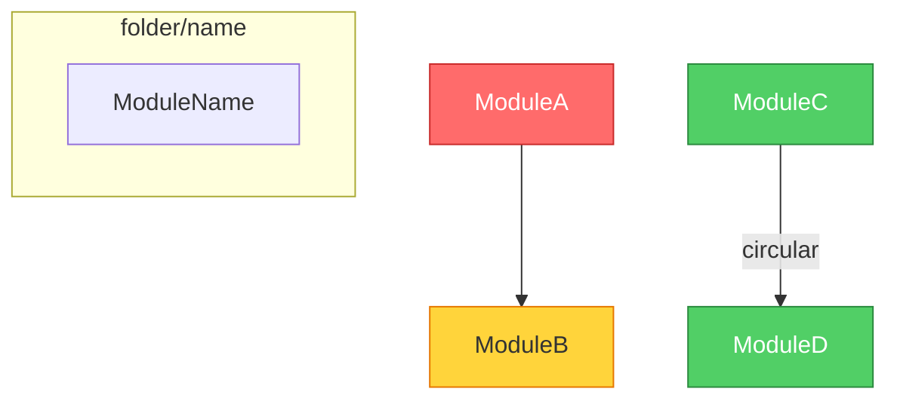
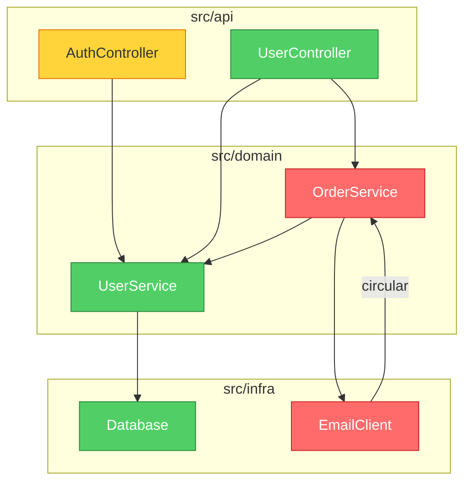

# Mermaid Dependency Graph (v0.6) Implementation Plan

> **For agentic workers:** REQUIRED SUB-SKILL: Use superpowers:subagent-driven-development (recommended) or superpowers:executing-plans to implement this plan task-by-task. Steps use checkbox (`- [ ]`) syntax for tracking.

**Goal:** Replace the plain-text dependency map in Mode 2 (Architecture Audit) with a Mermaid diagram that renders as a visual graph in GitHub/VS Code.

**Architecture:** Prompt-only change — modify the skill files that instruct Claude/Gemini how to generate the Mode 2 report. No code, no new dependencies. The Mermaid syntax is generated by the AI as text; rendering happens in the user's Markdown viewer.

**Tech Stack:** Markdown, Mermaid syntax, brooks-lint skill files

---

## File Map

| Action | File | Responsibility |
|--------|------|---------------|
| Modify | `skills/brooks-lint/architecture-guide.md` | Replace Step 1 plain-text format with Mermaid; add color scheme and constraints |
| Modify | `skills/brooks-lint/SKILL.md` | Update Mode 2 steps and Report Template for Mermaid |
| Modify | `CHANGELOG.md` | Add v0.6 entry |
| Modify | `CLAUDE.md` | Check v0.6 in roadmap |
| Modify | `README.md` | Version badge bump + add Mermaid example |
| Modify | `package.json` | Version bump to 0.6.0 |
| Modify | `.claude-plugin/plugin.json` | Version bump to 0.6.0 |
| Modify | `.claude-plugin/marketplace.json` | Version bump to 0.6.0 |
| Modify | `gemini-extension.json` | Version bump to 0.6.0 |

---

### Task 1: Update architecture-guide.md — Replace Step 1

**Files:**
- Modify: `skills/brooks-lint/architecture-guide.md:17-34`

- [ ] **Step 1: Replace the Step 1 section with Mermaid format**

Replace the entire "Step 1: Draw the Module Dependency Map" section (lines 17-34) with:

```markdown
### Step 1: Draw the Module Dependency Graph (Mermaid)

Before evaluating any risk, map the dependencies as a Mermaid diagram. This diagram will appear
at the **top of the report**, before the Findings section.

**Format:**

````markdown

````

**Rules:**

1. **Nodes:** Each top-level directory or module = one node. Use the directory/module name as the label. Do NOT create a node per file — collapse files into their parent directory.
2. **Grouping:** Use `subgraph` for each top-level directory (e.g., `subgraph src/api`). Nest subgraphs only if the project has clearly distinct layers.
3. **Edges:** Arrows point FROM the depending module TO the dependency. Label circular dependencies with `|circular|`.
4. **Node limit:** Target ~50 nodes maximum. If the project has more than 50 top-level modules, collapse deeper directories into their parent.
5. **Fan-out:** Note any module with fan-out > 5 (imports from more than 5 others) by adding a comment line above the graph.
6. **Colors:** Assign classDef AFTER completing Steps 2-4 (you need to know findings before coloring). Use:
   - `critical` (red): module has at least one 🔴 Critical finding
   - `warning` (yellow): module has 🟡 Warning findings but no Critical
   - `clean` (green): module has only 🟢 Suggestion findings or none
   - No class assignment: module not directly involved in any finding
7. **Direction:** Use `graph TD` (top-down) as default. Use `graph LR` (left-to-right) only if the project has a clear pipeline/flow architecture.
```

- [ ] **Step 2: Update the Output section at the bottom of the file**

Replace lines 103-111 (the `## Output` section) with:

```markdown
## Output

Use the standard Report Template from `SKILL.md`.
Mode: Architecture Audit
Scope: the project or directory audited.

**Report structure:**
1. The Mermaid dependency graph (from Step 1) — placed FIRST, before the Findings section
2. Findings (sorted by severity: Critical → Warning → Suggestion)
3. Summary

When referencing findings, point to the corresponding node in the graph above
(e.g., "See the red node `OrderService` in the dependency graph above").

**Important:** The classDef color assignments in the Mermaid graph must be added LAST,
after all findings are identified. Generate the graph structure (nodes, edges, subgraphs)
during Step 1, then add the `classDef` and `class` lines after completing Steps 2-5.
```

- [ ] **Step 3: Commit**

```bash
git add skills/brooks-lint/architecture-guide.md
git commit -m "feat: replace plain-text dependency map with Mermaid format in Mode 2"
```

---

### Task 2: Update SKILL.md — Mode 2 steps and Report Template

**Files:**
- Modify: `skills/brooks-lint/SKILL.md:92-98` (Mode 2 section)
- Modify: `skills/brooks-lint/SKILL.md:117-163` (Report Template)

- [ ] **Step 1: Update Mode 2 instructions**

Replace lines 92-98 (the Mode 2 section) with:

```markdown
### Mode 2: Architecture Audit

1. Read `architecture-guide.md` in this directory for the analysis process
2. Read `decay-risks.md` in this directory for symptom definitions and source attributions
3. Draw the module dependency graph as a Mermaid diagram (Step 1 of the guide)
4. Scan for each decay risk in the order specified in the guide
5. Assign node colors in the Mermaid diagram based on findings (red/yellow/green)
6. Run the Conway's Law check
7. Output using the Report Template below — Mermaid graph FIRST, then Findings
```

- [ ] **Step 2: Update Report Template to include Mermaid graph placement**

Replace lines 117-163 (the Report Template) with:

````markdown
## Report Template

```
# Brooks-Lint Review

**Mode:** [PR Review / Architecture Audit / Tech Debt Assessment / Test Quality Review]
**Scope:** [file(s), directory, or description of what was reviewed]
**Health Score:** XX/100

[One sentence overall verdict]

---

## Module Dependency Graph

<!-- Mode 2 (Architecture Audit) ONLY — omit this section for other modes -->


---

## Findings

<!-- Sort all findings by severity: Critical first, then Warning, then Suggestion -->
<!-- If no findings in a severity tier, omit that tier's heading -->

### 🔴 Critical

**[Risk Name] — [Short descriptive title]**
Symptom: [exactly what was observed in the code]
Source: [Book title — Principle or Smell name]
Consequence: [what breaks or gets worse if this is not fixed]
Remedy: [concrete, specific action]

### 🟡 Warning

**[Risk Name] — [Short descriptive title]**
Symptom: ...
Source: ...
Consequence: ...
Remedy: ...

### 🟢 Suggestion

**[Risk Name] — [Short descriptive title]**
Symptom: ...
Source: ...
Consequence: ...
Remedy: ...

---

## Summary

[2–3 sentences: what is the most important action, and what is the overall trend]
```
````

- [ ] **Step 3: Commit**

```bash
git add skills/brooks-lint/SKILL.md
git commit -m "feat: add Mermaid dependency graph to Mode 2 report template"
```

---

### Task 3: Update CHANGELOG.md

**Files:**
- Modify: `CHANGELOG.md:5` (insert before current first entry)

- [ ] **Step 1: Add v0.6.0 changelog entry**

Insert the following block at line 5, before the `## [0.5.2]` entry:

```markdown
## [0.6.0] - 2026-03-31

### Added

- **Mermaid Dependency Graph in Architecture Audit (Mode 2)** — the plain-text ASCII
  dependency map is replaced with a Mermaid diagram that renders as a visual graph
  in GitHub, VS Code, Notion, and other Markdown environments
- Node color coding by severity: red (Critical), yellow (Warning), green (clean)
- Automatic grouping by project folder structure using Mermaid subgraphs
- Circular dependencies visually marked with labeled edges
- Graph appears at the top of the audit report for immediate architectural overview

### Changed

- `architecture-guide.md`: Step 1 now produces Mermaid syntax instead of ASCII arrows;
  added color scheme reference, node limit constraint (~50), and rendering order note
- `SKILL.md`: Mode 2 steps updated (7 steps, up from 6); Report Template includes
  "Module Dependency Graph" section for Mode 2
- All version references bumped to 0.6.0

---

```

- [ ] **Step 2: Commit**

```bash
git add CHANGELOG.md
git commit -m "docs: add v0.6.0 changelog entry"
```

---

### Task 4: Update CLAUDE.md roadmap

**Files:**
- Modify: `CLAUDE.md:62`

- [ ] **Step 1: Mark v0.6 as complete in roadmap**

Replace line 62:

```
- v0.6: Mermaid dependency graph output
```

with:

```
- v0.6 ✅: Mermaid dependency graph output — visual Mermaid diagrams in Architecture Audit
```

- [ ] **Step 2: Commit**

```bash
git add CLAUDE.md
git commit -m "docs: mark v0.6 complete in CLAUDE.md roadmap"
```

---

### Task 5: Update README.md — version badge + Mermaid example

**Files:**
- Modify: `README.md:20` (version badge)
- Modify: `README.md` (after "What It Looks Like" section, add Mermaid example)

- [ ] **Step 1: Update version badge**

Replace:

```
version-0.5.2-blue
```

with:

```
version-0.6.0-blue
```

- [ ] **Step 2: Add Mermaid diagram example to README**

Find the end of the "What It Looks Like" section (after the existing Python example and findings output). Before the "## Benchmark" heading, insert:

```markdown
### Architecture Audit with Dependency Graph

In Mode 2 (Architecture Audit), brooks-lint generates a **Mermaid dependency graph** at the top of the report. Modules are color-coded by severity: red = Critical findings, yellow = Warning, green = clean.



The graph renders natively in GitHub, VS Code, and Notion — no extra tools needed.
```

- [ ] **Step 3: Commit**

```bash
git add README.md
git commit -m "docs: add Mermaid dependency graph example to README"
```

---

### Task 6: Version bump — all metadata files

**Files:**
- Modify: `package.json:3`
- Modify: `.claude-plugin/plugin.json:4`
- Modify: `.claude-plugin/marketplace.json:12`
- Modify: `gemini-extension.json:3`

- [ ] **Step 1: Bump package.json**

Replace:

```json
"version": "0.5.2"
```

with:

```json
"version": "0.6.0"
```

- [ ] **Step 2: Bump .claude-plugin/plugin.json**

Replace:

```json
"version": "0.5.2"
```

with:

```json
"version": "0.6.0"
```

- [ ] **Step 3: Bump .claude-plugin/marketplace.json**

Replace:

```json
"version": "0.5.2"
```

with:

```json
"version": "0.6.0"
```

- [ ] **Step 4: Bump gemini-extension.json**

Replace:

```json
"version": "0.5.2"
```

with:

```json
"version": "0.6.0"
```

- [ ] **Step 5: Commit**

```bash
git add package.json .claude-plugin/plugin.json .claude-plugin/marketplace.json gemini-extension.json
git commit -m "chore: bump version to 0.6.0"
```

---

### Task 7: Smoke test — run a Mode 2 audit

This task verifies the changes work end-to-end.

- [ ] **Step 1: Run brooks-lint architecture audit on the brooks-lint repo itself**

Use the `/brooks-lint:brooks-audit` command (or invoke the skill directly) on the brooks-lint repository. Verify:

1. The output begins with a Mermaid code block (`\`\`\`mermaid ... \`\`\``)
2. The graph uses `graph TD` direction
3. Modules are grouped by folder using `subgraph`
4. `classDef critical/warning/clean` lines are present
5. `class` assignments match the findings below
6. Circular dependencies (if any) have `|circular|` labels
7. The graph has fewer than 50 nodes
8. The rest of the report (Findings, Health Score, Summary) is intact

- [ ] **Step 2: Copy the Mermaid block and verify it renders on GitHub**

Paste the Mermaid block into a GitHub comment or gist and confirm it renders as a visual diagram with colored nodes.

- [ ] **Step 3: Final commit if any fixes were needed**

```bash
git add -A
git commit -m "fix: adjust Mermaid output based on smoke test"
```

(Skip if no fixes needed.)
