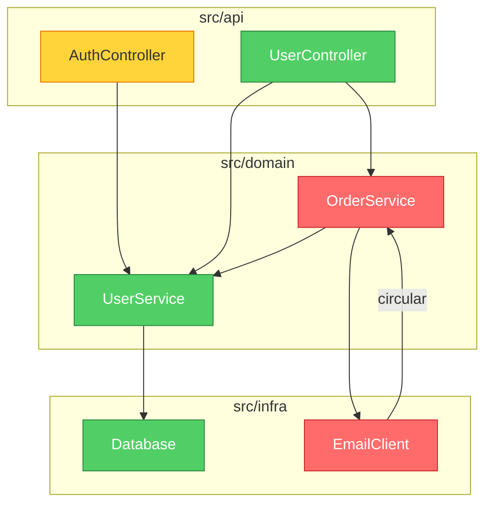

# Design Spec: Mermaid Dependency Graph Output (v0.6)

**Date:** 2026-03-31
**Status:** Approved
**Scope:** Architecture Audit (Mode 2) only

---

## Problem

When brooks-lint performs an architecture audit (Mode 2), Step 1 produces a plain-text dependency map using ASCII arrows:

```
[ModuleA] --> [ModuleB]
[ModuleB] --> [ModuleC]
```

This requires users to mentally construct the graph. Circular dependencies, layer violations, and coupling hotspots are hard to spot in text form.

## Solution

Replace the plain-text dependency map with a Mermaid diagram that renders as a visual graph in GitHub, VS Code, Notion, and other Markdown environments. The diagram appears at the **top of the audit report**, before any textual findings, so users get a bird's-eye view of the architecture first.

## Design Decisions

| Decision | Choice | Rationale |
|----------|--------|-----------|
| Output format | Mermaid | Native rendering in GitHub/VS Code/Notion; Claude/Gemini generate it fluently; architecture audits typically have 10-30 top-level modules, well within Mermaid's practical limit |
| Report position | First element in the report, before all findings | Industry precedent (CodeRabbit, dependency-cruiser-report-action); users understand structure 10x faster from a diagram than text |
| Node content | Module name only, color = risk severity | Keeps nodes compact; avoids layout issues from variable-width labels; detail lives in the textual findings below |
| Grouping strategy | By project folder structure (subgraph per top-level directory) | Deterministic, matches developer mental model, avoids AI misclassification risk |
| Architecture | Analysis layer separated from rendering layer | Enables future format swaps (D2, Graphviz) without changing analysis logic |

## Node Color Scheme

Colors align with brooks-lint's existing severity system:

| Color | Meaning | classDef |
|-------|---------|----------|
| Red (`#ff6b6b`) | Module has at least one Critical (🔴) finding | `classDef critical fill:#ff6b6b,stroke:#c92a2a,color:#fff` |
| Yellow (`#ffd43b`) | Module has Warning (🟡) findings but no Critical | `classDef warning fill:#ffd43b,stroke:#e67700` |
| Green (`#51cf66`) | Module has only Suggestion (🟢) findings or none | `classDef clean fill:#51cf66,stroke:#2b8a3e,color:#fff` |
| Default (gray) | Module not analyzed / out of scope | No classDef applied |

## Edge Conventions

- Solid arrow: normal dependency (A depends on B)
- Arrow direction: FROM the depending module TO the dependency
- Circular dependencies: labeled edge with `|circular|` annotation, red styling
- Direction: `graph TD` (top-down) for layer-based layouts

## Grouping Rules

1. Each top-level directory under the project root becomes a `subgraph`
2. Files within a directory are collapsed into a single node unless the directory contains clearly distinct sub-modules (determined by the presence of sub-directories with their own entry points)
3. Maximum node count target: ~50. If exceeded, collapse deeper directories into their parent

## Output Example

````markdown

````

## Report Structure (Mode 2, updated)

```
1. Mermaid Dependency Graph          <-- NEW (v0.6)
2. Dependency Disorder findings
3. Domain Model Distortion findings
4. Cognitive Overload findings
5. Change Propagation findings
6. Knowledge Duplication findings
7. Accidental Complexity findings
8. Conway's Law Check
9. Health Score
```

The graph is referenced in the findings — e.g., "See the red node `OrderService` in the dependency graph above."

## Architecture: Analysis-Render Separation

```
Step 1: Dependency Analysis
    Input:  Project source files
    Output: DependencyData {
              nodes: [{ name, folder, severity }]
              edges: [{ from, to, isCircular }]
              groups: [{ name, members }]
            }

Step 2: Render to Mermaid
    Input:  DependencyData
    Output: Mermaid syntax string (```mermaid ... ```)
```

This separation means:
- Adding D2 output = new renderer, same analysis
- Adding Graphviz output = new renderer, same analysis
- Changing color scheme = edit renderer only
- Changing analysis logic = edit analysis only

## Implementation Scope

### What changes

| File | Change |
|------|--------|
| `skills/brooks-lint/SKILL.md` | Add Mermaid output instruction to Mode 2 section |
| `skills/brooks-lint/architecture-guide.md` | Replace Step 1 plain-text format with Mermaid format; add color scheme reference; add node count constraint |
| `CLAUDE.md` | Update roadmap (v0.6 checked) |
| `CHANGELOG.md` | Add v0.6 entry |
| `README.md` | Update version badge; add Mermaid example to "What It Looks Like" or new section |
| `GEMINI.md` | No change needed (inherits from skill files) |
| `gemini-extension.json` | Version bump |
| `.claude-plugin/plugin.json` | Version bump |
| `.claude-plugin/marketplace.json` | Version bump |
| `package.json` | Version bump |

### What does NOT change

- Modes 1, 3, 4 (PR Review, Tech Debt, Test Quality)
- decay-risks.md, test-decay-risks.md
- Iron Law format (Symptom → Source → Consequence → Remedy)
- Health Score calculation
- Commands (no new slash command needed)
- Hooks

## Constraints

- **No JavaScript/code execution required** — the Mermaid syntax is generated as text by the AI, rendered by the user's Markdown viewer
- **No new dependencies** — this is a prompt-level change to the skill, not a code change
- **Backward compatible** — Mode 2 still produces all existing analysis; the graph is additive

## Future Considerations (NOT in v0.6)

- D2 as alternative output format (if Mermaid proves limiting)
- PR Review (Mode 1) dependency graph showing changed files' blast radius
- Interactive click-to-navigate (requires HTML output, not Markdown)
- Mermaid `architecture-beta` diagram type (v11.1+, not yet widely supported)

## Success Criteria

1. Mode 2 output begins with a valid Mermaid diagram that renders correctly on GitHub
2. Nodes are colored by risk severity using classDef
3. Circular dependencies are visually distinct
4. Modules are grouped by folder structure using subgraph
5. The diagram stays under ~50 nodes for any project
6. Existing Mode 2 findings (Steps 2-6) are unchanged
